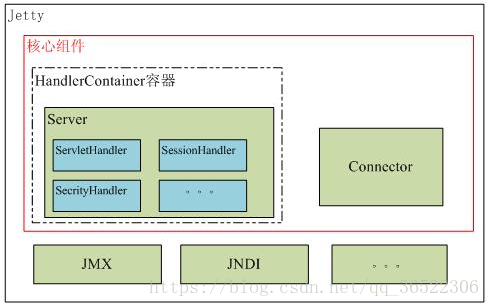
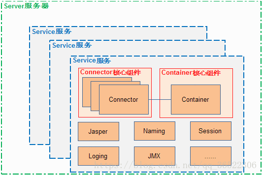

[TOC]

***

# 后台服务器开发

# 远程通信方式

## WebService平台技术

>[XML+XSD,SOAP和WSDL就是构成WebService平台的三大技术](https://www.jianshu.com/p/49d7997ad3b7)
>
>`XML+XSD`
>
>* WebService采用HTTP协议传输数据，采用XML格式封装数据（即XML中说明调用远程服务对象的哪个方法，传递的参数是什么，以及服务对象的返回结果是什么）。XML是WebService平台中表示数据的格式。除了易于建立和易于分析外，XML主要的优点在于它既是平台无关的，又是厂商无关的。无关性是比技术优越性更重要的：软件厂商是不会选择一个由竞争对手所发明的技术的。
>* XML解决了数据表示的问题，但它没有定义一套标准的数据类型，更没有说怎么去扩展这套数据类型。例如，整形数到底代表什么？16位，32位，64位？这些细节对实现互操作性很重要。XML Schema(XSD)就是专门解决这个问题的一套标准。它定义了一套标准的数据类型，并给出了一种语言来扩展这套数据类型。WebService平台就是用XSD来作为其数据类型系统的。当你用某种语言(如VB.NET或C#)来构造一个Web service时，为了符合WebService标准，所有你使用的数据类型都必须被转换为XSD类型。你用的工具可能已经自动帮你完成了这个转换，但你很可能会根据你的需要修改一下转换过程。
>
>`SOAP`
>
>* WebService通过HTTP协议发送请求和接收结果时，发送的请求内容和结果内容都采用XML格式封装，并增加了一些特定的HTTP消息头，以说明HTTP消息的内容格式，这些特定的HTTP消息头和XML内容格式就是SOAP协议。SOAP提供了标准的RPC方法来调用Web Service。
>
>* SOAP协议 = HTTP协议 + XML数据格式
>
>* SOAP协议定义了SOAP消息的格式，SOAP协议是基于HTTP协议的，SOAP也是基于XML和XSD的，XML是SOAP的数据编码方式。打个比喻：HTTP就是普通公路，XML就是中间的绿色隔离带和两边的防护栏，SOAP就是普通公路经过加隔离带和防护栏改造过的高速公路。
>
>`WSDL`
>
>* 好比我们去商店买东西，首先要知道商店里有什么东西可买，然后再来购买，商家的做法就是张贴广告海报。 WebService也一样，WebService客户端要调用一个WebService服务，首先要有知道这个服务的地址在哪，以及这个服务里有什么方法可以调用，所以，WebService务器端首先要通过一个WSDL文件来说明自己家里有啥服务可以对外调用，服务是什么（服务中有哪些方法，方法接受的参数是什么，返回值是什么），服务的网络地址用哪个url地址表示，服务通过什么方式来调用。
>
>* WSDL(Web Services Description Language)就是这样一个基于XML的语言，用于描述Web Service及其函数、参数和返回值。它是WebService客户端和服务器端都能理解的标准格式。因为是基于XML的，所以WSDL既是机器可阅读的，又是人可阅读的，这将是一个很大的好处。一些最新的开发工具既能根据你的Web service生成WSDL文档，又能导入WSDL文档，生成调用相应WebService的代理类代码。
>* WSDL文件保存在Web服务器上，通过一个url地址就可以访问到它。客户端要调用一个WebService服务之前，要知道该服务的WSDL文件的地址。WebService服务提供商可以通过两种方式来暴露它的WSDL文件地址：1.注册到UDDI服务器，以便被人查找；2.直接告诉给客户端调用者。
>
>


## 常见通信协议

> [浅谈几种通信方式(dubbo,webservice,restful)](https://blog.csdn.net/qq_34646231/article/details/84395460)
>
> **TCP/IP**
>
> ```html
> TCP/IP 协议是一个协议族。里面包括很多协议。UDP 只是其中的一个。因为TCP/IP比较重要所以用他两命名。
> ```
>
> **TCP和UDP**
>
> ```html
> tcp和udp都是传输协议，主要区别是tcp协议连接需要3次握手，断开需要四次握手，是通过流来传输的，就是确定连接后，一直发送信息，传完后断开。
> udp不需要进行连接，直接把信息封装成多个报文，直接发送。所以udp的速度更快写，但是不保证数据的完整性和数据顺序(这个是可以在实现时通过验证手段来手动确定完整性)。
> ```
>
> **HTTP**
>
> ```html
> http协议是建立在TCP协议之上的一种应用，是Web联网的基础，最显著的特点是客户端发送的每次请求都需要服务器回送响应，在请求结束后，会主动释放连接。
> 从建立连接到关闭连接的过程称为“一次连接”。
> ```
>
> **SOCKET**
>
> ```html
> socket并不是一种协议，是在程序员层面上对TCP/IP协议的封装和应用。其实是一个调用接口，方便程序员使用TCP/IP协议栈而已。程序员通过socket来使用tcp/ip协议。
> 但是socket并不是一定要使用tcp/ip协议，Socket编程接口在设计的时候，就希望也能适应其他的网络协议。
> ```
>
> **RPC**
>
> ```html
> RPC(Remote Procedure Call)—远程过程调用，它是一种通过网络从远程计算机程序上请求服务，而不需要了解底层网络技术的协议。RPC协议假定某些传输协议的存在，如TCP或UDP，为通信程序之间携带信息数据。
> 在OSI网络通信模型中，RPC跨越了传输层和应用层。RPC使得开发包括网络分布式多程序在内的应用程序更加容易。
> ```
>
> **SOAP**
>
> ```html
> 简单对象访问协议是交换数据的一种协议规范，是一种轻量的、简单的、基于XML（标准通用标记语言下的一个子集）的协议，它被设计成在WEB上交换结构化的和固化的信息。
> ```
>
> 

## 常见通信方式

>`Webservice`
>
>```html
>效率不高基于soap协议，其主要的特点是跨语言、跨平台的。项目中不推荐使用，可用于不同公司间接口的调用。
>```
>
>`restful`
>
>```html
>http+json。很多项目中应用。如果服务太多，服务之间调用关系混乱，需要治疗服务。
>```
>
>`dubbo`
>
>```html
>使用rpc协议进行远程调用，直接使用socket通信。传输效率高，并且可以统计出系统之间的调用关系、调用次数。使用Java语言开发，只能用于Java语言开发的项目间的通信，不具备跨语言，跨平台的特点！
>```
>
>`webservice之Restful风格`
>
>[webservice之Restful风格](https://www.jianshu.com/p/c8ec2f0526fc)
>
>```html
>使用restful风格的webservice 也就是cxf发布的webservice的地址是restful风格的
>使用restful风格发布的webservice不采用soap协议 ，轻量级 速度快，采用http传输协议。
>```
>
>

>[SOAP webserivce 和 RESTful webservice 对比及区别 ](http://www.sohu.com/a/142276140_355142)
>
>[RESTful跟WebService的区别](https://www.jianshu.com/p/cd7bfa8d51b7)
>
>

# webserver/servlet容器 

>[关于tomcat和jetty对比(不喜欢jetty的勿看)](https://yq.aliyun.com/articles/553292)
>
>[tomcat与jetty的区别](https://www.cnblogs.com/study-makes-me-happy/p/9606238.html)
>
>[Jetty篇一之初识Jetty](https://blog.csdn.net/qq_36522306/article/details/80699391)
>
>` 相同点 `
>
>*  Tomcat和Jetty都是一种Servlet引擎，他们都支持标准的servlet规范和JavaEE的规范。 
>
>`架构比较`
>
>* Jetty的架构比Tomcat的更为简单。
>* Jetty的架构是基于Handler来实现的，主要的扩展功能都可以用Handler来实现，扩展简单。
>* Tomcat的架构是基于容器设计的，进行扩展是需要了解Tomcat的整体设计结构，不易扩展。
>
>`性能比较`
>
>* Jetty和Tomcat性能方面差异不大。
>* Jetty可以同时处理大量连接而且可以长时间保持连接，适合于web聊天应用等等。
>* Jetty的架构简单，因此作为服务器，Jetty可以按需加载组件，减少不需要的组件，减少了服务器内存开销，从而提高服务器性能。
>* Jetty默认采用NIO结束在处理I/O请求上更占优势，在处理静态资源时，性能较高。
>* Tomcat适合处理少数非常繁忙的链接，也就是说链接生命周期短的话，Tomcat的总体性能更高。
>* Tomcat默认采用BIO处理I/O请求，在处理静态资源时，性能较差。
>
>`其它比较`
>
>* Jetty的应用更加快速，修改简单，对新的Servlet规范的支持较好。
>* Tomcat目前应用比较广泛，对JavaEE和Servlet的支持更加全面，很多特性会直接集成进来。
>* [Google 选择 Jetty, 放弃 Tomcat](https://yq.aliyun.com/go/articleRenderRedirect?url=http%3A%2F%2Fblog.csdn.net%2Fliguohuaty%2Farticle%2Fdetails%2F8053147)
>
>` Jetty的基本架构 `
>
>  
>
>`Tomcat的基本架构`
>
>  

# 不同开发实现

>
>
>


> [花了近十年的时间，整理出史上最全面Java面试题](https://www.jianshu.com/p/be45f7f06988)


