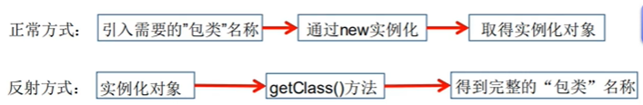
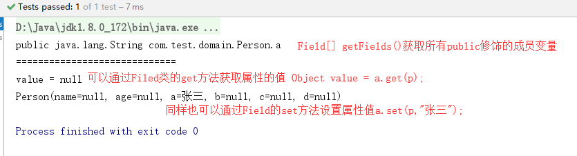
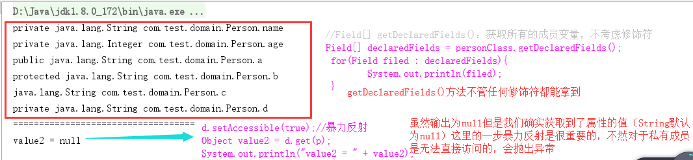
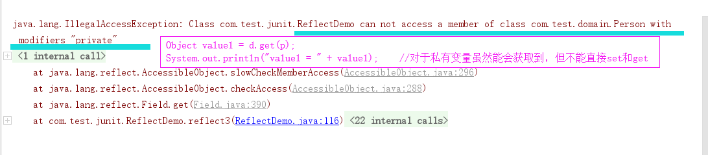
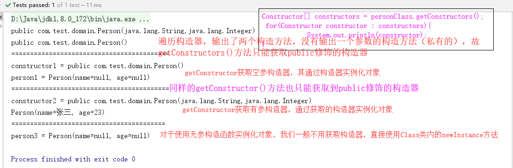
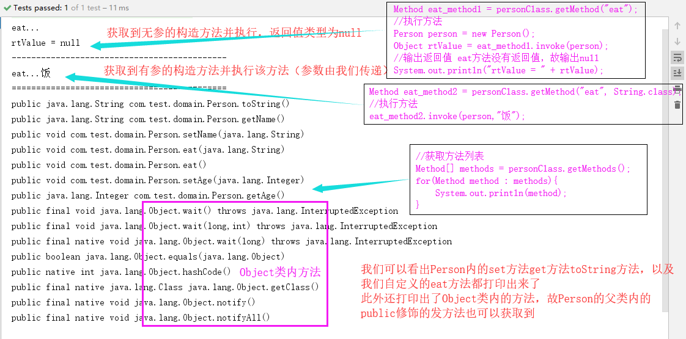
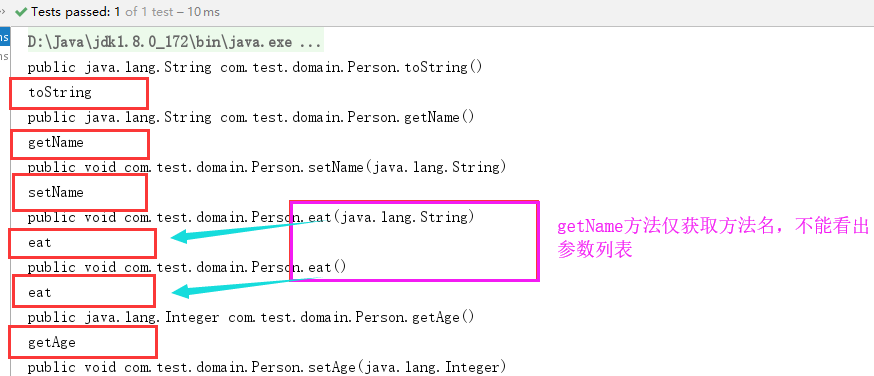

[TOC]

> [【黑马程序员-Java语言高级部分9.2】Java 反射](https://www.bilibili.com/video/av56351262)
>
> [反射机制笔记](https://note.youdao.com/ynoteshare1/index.html?id=128508bf6a04968eced81ede9ac1b304&type=note)
>
> [【狂神说Java】注解和反射](https://www.bilibili.com/video/av55440782)
>
> [JAVA注解与反射和类的加载机制第十六个专题](https://www.bilibili.com/video/av48959453?p=9)


# 反射概念

## 基本概念

> **框架**：半成品软件，可以在框架的基础上进行软件开发，简化编码。
>
> 学习框架并不需要了解反射，但是要是想自己写一个框架，那么就要对反射机制有很深入的了解。
>
> `反射机制`：将类的各个组成部分封装为其他对象，这就是反射机制。
>
> 反射的好处：
>
> > - 可以在程序运行过程中，操作这些对象。
> > - 可以解耦，提高程序的可扩展性。
> > - 假设我们使用的是new这种形式进行对象的实例化。此时如果在项目的某一个小模块中我们的一个实例类丢失了，那么在编译期间就会报错，以导致整个项目无法启动。
> > - 对于反射创建对象Class.forName("全类名");这种形式，我们在编译期需要的仅仅只是一个字符串（全类名），在编译期不会报错，这样其他的模块就可以正常的运行，而不会因为一个模块的问题导致整个项目崩溃。这就是Spring框架中`IOC控制反转`的本质。
>
> `Reflection(反射)`是Java被视为动态语言的关键，反射机制允许程序在执行期借助于Reflection API取得任何类的内部信息，并能直接操作任意对象的内部属性及方法。
>
> 加载完类之后，在堆内存的方法区中就产生了一个Class类型的对象（**一个类只有一个Class对象**），这个对象就包含了完整的类的结构信息。
>
> 我们可以通过这个对象看到类的结构。这个对象就像一面镜子，透过这个镜子看到类的结构，所以，我们形象的称之为：反射
>
> 


## 代码的三个阶段

> `Source`源代码阶段：\*.java被编译成\*.class字节码文件。
>
> `Class`类对象阶段：\*.class字节码文件被类加载器加载进内存，并将其封装成Class对象（用于在内存中描述字节码文件），Class对象将原字节码文件中的成员变量抽取出来封装成数组Field[]，将原字节码文件中的构造函数抽取出来封装成数组Construction[]，在将成员方法封装成Method[]。
>
> - RunTime运行时阶段：创建对象的过程new。
>
>   


# Java内存

>`堆`: 存放new的对象和数组，被所有的线程共享，不会存放别的对象引用
>
>`栈`: 存放基本变量类型(会包含这个基本类型的具体数值)，引用对象的变量(会存放这个引用在堆里面的具体地址)
>
>`方法区`: 可以被所有的线程共享，包含了所有的class和static变量

## 类加载过程

>当程序主动使用某个类时，如果该类还未被加载到内存中，则系统会通过如下三个步骤来对该类进行初始化。
>
>

## 类加载与ClassLoader

>    **加载**：将class文件字节码内容加载到内存中，并将这些静态数据转换成方法区的运行时数据结构，然后生成一个代表这个类的java.lang.Class对象。
>    **链接**：将Java类的二进制代码合并到JVM的运行状态之中的过程。
>
>    >验证：确保加载的类信息符合JVM规范，没有安全方面的问题
>    >
>    >准备：正式为类变量（static）分配内存并设置类变量默认初始值的阶段，这些内存都将在方法区中进行分配。
>    >解析：虚拟机常量池内的符号引用（常量名）替换为直接引用（地址）的过程。
>    >初始化：执行类构造器<clinit>()方法的过程。类构造器<clinit>()方法是由编译期自动收集类中所有类变量的赋值动作和静态代码块中的语句合并产生的。
>    >
>    >类构造器是构造类信息的，不是构造该类对象的构造器。
>    >当初始化一个类的时候，如果发现其父类还没有进行初始化，则需要先触发其父类的初始化。
>    >虚拟机会保证一个类的<clinit>()方法在多线程环境中被正确加锁和同步。

## 类初始化时机

>`类主动引用`（一定会发生类的初始化）
>
>> 当虚拟机启动，先初始化main方法所在的类
>>
>> new一个类的对象
>>
>> 调用类的静态成员（除了final常量）和静态方法
>>
>> 使用java.lang.reflect包的方法对类进行反射调用
>>
>> 当初始化一个类，如果其父类没有被初始化，则先会初始化它的父类
>
>`类被动引用`（不会发生类的初始化）
>
>> 当访问一个静态域时，只有真正声明这个域的类才会被初始化。如：当通过子类引用父类的静态变量，不会导致子类初始化
>>
>> 通过数组定义类引用，不会触发此类的初始化
>>
>> 引用常量不会触发此类的初始化（常量在链接阶段就存入调用类的常量池中了）
>
>

## 类加载器的作用

>    **类加载的作用**：将class文件字节码内容加载到内存中，并将这些静态数据转换成方法区的运行时
>    数据结构，然后在堆中生成一个代表这个类的java.lang.Class对象，作为方法区中类数据的访问入口。
>    **类缓存**：标准的JavaSE类加载器可以按要求查找类，但一旦某个类被加载到类加载器中，它将维持加载(缓存)一段时间。不过JVM垃圾回收机制可以回收这些Class对象
>    
>
>    **类加载器作用**是用来把类(class)装载进内存的。
>
>    JVM规范定义了如下类型的类的加载器。
>
>    
>
>    ```java
>    public static void main(string[] args){
>    	// 获取系统类的加载器 
>        ClassLoader systemClassloader = ClassLoader.getsystemclassloade(); 
>        System.out.println(systemclassLoader); 
>        // 获取系统类加载器的父类加载器-一>扩展类加载器 
>        ClassLoader parent = systemclassLoader.getParent(); 
>        System.out.println(parent); 
>        // 获取扩展类加载器的父类加载器-->根加载器（C/c++） 
>        ClassLoader parent1=parent.getParent();
>        System.out.println(parent1);
>    	// 测试当前类是哪个加载器加载的 
>        ClassLoader classLoader = Class.forName("com.reflection.Test").getClassLoader(); 
>        System.out.println(classLoader); 
>        // 测试JDK内置的类是谁加载的
>        classLoader = Class.forName("java.lang.object").getclassLoader(); 
>        system.out.println(classloader);
>    }
>    ```
>
>    
>
>    

## 自定义网络类加载

>```java
>import java.io.ByteArrayOutputStream;
>import java.io.File;
>import java.io.FileInputStream;
>import java.io.IOException;
>/**
>* 自定义网络类加载器
>*/
>public class NetworkClassLoader extends ClassLoader {
>    private String filePath;
>    private String fileExtention = ".class";
>    public NetworkClassLoader(String filePath) {
>        this.filePath = filePath;
>    }
>    public Class findClass(String name) {
>        System.out.println("findClass name=" + name);
>        byte[] bArr = null;
>        try {
>       		bArr = loadClassData(name);
>        } catch (IOException e) {
>	        e.printStackTrace();
>        }
>        return defineClass(name, bArr, 0, bArr.length);
>    }
>    private byte[] loadClassData(String name) throws IOException {
>    // name = "annotatonreflection.NetworkClassLoader";
>        name = name.replace(".", "/");
>        name += fileExtention;
>        File file = new File(filePath, name);
>        FileInputStream fileInputStream = new FileInputStream(file);
>        ByteArrayOutputStream byteArrayOutputStream = new ByteArrayOutputStream();
>        int len = -1;
>        while ((len = fileInputStream.read()) != -1) {
>        	byteArrayOutputStream.write(len);
>        }
>        return byteArrayOutputStream.toByteArray();
>    }
>    
>    public static void main(String[] args) {
>        NetworkClassLoader classLoader = new NetworkClassLoader("CDesktop");
>        try {
>            Class clazz = classLoader.loadClass("annotatonreflection.Person");
>            Object obj = clazz.newInstance();
>            System.out.println(obj);
>            // System.out.println(clazz.getClassLoader());
>            ClassLoader classLoader2 = clazz.getClassLoader();
>            while (classLoader2 != null) {
>                System.out.println(classLoader2);
>                classLoader2 = classLoader2.getParent();
>            }
>            System.out.println("引导类加载器"+classLoader2); //引导类加载器是null
>        } catch (ClassNotFoundException e) {
>        	e.printStackTrace();
>        } catch (InstantiationException e) {
>        	e.printStackTrace();
>        } catch (IllegalAccessException e) {
>        	e.printStackTrace();
>        }
>    }	
>}
>```
>
>

# Class对象获取方式

>获取Class对象的`三种方式`对应着java代码在计算机中的`三个阶段`
>
>1. `Source`源代码阶段: Class.forName("全类名")：将字节码文件加载进内存，返回Class对象
>
>   多用于配置文件，将类名定义在配置文件中。读取文件，加载类。 
>
>2. `Class`类对象阶段: 类名.class：通过类名的属性class获取
>
>   多用于参数的传递 
>
>3. `Runtime`运行时阶段: 对象.getClass()：getClass()方法是定义在Objec类中的方法
>
>   多用于对象的获取字节码的方式  
>
>**结论**: 同一个字节码文件(\*.class)在一次程序运行过程中，只会被加载一次，无论通过哪一种方式获取的Class对象都是同一个。
>
>> * 若已知具体的类，通过类的class属性获取，该方法最为安全可靠，程序性能最高。
>>
>>   Class clazz=Person.class；
>>
>> * 已知某个类的实例，调用该实例的getClass（）方法获取Class对象
>>
>>   Class clazz=person.getClass()；
>>
>> * 已知一个类的全类名，且该类在类路径下，可通过Class类的静态方法forName()获取，可能抛出ClassNotFoundException
>>
>>   Class clazz=Class.forName("demo01.Student");
>>
>> * 内置基本数据类型可以直接用类名.Type
>>
>> * 还可以利用ClassLoader我们之后讲解
>
>哪些类型可以有Class对象？
>
>   >class: 外部类，成员(成员内部类，静态内部类)，局部内部类，匿名内部类。
>   >
>   >interface: 接口
>   >
>   >[]: 数组
>   >
>   >enum: 枚举
>   >
>   >annotation: 注解@interface
>   >
>   >primitive type: 基本数据类型
>   >
>   >void

>```java
>//所有关型Class 
>public class Test{ 
>    public static void main(string[] args){ 
>        Class c1 = Object.class; // 类
>        Class c2 = Comparable.class; // 接口
>        class c3 = String[].class; // 一维数组 
>        Class c4 = int[][].class; // 二维数组 
>        Class c5 = Override.class; // 注解 
>        Class c6 = ElementType.class; // 枚举 
>        Class c7 = Integer.class; // 基本数据类型
>        Class c8 = void.class; // void 
>        Class c9 = Class.class; // class 
>        System.out.println(c1); 
>        System.out.println(c2); 
>        System.out.println(c3); 
>        System.out.println(c4); 
>        System.out.println(c5); 
>        System.out.println(c6); 
>        System.out.println(c7); 
>        System.out.println(c8); 
>        System.out.println(c9); 
>        int[] a = new int[10]; 
>        int[] b = new int[100]; 
>        system.out.println(a.getclass().hashcode(); 
>	}
>}
>```
>
>


> ```java
> @Test
> public void reflect() throws ClassNotFoundException {
>      // 方式一：Class.forName("全类名");
>      Class cls1 = Class.forName("com.test.domain.Person");   //P erson自定义实体类
>      System.out.println("cls1 = " + cls1);
> 
>      // 方式二：类名.class
>      Class cls2 = Person.class;
>      System.out.println("cls2 = " + cls2);
> 
>      // 方式三：对象.getClass();
>      Person person = new Person();        
>      Class cls3 = person.getClass();
>      System.out.println("cls3 = " + cls3);
> 
>      // == 比较三个对象
>      System.out.println("cls1 == cls2 : " + (cls1 == cls2));    //true
>      System.out.println("cls1 == cls3 : " + (cls1 == cls3));    //true
>    
>         // 方式四：基本内置类型的包装类都有一个Type属性 
>         Class c4=Integer.TYPE;
>         System.out.printin(c4); 
>         // 获得父类类型 
>         Class c5=c1.getsuperclass(); 
>         System.out.printin(c5);
> }
> ```
>
> 


# 反操作泛型

>    >Method和Field、Constructor对象都有setAccessible）方法。
>    >
>    >setAccessible作用是启动和禁用访问安全检查的开关。
>    >
>    >参数值为true则指示反射的对象在使用时应该取消Java语言访问检查。
>    >
>    >提高反射的效率。如果代码中必须用反射，而该句代码需要频繁的被调用，那么请设置为true。
>    >
>    >使得原本无法访问的私有成员也可以访问
>    >
>    >参数值为false则指示反射的对象应该实施Java语言访问检查
>    ```java
>    public class Test { 
>    	public void testel(Map<String,User> map,List<User> list){ 
>    	    System.out.println(""testo1"); 
>    	}
>    	public Map<string,User>testo2(){ 
>        	System.out.println("testo2"); 
>        	return null; 
>        }
>    	public static void main(String[] args) throws NoSuchMethodException { 
>            Method method=Test11.class.getMethod("teste1",Map.class,List.class); 
>            Type[] genericParameterTypes=method.getGenericParameterTypes();
>            for(Type genericParameterType:genericParameterTypes){
>                System.out.println("#"+genericParameterType); 
>                if(genericParameterType instanceof ParameterizedType){ 
>                    Type[] actualTypeArguments=((ParameterizedType)genericParameterType).getActualTypeArguments(); 
>                    for (Type actualTypeArgument:actualTypeArguments){ 
>                        System.out.println(actualTypeArgument);
>                        method=Test11.class.getMethod(name:"testo2",.…parameterTypes:null); 
>                        Type genericReturnType=method.getGenericReturnType(); 
>                        if(genericReturnType instanceof ParameterizedType){ 
>                            Type[]actualTypeArguments=((ParameterizedType) genericReturnType).getActualTypeArguments(); 
>                            for(Type actualTypeArgument:actualTypeArguments){ 
>                                System.out.println(actualTypeArgument);                                             }
>                        }
>                    }
>                }
>            }
>        }
>    }
>    ```
>
>    


# Class对象功能

## 获取功能

>1）获取成员变量们
>
>```java
>Field[] getFields() ：获取所有public修饰的成员变量
>Field getField(String name)   获取指定名称的 public修饰的成员变量
>
>Field[] getDeclaredFields()  获取所有的成员变量，不考虑修饰符
>Field getDeclaredField(String name) 
>```
>
>2）获取构造方法们
>
>```java
>Constructor<?>[] getConstructors()  
>Constructor<T> getConstructor(类<?>... parameterTypes)  
>
>Constructor<?>[] getDeclaredConstructors()  
>Constructor<T> getDeclaredConstructor(类<?>... parameterTypes)  
>```
>
>3）获取成员方法们
>
>```java
>Method[] getMethods()  
>Method getMethod(String name, 类<?>... parameterTypes)  
>
>Method[] getDeclaredMethods()  
>Method getDeclaredMethod(String name, 类<?>... parameterTypes)
>```
>
>4）获取全类名和简单类名
>
>```java
>String getName() 
>```
>
>

## Field：成员变量

>**设置值**: void set(Object obj, Object value)
>
>**获取值**: get(Object obj)
>
>忽略访问权限修饰符的安全检查 setAccessible(true): `暴力反射`

>```java
>import lombok.Getter;
>import lombok.Setter;
>import lombok.ToString;
>
>@Setter
>@Getter
>@ToString
>public class Person {
>    public String a;        //最大范围public
>        protected String b;     //受保护类型
>        String c;               //默认的访问权限
>        private String d;       //私有类型
>    }
>```
>
>```java
>// 测试getFields和getField(String name)方法
>**
>* 获取成员变量
>*   Field[] getFields()
> *   Field getField(String name)
> */
> @Test
> public void reflect() throws Exception {
>   // 0. 获取Person的Class对象
>   Class personClass = Person.class;
> 
>    // 1. Field[] getFields()获取所有public修饰的成员变量
>   Field[] fields = personClass.getFields();
>    for(Field field : fields){
>        System.out.println(field);
>    }
>    System.out.println("=============================");
>    // 2. Field getField(String name)
>    Field a = personClass.getField("a");
> 
>    // 3. 获取成员变量a 的值 [也只能获取公有的，获取私有的或者不存在的字符会抛出异常]
>   Person p = new Person();
>    Object value = a.get(p);
>    System.out.println("value = " + value);
> 
>    // 4 设置属性a的值
>   a.set(p,"张三");
>    System.out.println(p);
> }
> ```
>
>


>```java
>// 测试getDeclaredFields和getDeclaredField(String name)方法
>/**
> *  Field[] getDeclaredFields()
> *  Field getDeclaredField(String name)
> */
> @Test
>public void reflect3() throws Exception {
>   Class personClass = Person.class;
>    // Field[] getDeclaredFields()：获取所有的成员变量，不考虑修饰符
>   Field[] declaredFields = personClass.getDeclaredFields();
>    for(Field filed : declaredFields){
>        System.out.println(filed);
>    }
>    System.out.println("===================================");
>    // Field getDeclaredField(String name)
>    Field d = personClass.getDeclaredField("d");     //private String d;
>    Person p = new Person();
> 
>    // Object value1 = d.get(p);    //会抛出异常
>   // System.out.println("value1 = " + value1);    
>    //对于私有变量虽然能会获取到，但不能直接set和get
> 
>   //忽略访问权限修饰符的安全检查
>    d.setAccessible(true);//暴力反射
>    Object value2 = d.get(p);
>    System.out.println("value2 = " + value2);
> }
>```
>
>
>
>没有忽略访问修饰符直接访问抛出的异常
>
>

## Constructor:构造方法

> **创建对象**：T newInstance(Object... initargs)
>
>注意：如果使用空参数构造方法创建对象，操作可以简化：Class对象的newInstance方法

>```java
>import lombok.Getter;
>import lombok.Setter;
>import lombok.ToString;
>
>@Setter
>@Getter
>@ToString
>public class Person {
>        private String name;
>        private Integer age;
>    //无参构造函数
>        public Person() {}
>        //单个参数的构造函数，且为私有构造方法
>        private Person(String name){}
>        //有参构造函数
>        public Person(String name, Integer age) {
>           this.name = name;
>           this.age = age; }
>}
>    ```
>    
>     ````java
>     /**
>    * 获取构造方法们
>*   Constructor<?>[] getConstructors()
>*   Constructor<T> getConstructor(类<?>... parameterTypes)
>*/
>@Test
>public void reflect4() throws Exception {
>    Class personClass = Person.class;
> 
>    //Constructor<?>[] getConstructors()
>    Constructor[] constructors = personClass.getConstructors();
>   for(Constructor constructor : constructors){   
>       // Constructor 对象reflect包下的 import java.lang.reflect.Constructor;
>        System.out.println(constructor);
>   }
>    System.out.println("==========================================");
> 
>    // 获取无参构造函数 注意：Person类中必须要有无参的构造函数，不然抛出异常
>    Constructor constructor1 = personClass.getConstructor();
>    System.out.println("constructor1 = " + constructor1);
>   // 获取到构造函数后可以用于创建对象
>    Object person1 = constructor1.newInstance();
>    // Constructor类内提供了初始化方法newInstance();方法
>    System.out.println("person1 = " + person1);
>    System.out.println("==========================================");
> 
>    // 获取有参的构造函数  
>    // public Person(String name, Integer age) 
>    // 参数类型顺序要与构造函数内一致，且参数类型为字节码类型
>   Constructor constructor2 = personClass.getConstructor(String.class,Integer.class);
>   System.out.println("constructor2 = " + constructor2);
>    
>    // 创建对象
>    Object person2 = constructor2.newInstance("张三", 23);   
>     // 获取的是有参的构造方法，就必须要给参数
>    System.out.println(person2);
>    System.out.println("=========================================");
> 
>    // 对于一般的无参构造函数，我们都不会先获取无参构造器之后在进行初始化。
>   // 而是直接调用Class类内的newInstance()方法
>    Object person3 = personClass.newInstance();
>   System.out.println("person3 = " + person3);
>    // 我们之前使用的 Class.forName("").newInstance
>    // 其本质上就是调用了类内的无参构造函数来完成实例化的
>    // 以后在使用  Class.forName("").newInstance; 反射创建对象时，一定要保证类内有无参构造函数
> }
> ````
>
>
>
>

>**对于getDeclaredConstructor方法和getDeclaredConstructors方法**
>
>getDeclaredConstructor方法可以获取到任何访问权限的构造器，而getConstructor方法只能获取public修饰的构造器。此外在构造器的对象内也有setAccessible(true);方法，并设置成true就可以操作了。
>
>​    关于为什么要使用private访问权限的构造器，使用这个构造器不就不能外部访问了嘛，不也就无法进行实例化对象了吗？无法在类的外部实例化对象正是私有构造器的意义所在，在单例模式下经常使用，整个项目只有一个对象，外部无法实例化对象，可以在类内的进行实例化并通过静态方法返回（由于实例化的对象是静态的，故只有一个对象，也就是单例的）。
>
>网上说这就是单例模式中的饿汉模式，不管是否调用，都创建一个对象。
>
>```java
>class SingletonDemo{
>	// 私有化构造方法
>	private SingletonDemo(){
>    }
>    // 创建一个对象  类内实例化（静态的对象）
>    private static SingletonDemo singleton = new SingletonDemo();
>    // 提供public方法供外部访问，返回这个创建的对象
>    public static SingletonDemo getInstance(){
>        return singleton;
>    }
>}
>public class Singleton {
>	public static void main(String[] args) {
>		SingletonDemo s1 = SingletonDemo.getInstance();
>		//输出对象的地址，如果有地址存在，则说明对象创建成功并获取到
>		System.out.println(s1);
>   		SingletonDemo s2 = SingletonDemo.getInstance();
>		//如果结果为true，则说明是同一个对象
>		System.out.println(s1==s2);    //输出结果为true
>	}
>}
>```
>
>

# Method：方法对象

>**执行方法**：Object invoke(Object obj, Object... args)
>
>**获取方法名称**：String getName();

>```java
>import lombok.Getter;
>import lombok.Setter;
>import lombok.ToString;
>
>@Setter
>@Getter
>@ToString
>public class Person {
>    private String name;
>        private Integer age;
>        //无参构造函数
>    public Person() {}
>        //有参构造函数
>        public Person(String name, Integer age) {
>       this.name = name;
>           this.age = age;}
>    //无参方法
>        public void eat(){
>           System.out.println("eat...");
>         }
>         //重载有参方法
>        public void eat(String food){
>       System.out.println("eat..."+food);
>        }
>    }
>     ```
>    
>**invoke方法**
>    
>    ````java
>     /**
>    * 获取成员方法们：
>*  Method[] getMethods()
>*  Method getMethod(String name, 类<?>... parameterTypes)
>*/
>@Test
>public void reflect5() throws Exception {
>   Class personClass = Person.class;
>
>    // 获取指定名称的方法    
>    Method eat_method1 = personClass.getMethod("eat");
>    // 执行方法
>    Person person = new Person();
>   Object rtValue = eat_method1.invoke(person);
>    //如果方法有返回值类型可以获取到，没有就为null
>    // 输出返回值 eat方法没有返回值，故输出null
>   System.out.println("rtValue = " + rtValue);
>    System.out.println("--------------------------------------------");
> 
>    // 获取有参的构造函数  有两个参数 第一个方法名 第二个参数列表 ，不同的参数是不同的方法（重载）
>    Method eat_method2 = personClass.getMethod("eat", String.class);
>    //执行方法
>    eat_method2.invoke(person,"饭");
>    System.out.println("============================================");
>
>    //获取方法列表
>   Method[] methods = personClass.getMethods();
>    for(Method method : methods){     
>        //注意：获取到的方法名称不仅仅是我们在Person类内看到的方法
>        System.out.println(method);   
>        //继承下来的方法也会被获取到（当然前提是public修饰的）
>   }
> }
>````
> 
> 
> 
> 

## getName方法

>getName()方法获取的方法名是仅仅就是方法名（不带全类名），且不带有参数列表。
>
>```java
>@Test
>public void reflect6() throws NoSuchMethodException {
>        Class personClass = Person.class;
>        Method[] methods = personClass.getMethods();
>        for(Method method : methods){
>            System.out.println(method);
>            // 获取方法名
>            String name = method.getName();  
>            System.out.println(name);   
>        }
>}
>```
>
>

> **获取类名**
>
> getClass()方法是Object类的方法，需要注意一点获取的类名是**全类名**（带有路径）
>
> ```java
> @Test
> public void reflect7(){
>      Class personClass = Person.class;
>      String className = personClass.getName();
>      System.out.println(className);
> }
> ```
>
> 

## 关于获取成员方法们的另外两个方法

>同之前的叙述一样，带有Declared关键字的方法这两个方法，可以获取到任意修饰符的方法。同样的提供了setAccessible(true);方法进行暴力反射。
>
>    Method和Field、Constructor对象都有setAccessible）方法。
> 
> setAccessible作用是启动和禁用访问安全检查的开关。
> 
> 参数值为true则指示反射的对象在使用时应该取消Java语言访问检查。
> 
>    提高反射的效率。如果代码中必须用反射，而该句代码需要频繁的被调用，那么请设置为true。
>
>使得原本无法访问的私有成员也可以访问>参数值为false则指示反射的对象应该实施Java语言访问检查
>
>**综上说述：对于反射机制来说，在反射面前没有公有私有，都可以通过暴力反射解决。**
>
>```java
>Method[] getDeclaredMethods()  
>Method getDeclaredMethod(String name, 类<?>... parameterTypes)
>method.setAccessible(true);   //暴力反射
>```
>
>

