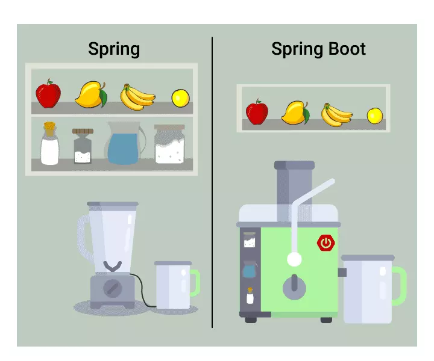

[TOC]

***

# Java中的注解到底是如何工作的？

> [Java中的注解到底是如何工作的？](https://mp.weixin.qq.com/s/FCxybEZK8f45_zI8AYbX6Q)
>
> [Java 必须掌握的 12 种 Spring 常用注解！](https://mp.weixin.qq.com/s/nSIyS35N6KpnFCWdI43THA)
>
> [java中的注解，真的很重要，你理解了嘛](https://baijiahao.baidu.com/s?id=1637216017950921752&wfr=spider&for=pc)

自Java5.0版本引入注解之后，它就成为了Java平台中非常重要的一部分。开发过程中，我们也时常在应用代码中会看到诸如@Override，@Deprecated这样的注解。

这篇文章中，我将向大家讲述到底什么是注解，为什么要引入注解，注解是如何工作的，如何编写自定义的注解(通过例子)，什么情况下可以使用注解以及最新注解和ADF(应用开发框架)。这会花点儿时间，所以为自己准备一杯咖啡，让我们来进入注解的世界吧。

>  https://www.zhihu.com/question/64671972 
>
> [Spring和SpringBoot比较，解惑区别]( https://www.jianshu.com/p/ffe5ebe17c3a )
>
> [用Spring Boot颠覆Java应用开发]( https://zhuanlan.zhihu.com/p/22920391 )

  

# 什么是注解？

用一个词就可以描述注解，那就是元数据，即一种描述数据的数据。所以，可以说注解就是源代码的元数据。比如，下面这段代码：

```java
@Override
public String toString() {
    return "This is String Representation of current object.";
}
```

> 上面的代码中，我重写了toString()方法并使用了@Override注解。但是，即使我不使用@Override注解标记代码，程序也能够正常执行。
>
> 那么，该注解表示什么？这么写有什么好处吗？事实上，@Override告诉编译器这个方法是一个重写方法(描述方法的元数据)，如果父类中不存在该方法，编译器便会报错，提示该方法没有重写父类中的方法。
>
> 如果我不小心拼写错误，例如将toString()写成了toStrring(){double r}，而且我也没有使用@Override注解，那程序依然能编译运行。但运行结果会和我期望的大不相同。现在我们了解了什么是注解，并且使用注解有助于阅读程序。推荐阅读：[Spring MVC常用注解，你会几个？](http://mp.weixin.qq.com/s?__biz=MzI3ODcxMzQzMw==&mid=2247484331&idx=1&sn=acf8750f5b4174cf238527498f06e307&chksm=eb53869ddc240f8bfebeb73cd5bae0fed5ebf4b349f37a62129afc7f0432fbf99500245f129a&scene=21#wechat_redirect)
>
> Annotation是一种应用于类、方法、参数、变量、构造器及包声明中的特殊修饰符。它是一种由JSR-175标准选择用来描述元数据的一种工具。


# 为什么要引入注解？

使用Annotation之前(甚至在使用之后)，XML被广泛的应用于描述元数据。不知何时开始一些应用开发人员和架构师发现XML的维护越来越糟糕了。

他们希望使用一些和代码紧耦合的东西，而不是像XML那样和代码是松耦合的(在某些情况下甚至是完全分离的)代码描述。

如果你在Google中搜索“XML vs. annotations”，会看到许多关于这个问题的辩论。最有趣的是XML配置其实就是为了分离代码和配置而引入的。

上述两种观点可能会让你很疑惑，两者观点似乎构成了一种循环，但各有利弊。下面我们通过一个例子来理解这两者的区别。

假如你想为应用设置很多的常量或参数，这种情况下，XML是一个很好的选择，因为它不会同特定的代码相连。如果你想把某个方法声明为服务，那么使用Annotation会更好一些，因为这种情况下需要注解和方法紧密耦合起来，开发人员也必须认识到这点。

另一个很重要的因素是Annotation定义了一种标准的描述元数据的方式。在这之前，开发人员通常使用他们自己的方式定义元数据。例如，使用标记interfaces，注释，transient关键字等等。每个程序员按照自己的方式定义元数据，而不像Annotation这种标准的方式。

目前，许多框架将XML和Annotation两种方式结合使用，平衡两者之间的利弊。


# 编写自定义的Annotation

在讲述这部分之前，建议你首先下载Annotation的示例代码AnnotationsSample.zip 。下载之后放在你习惯使用的IDE中，这些代码会帮助你更好的理解Annotation机制。

推荐阅读：[Java 必须掌握的 12 种 Spring 常用注解！](http://mp.weixin.qq.com/s?__biz=MzI3ODcxMzQzMw==&mid=2247487433&idx=1&sn=227d343dc27c8465cd1c1f8923547561&chksm=eb538affdc2403e9e0d0916491046411fa52c848bd1ae14781fc5ef1ad7fb9f5395278097dfa&scene=21#wechat_redirect)

编写Annotation非常简单，可以将Annotation的定义同接口的定义进行比较。我们来看两个例子：一个是标准的注解@Override，另一个是用户自定义注解@Todo。

> ```java
> @Target(ElementType.METHOD)
> @Retention(RetentionPolicy.SOURCE)
>    	public @interface Override {
> }
> ```
>
> 对于@Override注释你可能有些疑问，它什么都没做，那它是如何检查在父类中有一个同名的函数呢。当然，不要惊讶，我是逗你玩的。
>
> @Override注解的定义不仅仅只有这么一点代码。这部分内容很重要，我不得不再次重复：Annotations仅仅是元数据，和业务逻辑无关。
>
> 理解起来有点困难，但就是这样。如果Annotations不包含业务逻辑，那么必须有人来实现这些逻辑。元数据的用户来做这个事情。Annotations仅仅提供它定义的属性(类/方法/包/域)的信息。Annotations的用户(同样是一些代码)来读取这些信息并实现必要的逻辑。

当我们使用Java的标注Annotations(例如@Override)时，JVM就是一个用户，它在字节码层面工作。到这里，应用开发人员还不能控制也不能使用自定义的注解。因此，我们讲解一下如何编写自定义的Annotations。

我们来逐个讲述编写自定义Annotations的要点。上面的例子中，你看到一些注解应用在注解上。

> J2SE5.0版本在 java.lang.annotation提供了四种[元注解](http://mp.weixin.qq.com/s?__biz=MzI3ODcxMzQzMw==&mid=2247484117&idx=1&sn=8e7799efd44d337bbf3a86b2ff3dffcb&chksm=eb5387e3dc240ef52a242a00f89913aa579fdd6dcaa7a50fddb7b825bc6fbf11f098a2aabd85&scene=21#wechat_redirect)，专门注解其他的注解：
>
> ```xml
> @Documented  – 注解是否将包含在JavaDoc中
> @Retention   – 什么时候使用该注解
> @Target?     – 注解用于什么地方
> @Inherited   – 是否允许子类继承该注解
> ```
>
> **@Documented**–一个简单的Annotations标记注解，表示是否将注解信息添加在java文档中。
>
> 
>
> **@Retention**– 定义该注解的生命周期。
>
> ```xml
> RetentionPolicy.SOURCE  – 在编译阶段丢弃。这些注解在编译结束之后就不再有任何意义，所以它们不会写入字节码。@Override, @SuppressWarnings都属于这类注解。
> RetentionPolicy.CLASS   – 在类加载的时候丢弃。在字节码文件的处理中有用。注解默认使用这种方式。
> RetentionPolicy.RUNTIME – 始终不会丢弃，运行期也保留该注解，因此可以使用反射机制读取该注解的信息。我们自定义的注解通常使用这种方式。
> ```
>
> 
>
> **@Target** – 表示该注解用于什么地方。如果不明确指出，该注解可以放在任何地方。
>
> 需要说明的是：属性的注解是兼容的，如果你想给7个属性都添加注解，仅仅排除一个属性，那么你需要在定义target包含所有的属性。
>
> ```xml
> ElementType.TYPE:用于描述类、接口或enum声明
> ElementType.FIELD:用于描述实例变量
> ElementType.METHOD
> ElementType.PARAMETER
> ElementType.CONSTRUCTOR
> ElementType.LOCAL_VARIABLE
> ElementType.ANNOTATION_TYPE 另一个注释
> ElementType.PACKAGE 用于记录java文件的package信息
> ```
>
> 
>
> @**Inherited** – 定义该注释和子类的关系
>
> > 那么，注解的内部到底是如何定义的呢？Annotations只支持基本类型、String及枚举类型。注释中所有的属性被定义成方法，并允许提供默认值。
> >
> > 指定子类可以继承父类的注解，只能是类上的注解，方法和字段的注解不能继承。即如果父类上的注解是@Inherited修饰的就能被子类继承。
>
> ```java
> @Target(ElementType.METHOD)
> @Retention(RetentionPolicy.RUNTIME)
> @interface Todo {
>     public enum Priority {LOW, MEDIUM, HIGH}
>     public enum Status {STARTED, NOT_STARTED}
>     String author() default "Yash";
>     Priority priority() default Priority.LOW;
>     Status status() default Status.NOT_STARTED;
> }
> ```
>
> 下面的例子演示了如何使用上面的注解。
>
> ```java
> @Todo(priority = Todo.Priority.MEDIUM, author = "Yashwant", status = Todo.Status.STARTED)
> public void incompleteMethod1() {
>        //Some business logic is written
>        //But it’s not complete yet
> }
> ```
>
> 如果注解中只有一个属性，可以直接命名为“value”，使用时无需再标明属性名。
>
> ```java
> @interface Author{
>    	String value();
> }
> @Author("Yashwant")
> public void someMethod() {
> }
> ```
>
> > 但目前为止一切看起来都还不错。我们定义了自己的注解并将其应用在业务逻辑的方法上。现在我们需要写一个用户程序调用我们的注解。这里我们需要使用反射机制。如果你熟悉反射代码，就会知道反射可以提供类名、方法和实例变量对象。
>
> > 所有这些对象都有getAnnotation()这个方法用来返回注解信息。我们需要把这个对象转换为我们自定义的注释(使用 instanceOf()检查之后)，同时也可以调用自定义注释里面的方法。看看以下的实例代码，使用了上面的注解:
>
> ```java
> Class businessLogicClass = BusinessLogic.class;
> for(Method method : businessLogicClass.getMethods()) {
> 　　Todo todoAnnotation = (Todo)method.getAnnotation(Todo.class);
> 　　if(todoAnnotation != null) {
> 　　　　System.out.println(" Method Name : " + method.getName());
> 　　　　System.out.println(" Author : " + todoAnnotation.author());
> 　　　　System.out.println(" Priority : " + todoAnnotation.priority());
> 　　　　System.out.println(" Status : " + todoAnnotation.status());
> 　　}
> }
> ```
>
> jdk1.8又提供了以下两个元注解
>
> **@Native**
>
> 指定字段是一个常量，其值引用native code。
>
> 
>
> **@Repeatable**
>
> 注解上可以使用重复注解，即可以在一个地方可以重复使用同一个注解，像spring中的包扫描注解就使用了这个。
>
> 所有元注解定义在java.lang.annotation包下面，其中Annotation是注解的基本接口，所有的注解都继承这个接口

> [**自定义注解：**](https://www.cnblogs.com/hahaxiaoyu/p/5070812.html)
>
> 　　使用@interface自定义注解时，自动继承了java.lang.annotation.Annotation接口，由编译程序自动完成其他细节。在定义注解时，不能继承其他的注解或接口。@interface用来声明一个注解，其中的每一个方法实际上是声明了一个配置参数。方法的名称就是参数的名称，返回值类型就是参数的类型（返回值类型只能是基本类型、Class、String、enum）。可以通过default来声明参数的默认值。
>
> 　　**定义注解格式：**
>
> ```java
> public @interface 注解名 {定义体}
> ```
>
> 　　**注解参数的可支持数据类型：**
>
> > 1. 所有基本数据类型（int,float,boolean,byte,double,char,long,short)
> > 2. String类型
> > 3. Class类型
> > 4. enum类型
> > 5. Annotation类型
> > 6. 以上所有类型的数组
>
> 　　Annotation类型里面的参数该怎么设定: 
>
> > 第一, 只能用public或默认(default)这两个访问权修饰.例如,String value();这里把方法设为defaul默认类型；　 　
> > 第二, 参数成员只能用基本类型byte,short,char,int,long,float,double,boolean八种基本数据类型和 String,Enum,Class,annotations等数据类型,以及这一些类型的数组.例如,String value();这里的参数成员就为String;　　
> > 第三, 如果只有一个参数成员,最好把参数名称设为"value",后加小括号.例:下面的注解就只有一个参数成员，是一个String数组。
>
> ```java
> @Target(ElementType.METHOD)
> @Retention(RetentionPolicy.RUNTIME)
> public @interface Entrance
> {
>    	String[] value() default {};
> }
> ```
>
> 
>
> **注解元素的默认值：**
>
> 　　注解元素必须有确定的值，要么在定义注解的默认值中指定，要么在使用注解时指定，非基本类型的注解元素的值不可为null。因此, 使用空字符串或0作为默认值是一种常用的做法。这个约束使得处理器很难表现一个元素的存在或缺失的状态，因为每个注解的声明中，所有元素都存在，并且都具有相应的值，为了绕开这个约束，我们只能定义一些特殊的值，例如空字符串或者负数，一次表示某个元素不存在，在定义注解时，这已经成为一个习惯用法。
>
> ```java
> @Target(ElementType.METHOD)
> @Retention(RetentionPolicy.RUNTIME)
> public @interface Entrance
> {
> 	public String name() default "";
> }
> ```
>
> 


# 注解用例

注解的功能很强大，Spring和Hebernate这些框架在日志和有效性中大量使用了注解功能。注解可以应用在使用标记接口的地方。不同的是标记接口用来定义完整的类，但你可以为单个的方法定义注释，例如是否将一个方法暴露为服务。推荐阅读：[Spring Boot 最核心的 25 个注解，都是干货！](http://mp.weixin.qq.com/s?__biz=MzI3ODcxMzQzMw==&mid=2247488597&idx=1&sn=e3b44af93f36fce77fe69956c4e41251&chksm=eb539163dc2418754aebb15db1d6f245981bc02e9f7c19878765ba13385187ab7a777afbc3a6&scene=21#wechat_redirect)

在最新的servlet3.0中引入了很多新的注解，尤其是和servlet安全相关的注解。

> **HandlesTypes** –该注解用来表示一组传递给ServletContainerInitializer的应用类。
>
> **HttpConstraint** – 该注解代表所有HTTP方法的应用请求的安全约束，和ServletSecurity注释中定义的HttpMethodConstraint安全约束不同。
>
> **HttpMethodConstraint** – 指明不同类型请求的安全约束，和ServletSecurity 注解中描述HTTP协议方法类型的注释不同。
>
> **MultipartConfig** –该注解标注在Servlet上面，表示该Servlet希望处理的请求的 MIME 类型是 multipart/form-data。
>
> **ServletSecurity** 该注解标注在Servlet继承类上面，强制该HTTP协议请求遵循安全约束。
>
> **WebFilter** – 该注解用来声明一个Server过滤器；
>
> **WebInitParam** – 该注解用来声明Servlet或是过滤器的中的初始化参数，通常配合 @WebServlet 或者 @WebFilter 使用。
>
> **WebListener** –该注解为Web应用程序上下文中不同类型的事件声明监听器。
>
> **WebServlet** –该注解用来声明一个Servlet的配置。


# ADF(应用程序框架)和注解

> 现在我们开始讨论文章的最后一部分了。应用程序框架，被称为ADF，由Oracle开发用来创建Oracle融合应用。我们已经了解了注解的优缺点，也知道如何编写自定义的注解，但我们应该将注解应用在ADF的哪部分呢？ADF是否提供了一些朴素的注解？
>
> 很好的问题，确实在ADF中大量使用注解有一些限制。之前提到的应用框架如Spring和Hibernate使用AOP(面向侧面的程序设计)。在AOP中，框架提供了一种机制，在事件的预处理和后续处理中注入代码。
>
> 例如：你有一个钩子用来在方法执行之前和之后添加代码，所以你可以在这些地方编写你的用户代码。ADF不使用AOP。如果我们有任何注解的用例可用，我们可能需要通过继承的方式实现。

