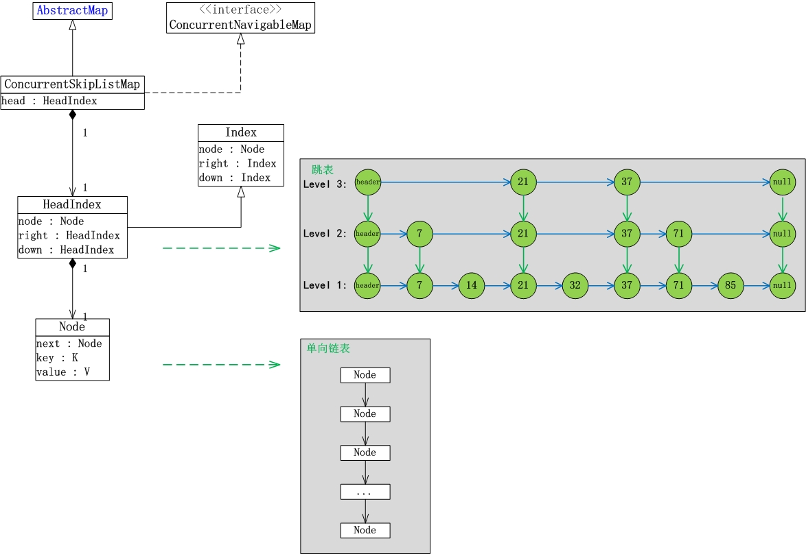

[TOC]

# JUC集合

**List的实现类主要有: LinkedList, ArrayList, Vector, Stack。**

(01) LinkedList是双向链表实现的双端队列；它不是线程安全的，只适用于单线程。
(02) ArrayList是数组实现的队列，它是一个动态数组；它也不是线程安全的，只适用于单线程。
(03) Vector是数组实现的矢量队列，它也一个动态数组；不过和ArrayList不同的是，Vector是线程安全的，它支持并发。
(04) Stack是Vector实现的栈；和Vector一样，它也是线程安全的。

 **Set的实现类主要有: HastSet和TreeSet。**

(01) HashSet是一个没有重复元素的集合，它通过HashMap实现的；HashSet不是线程安全的，只适用于单线程。
(02) TreeSet也是一个没有重复元素的集合，不过和HashSet不同的是，TreeSet中的元素是有序的；它是通过TreeMap实现的；TreeSet也不是线程安全的，只适用于单线程。

 **Map的实现类主要有: HashMap，WeakHashMap, Hashtable和TreeMap。**

(01) HashMap是存储“键-值对”的哈希表；它不是线程安全的，只适用于单线程。
(02) WeakHashMap是也是哈希表；和HashMap不同的是，HashMap的“键”是强引用类型，而WeakHashMap的“键”是弱引用类型，也就是说当WeakHashMap 中的某个键不再正常使用时，会被从WeakHashMap中被自动移除。WeakHashMap也不是线程安全的，只适用于单线程。
(03) Hashtable也是哈希表；和HashMap不同的是，Hashtable是线程安全的，支持并发。
(04) TreeMap也是哈希表，不过TreeMap中的“键-值对”是有序的，它是通过R-B Tree(红黑树)实现的；TreeMap不是线程安全的，只适用于单线程。
更多关于这些集合类的介绍，可以参考“Java 集合系列目录(Category)”。

```java
为了方便，我们将前面介绍集合类统称为”java集合包“。java集合包大多是“非线程安全的”，虽然可以通过Collections工具类中的方法获取java集合包对应的同步类，但是这些同步类的并发效率并不是很高。为了更好的支持高并发任务，并发大师Doug Lea在JUC(java.util.concurrent)包中添加了java集合包中单线程类的对应的支持高并发的类。例如，ArrayList对应的高并发类是CopyOnWriteArrayList，HashMap对应的高并发类是ConcurrentHashMap，等等。

JUC包在添加”java集合包“对应的高并发类时，为了保持API接口的一致性，使用了”Java集合包“中的框架。例如，CopyOnWriteArrayList实现了“Java集合包”中的List接口，HashMap继承了“java集合包”中的AbstractMap类，等等。得益于“JUC包使用了Java集合包中的类”，如果我们了解了Java集合包中的类的思想之后，理解JUC包中的类也相对容易；理解时，最大的难点是，对JUC包是如何添加对“高并发”的支持的！
```
```java
1. List和Set
JUC集合包中的List和Set实现类包括: CopyOnWriteArrayList, CopyOnWriteArraySet和ConcurrentSkipListSet。
(01) CopyOnWriteArrayList相当于线程安全的ArrayList，它实现了List接口。CopyOnWriteArrayList是支持高并发的。
(02) CopyOnWriteArraySet相当于线程安全的HashSet，它继承于AbstractSet类。CopyOnWriteArraySet内部包含一个CopyOnWriteArrayList对象，它是通过CopyOnWriteArrayList实现的。

2. Map
JUC集合包中Map的实现类包括: ConcurrentHashMap和ConcurrentSkipListMap。
(01) ConcurrentHashMap是线程安全的哈希表(相当于线程安全的HashMap)；它继承于AbstractMap类，并且实现ConcurrentMap接口。ConcurrentHashMap是通过“锁分段”来实现的，它支持并发。
(02) ConcurrentSkipListMap是线程安全的有序的哈希表(相当于线程安全的TreeMap); 它继承于AbstractMap类，并且实现ConcurrentNavigableMap接口。ConcurrentSkipListMap是通过“跳表”来实现的，它支持并发。
(03) ConcurrentSkipListSet是线程安全的有序的集合(相当于线程安全的TreeSet)；它继承于AbstractSet，并实现了NavigableSet接口。ConcurrentSkipListSet是通过ConcurrentSkipListMap实现的，它也支持并发。

3. Queue
JUC集合包中Queue的实现类包括: ArrayBlockingQueue, LinkedBlockingQueue, LinkedBlockingDeque, ConcurrentLinkedQueue和ConcurrentLinkedDeque。
(01) ArrayBlockingQueue是数组实现的线程安全的有界的阻塞队列。
(02) LinkedBlockingQueue是单向链表实现的(指定大小)阻塞队列，该队列按 FIFO（先进先出）排序元素。
(03) LinkedBlockingDeque是双向链表实现的(指定大小)双向并发阻塞队列，该阻塞队列同时支持FIFO和FILO两种操作方式。
(04) ConcurrentLinkedQueue是单向链表实现的无界队列，该队列按 FIFO（先进先出）排序元素。
(05) ConcurrentLinkedDeque是双向链表实现的无界队列，该队列同时支持FIFO和FILO两种操作方式。
```

# CopyOnWriteArrayList 

```java
它相当于线程安全的ArrayList。和ArrayList一样，它是个可变数组；但是和ArrayList不同的时，它具有以下特性：
1. 它最适合于具有以下特征的应用程序：List 大小通常保持很小，只读操作远多于可变操作，需要在遍历期间防止线程间的冲突。
2. 它是线程安全的。
3. 因为通常需要复制整个基础数组，所以可变操作（add()、set() 和 remove() 等等）的开销很大。
4. 迭代器支持hasNext(), next()等不可变操作，但不支持可变 remove()等操作。
5. 使用迭代器进行遍历的速度很快，并且不会与其他线程发生冲突。在构造迭代器时，迭代器依赖于不变的数组快照。
```

```
说明：
1. CopyOnWriteArrayList实现了List接口，因此它是一个队列。
2. CopyOnWriteArrayList包含了成员lock。每一个CopyOnWriteArrayList都和一个互斥锁lock绑定，通过lock，实现了对CopyOnWriteArrayList的互斥访问。
3. CopyOnWriteArrayList包含了成员array数组，这说明CopyOnWriteArrayList本质上通过数组实现的。

下面从“动态数组”和“线程安全”两个方面进一步对CopyOnWriteArrayList的原理进行说明。
1. CopyOnWriteArrayList的“动态数组”机制 -- 它内部有个“volatile数组”(array)来保持数据。在“添加/修改/删除”数据时，都会新建一个数组，并将更新后的数据拷贝到新建的数组中，最后再将该数组赋值给“volatile数组”。这就是它叫做CopyOnWriteArrayList的原因！CopyOnWriteArrayList就是通过这种方式实现的动态数组；不过正由于它在“添加/修改/删除”数据时，都会新建数组，所以涉及到修改数据的操作，CopyOnWriteArrayList效率很
低；但是单单只是进行遍历查找的话，效率比较高。
2. CopyOnWriteArrayList的“线程安全”机制 -- 是通过volatile和互斥锁来实现的。(01) CopyOnWriteArrayList是通过“volatile数组”来保存数据的。一个线程读取volatile数组时，总能看到其它线程对该volatile变量最后的写入；就这样，通过volatile提供了“读取到的数据总是最新的”这个机制的
保证。(02) CopyOnWriteArrayList通过互斥锁来保护数据。在“添加/修改/删除”数据时，会先“获取互斥锁”，再修改完毕之后，先将数据更新到“volatile数组”中，然后再“释放互斥锁”；这样，就达到了保护数据的目的。 

```

```java
// CopyOnWriteArrayList函数列表
// 创建一个空列表。
CopyOnWriteArrayList()
// 创建一个按 collection 的迭代器返回元素的顺序包含指定 collection 元素的列表。
CopyOnWriteArrayList(Collection<? extends E> c)
// CopyOnWriteArrayList(E[] toCopyIn)
// 创建一个保存给定数组的副本的列表。
// 将指定元素添加到此列表的尾部。
boolean add(E e)
// 在此列表的指定位置上插入指定元素。
void add(int index, E element)
// 按照指定 collection 的迭代器返回元素的顺序，将指定 collection 中的所有元素添加此列表的尾部。
boolean addAll(Collection<? extends E> c)
// 从指定位置开始，将指定 collection 的所有元素插入此列表。
boolean addAll(int index, Collection<? extends E> c)
// 按照指定 collection 的迭代器返回元素的顺序，将指定 collection 中尚未包含在此列表中的所有元素添加列表的尾部。
int addAllAbsent(Collection<? extends E> c)
// 添加元素（如果不存在）。
boolean addIfAbsent(E e)
// 从此列表移除所有元素。
void clear()
// 返回此列表的浅表副本。
Object clone()
// 如果此列表包含指定的元素，则返回 true。
boolean contains(Object o)
// 如果此列表包含指定 collection 的所有元素，则返回 true。
boolean containsAll(Collection<?> c)
// 比较指定对象与此列表的相等性。
boolean equals(Object o)
// 返回列表中指定位置的元素。
E get(int index)
// 返回此列表的哈希码值。
int hashCode()
// 返回第一次出现的指定元素在此列表中的索引，从 index 开始向前搜索，如果没有找到该元素，则返回 -1。
int indexOf(E e, int index)
// 返回此列表中第一次出现的指定元素的索引；如果此列表不包含该元素，则返回 -1。
int indexOf(Object o)
// 如果此列表不包含任何元素，则返回 true。
boolean isEmpty()
// 返回以恰当顺序在此列表元素上进行迭代的迭代器。
Iterator<E> iterator()
// 返回最后一次出现的指定元素在此列表中的索引，从 index 开始向后搜索，如果没有找到该元素，则返回 -1。
int lastIndexOf(E e, int index)
// 返回此列表中最后出现的指定元素的索引；如果列表不包含此元素，则返回 -1。
int lastIndexOf(Object o)
// 返回此列表元素的列表迭代器（按适当顺序）。
ListIterator<E> listIterator()
// 返回列表中元素的列表迭代器（按适当顺序），从列表的指定位置开始。
ListIterator<E> listIterator(int index)
// 移除此列表指定位置上的元素。
E remove(int index)
// 从此列表移除第一次出现的指定元素（如果存在）。
boolean remove(Object o)
// 从此列表移除所有包含在指定 collection 中的元素。
boolean removeAll(Collection<?> c)
// 只保留此列表中包含在指定 collection 中的元素。
boolean retainAll(Collection<?> c)
// 用指定的元素替代此列表指定位置上的元素。
E set(int index, E element)
// 返回此列表中的元素数。
int size()
// 返回此列表中 fromIndex（包括）和 toIndex（不包括）之间部分的视图。
List<E> subList(int fromIndex, int toIndex)
// 返回一个按恰当顺序（从第一个元素到最后一个元素）包含此列表中所有元素的数组。
Object[] toArray()
// 返回以恰当顺序（从第一个元素到最后一个元素）包含列表所有元素的数组；返回数组的运行时类型是指定数组的运行时类型。
<T> T[] toArray(T[] a)
// 返回此列表的字符串表示形式。
```

```java
1. 创建
CopyOnWriteArrayList共3个构造函数。
说明：这3个构造函数都调用了setArray()，
说明：setArray()的作用是给array赋值；其中，array是volatile transient Object[]类型，即array是“volatile数组”。
关于volatile关键字，我们知道“volatile能让变量变得可见”，即对一个volatile变量的读，总是能看到（任意线程）对这个volatile变量最后的写入。正在由于这种特性，每次更新了“volatile数组”之后，其它线程都能看到对它所做的更新。
关于transient关键字，它是在序列化中才起作用，transient变量不会被自动序列化。transient不是本文关注的重点，了解即可。
关于transient的更多内容，请参考：http://www.cnblogs.com/skywang12345/p/io_06.html

2. 添加
以add(E e)为例，来对“CopyOnWriteArrayList的添加操作”进行说明
说明：add(E e)的作用就是将数据e添加到”volatile数组“中。它的实现方式是，新建一个数组，接着将原始的”volatile数组“的数据拷贝到新数组中，然后将新增数据也添加到新数组中；最后，将新数组赋值给”volatile数组“。
在add(E e)中有两点需要关注。
	第一，在”添加操作“开始前，获取独占锁(lock)，若此时有需要线程要获取锁，则必须等待；在操作完毕后，释放独占锁(lock)，此时其它线程才能获取锁。通过独占锁，来防止多线程同时修改数据！

3. 获取
说明：get(int index)的实现很简单，就是返回”volatile数组“中的第index个元素。

4. 删除
以remove(int index)为例，来对“CopyOnWriteArrayList的删除操作”进行说明。
说明：remove(int index)的作用就是将”volatile数组“中第index个元素删除。它的实现方式是，如果被删除的是最后一个元素，则直接通过Arrays.copyOf()进行处理，而不需要新建数组。否则，新建数组，然后将”volatile数组中被删除元素之外的其它元素“拷贝到新数组中；最后，将新数组赋值给”volatile数组“。
	和add(E e)一样，remove(int index)也是”在操作之前，获取独占锁；操作完成之后，释放独占是“；并且”在操作完成时，会通过将数据更新到volatile数组中“。

5. 遍历
以iterator()为例，来对“CopyOnWriteArrayList的遍历操作”进行说明。
说明：iterator()会返回COWIterator对象。COWIterator实现额ListIterator接口，
说明：COWIterator不支持修改元素的操作。例如，对于remove(),set(),add()等操作，COWIterator都会抛出异常！
另外，需要提到的一点是，CopyOnWriteArrayList返回迭代器不会抛出ConcurrentModificationException异常，即它不是fail-fast机制的！
```

## CopyOnWriteArrayList示例

```java
import java.util.*;
import java.util.concurrent.*;
/*
 *   CopyOnWriteArrayList是“线程安全”的动态数组，而ArrayList是非线程安全的。
 *
 *   下面是“多个线程同时操作并且遍历list”的示例
 *   (01) 当list是CopyOnWriteArrayList对象时，程序能正常运行。
 *   (02) 当list是ArrayList对象时，程序会产生ConcurrentModificationException异常。
 *
 * @author skywang
 */
public class CopyOnWriteArrayListTest1 {
    // TODO: list是ArrayList对象时，程序会出错。
    //private static List<String> list = new ArrayList<String>();
    private static List<String> list = new CopyOnWriteArrayList<String>();
    public static void main(String[] args) {
        // 同时启动两个线程对list进行操作！
        new MyThread("ta").start();
        new MyThread("tb").start();
    }
    private static void printAll() {
        String value = null;
        Iterator iter = list.iterator();
        while(iter.hasNext()) {
            value = (String)iter.next();
            System.out.print(value+", ");
        }
        System.out.println();
    }
    private static class MyThread extends Thread {
        MyThread(String name) {
            super(name);
        }
        @Override
        public void run() {
                int i = 0;
            while (i++ < 6) {
                // “线程名” + "-" + "序号"
                String val = Thread.currentThread().getName()+"-"+i;
                list.add(val);
                // 通过“Iterator”遍历List。
                printAll();
            }
        }
    }
}

ta-1, tb-1, ta-1, 
tb-1, 
ta-1, ta-1, tb-1, tb-1, tb-2, 
tb-2, ta-1, ta-2, 
tb-1, ta-1, tb-2, tb-1, ta-2, tb-2, tb-3, 
ta-2, ta-1, tb-3, tb-1, ta-3, 
tb-2, ta-1, ta-2, tb-1, tb-3, tb-2, ta-3, ta-2, tb-4, 
tb-3, ta-1, ta-3, tb-1, tb-4, tb-2, ta-4, 
ta-2, ta-1, tb-3, tb-1, ta-3, tb-2, tb-4, ta-2, ta-4, tb-3, tb-5, 
ta-3, ta-1, tb-4, tb-1, ta-4, tb-2, tb-5, ta-2, ta-5, 
tb-3, ta-1, ta-3, tb-1, tb-4, tb-2, ta-4, ta-2, tb-5, tb-3, ta-5, ta-3, tb-6, 
tb-4, ta-4, tb-5, ta-5, tb-6, ta-6,

结果说明：如果将源码中的list改成ArrayList对象时，程序会产生ConcurrentModificationException异常。
```


# ConcurrentSkipListMap 

```java
ConcurrentSkipListMap是线程安全的有序的哈希表，适用于高并发的场景。
ConcurrentSkipListMap和TreeMap，它们虽然都是有序的哈希表。但是，第一，它们的线程安全机制不同，TreeMap是非线程安全的，而ConcurrentSkipListMap是线程安全的。第二，ConcurrentSkipListMap是通过跳表实现的，而TreeMap是通过红黑树实现的。
关于跳表(Skip List)，它是平衡树的一种替代的数据结构，但是和红黑树不相同的是，跳表对于树的平衡的实现是基于一种随机化的算法的，这样也就是说跳表的插入和删除的工作是比较简单的。
```



**说明**：

先以数据“7,14,21,32,37,71,85”序列为例，来对跳表进行简单说明。

跳表分为许多层(level)，每一层都可以看作是数据的索引，这些索引的意义就是加快跳表查找数据速度。每一层的数据都是有序的，上一层数据是下一层数据的子集，并且第一层(level 1)包含了全部的数据；层次越高，跳跃性越大，包含的数据越少。
跳表包含一个表头，它查找数据时，是从上往下，从左往右进行查找。现在“需要找出值为32的节点”为例，来对比说明跳表和普遍的链表。

**情况1：链表中查找“32”节点**


**情况2：跳表中查找“32”节点**


忽略索引垂直线路上路径的情况下，只需要2步(红色部分表示路径)。

```java
下面说说Java中ConcurrentSkipListMap的数据结构。
(01) ConcurrentSkipListMap继承于AbstractMap类，也就意味着它是一个哈希表。
(02) Index是ConcurrentSkipListMap的内部类，它与“跳表中的索引相对应”。HeadIndex继承于Index，ConcurrentSkipListMap中含有一个HeadIndex的对象head，head是“跳表的表头”。
(03) Index是跳表中的索引，它包含“右索引的指针(right)”，“下索引的指针(down)”和“哈希表节点node”。node是Node的对象，Node也是ConcurrentSkipListMap中的内部类。
```

```java
// ConcurrentSkipListMap函数列表
// 构造一个新的空映射，该映射按照键的自然顺序进行排序。
ConcurrentSkipListMap()
// 构造一个新的空映射，该映射按照指定的比较器进行排序。
ConcurrentSkipListMap(Comparator<? super K> comparator)
// 构造一个新映射，该映射所包含的映射关系与给定映射包含的映射关系相同，并按照键的自然顺序进行排序。
ConcurrentSkipListMap(Map<? extends K,? extends V> m)
// 构造一个新映射，该映射所包含的映射关系与指定的有序映射包含的映射关系相同，使用的顺序也相同。
ConcurrentSkipListMap(SortedMap<K,? extends V> m)
// 返回与大于等于给定键的最小键关联的键-值映射关系；如果不存在这样的条目，则返回 null。
Map.Entry<K,V> ceilingEntry(K key)
// 返回大于等于给定键的最小键；如果不存在这样的键，则返回 null。
K ceilingKey(K key)
// 从此映射中移除所有映射关系。
void clear()
// 返回此 ConcurrentSkipListMap 实例的浅表副本。
ConcurrentSkipListMap<K,V> clone()
// 返回对此映射中的键进行排序的比较器；如果此映射使用键的自然顺序，则返回 null。
Comparator<? super K> comparator()
// 如果此映射包含指定键的映射关系，则返回 true。
boolean containsKey(Object key)
// 如果此映射为指定值映射一个或多个键，则返回 true。
boolean containsValue(Object value)
// 返回此映射中所包含键的逆序 NavigableSet 视图。
NavigableSet<K> descendingKeySet()
// 返回此映射中所包含映射关系的逆序视图。
ConcurrentNavigableMap<K,V> descendingMap()
// 返回此映射中所包含的映射关系的 Set 视图。
Set<Map.Entry<K,V>> entrySet()
// 比较指定对象与此映射的相等性。
boolean equals(Object o)
// 返回与此映射中的最小键关联的键-值映射关系；如果该映射为空，则返回 null。
Map.Entry<K,V> firstEntry()
// 返回此映射中当前第一个（最低）键。
K firstKey()
// 返回与小于等于给定键的最大键关联的键-值映射关系；如果不存在这样的键，则返回 null。
Map.Entry<K,V> floorEntry(K key)
// 返回小于等于给定键的最大键；如果不存在这样的键，则返回 null。
K floorKey(K key)
// 返回指定键所映射到的值；如果此映射不包含该键的映射关系，则返回 null。
V get(Object key)
// 返回此映射的部分视图，其键值严格小于 toKey。
ConcurrentNavigableMap<K,V> headMap(K toKey)
// 返回此映射的部分视图，其键小于（或等于，如果 inclusive 为 true）toKey。
ConcurrentNavigableMap<K,V> headMap(K toKey, boolean inclusive)
// 返回与严格大于给定键的最小键关联的键-值映射关系；如果不存在这样的键，则返回 null。
Map.Entry<K,V> higherEntry(K key)
// 返回严格大于给定键的最小键；如果不存在这样的键，则返回 null。
K higherKey(K key)
// 如果此映射未包含键-值映射关系，则返回 true。
boolean isEmpty()
// 返回此映射中所包含键的 NavigableSet 视图。
NavigableSet<K> keySet()
// 返回与此映射中的最大键关联的键-值映射关系；如果该映射为空，则返回 null。
Map.Entry<K,V> lastEntry()
// 返回映射中当前最后一个（最高）键。
K lastKey()
// 返回与严格小于给定键的最大键关联的键-值映射关系；如果不存在这样的键，则返回 null。
Map.Entry<K,V> lowerEntry(K key)
// 返回严格小于给定键的最大键；如果不存在这样的键，则返回 null。
K lowerKey(K key)
// 返回此映射中所包含键的 NavigableSet 视图。
NavigableSet<K> navigableKeySet()
// 移除并返回与此映射中的最小键关联的键-值映射关系；如果该映射为空，则返回 null。
Map.Entry<K,V> pollFirstEntry()
// 移除并返回与此映射中的最大键关联的键-值映射关系；如果该映射为空，则返回 null。
Map.Entry<K,V> pollLastEntry()
// 将指定值与此映射中的指定键关联。
V put(K key, V value)
// 如果指定键已经不再与某个值相关联，则将它与给定值关联。
V putIfAbsent(K key, V value)
// 从此映射中移除指定键的映射关系（如果存在）。
V remove(Object key)
// 只有目前将键的条目映射到给定值时，才移除该键的条目。
boolean remove(Object key, Object value)
// 只有目前将键的条目映射到某一值时，才替换该键的条目。
V replace(K key, V value)
// 只有目前将键的条目映射到给定值时，才替换该键的条目。
boolean replace(K key, V oldValue, V newValue)
// 返回此映射中的键-值映射关系数。
int size()
// 返回此映射的部分视图，其键的范围从 fromKey 到 toKey。
ConcurrentNavigableMap<K,V> subMap(K fromKey, boolean fromInclusive, K toKey, boolean toInclusive)
// 返回此映射的部分视图，其键值的范围从 fromKey（包括）到 toKey（不包括）。
ConcurrentNavigableMap<K,V> subMap(K fromKey, K toKey)
// 返回此映射的部分视图，其键大于等于 fromKey。
ConcurrentNavigableMap<K,V> tailMap(K fromKey)
// 返回此映射的部分视图，其键大于（或等于，如果 inclusive 为 true）fromKey。
ConcurrentNavigableMap<K,V> tailMap(K fromKey, boolean inclusive)
// 返回此映射中所包含值的 Collection 视图。
Collection<V> values()
```

```java
1. 添加
下面以put(K key, V value)为例，对ConcurrentSkipListMap的添加方法进行说明。
实际上，put()是通过doPut()将key-value键值对添加到ConcurrentSkipListMap中的。
说明：doPut() 的作用就是将键值对添加到“跳表”中。
要想搞清doPut()，首先要弄清楚它的主干部分 —— 我们先单纯的只考虑“单线程的情况下，将key-value添加到跳表中”，即忽略“多线程相关的内容”。它的流程如下：
第1步：找到“插入位置”。
	即，找到“key的前继节点(b)”和“key的后继节点(n)”；key是要插入节点的键。
第2步：新建并插入节点。
	即，新建节点z(key对应的节点)，并将新节点z插入到“跳表”中(设置“b的后继节点为z”，“z的后继节点为n”)。
第3步：更新跳表。
	即，随机获取一个level，然后在“跳表”的第1层～第level层之间，每一层都插入节点z；在第level层之上就不再插入节点了。若level数值大于“跳表的层次”，则新建一层。

2. 删除
下面以remove(Object key)为例，对ConcurrentSkipListMap的删除方法进行说明。
实际上，remove()是通过doRemove()将ConcurrentSkipListMap中的key对应的键值对删除的。
说明：doRemove()的作用是删除跳表中的节点。
和doPut()一样，我们重点看doRemove()的主干部分，了解主干部分之后，其余部分就非常容易理解了。下面是“单线程的情况下，删除跳表中键值对的步骤”：
第1步：找到“被删除节点的位置”。
 即，找到“key的前继节点(b)”，“key所对应的节点(n)”，“n的后继节点f”；key是要删除节点的键。
第2步：删除节点。
 即，将“key所对应的节点n”从跳表中移除 -- 将“b的后继节点”设为“f”！
第3步：更新跳表。
 即，遍历跳表，删除每一层的“key节点”(如果存在的话)。如果删除“key节点”之后，跳表的层次需要-1；则执行相应的操作！
 
3. 获取
下面以get(Object key)为例，对ConcurrentSkipListMap的获取方法进行说明。
说明：doGet()是通过findNode()找到并返回节点的。
说明：findNode(key)的作用是在返回跳表中key对应的节点；存在则返回节点，不存在则返回null。
先弄清函数的主干部分，即抛开“多线程相关内容”，单纯的考虑单线程情况下，从跳表获取节点的算法。
第1步：找到“被删除节点的位置”。
	根据findPredecessor()定位key所在的层次以及找到key的前继节点(b)，然后找到b的后继节点n。
第2步：根据“key的前继节点(b)”和“key的前继节点的后继节点(n)”来定位“key对应的节点”。
	具体是通过比较“n的键值”和“key”的大小。如果相等，则n就是所要查找的键。
```

## ConcurrentSkipListMap示例

```java
import java.util.*;
import java.util.concurrent.*;
/*
 *   ConcurrentSkipListMap是“线程安全”的哈希表，而TreeMap是非线程安全的。
 *
 *   下面是“多个线程同时操作并且遍历map”的示例
 *   (01) 当map是ConcurrentSkipListMap对象时，程序能正常运行。
 *   (02) 当map是TreeMap对象时，程序会产生ConcurrentModificationException异常。
 *
 * @author skywang
 */
public class ConcurrentSkipListMapDemo1 {
    // TODO: map是TreeMap对象时，程序会出错。
    //private static Map<String, String> map = new TreeMap<String, String>();
    private static Map<String, String> map = new ConcurrentSkipListMap<String, String>();
    public static void main(String[] args) {
    
        // 同时启动两个线程对map进行操作！
        new MyThread("a").start();
        new MyThread("b").start();
    }
    private static void printAll() {
        String key, value;
        Iterator iter = map.entrySet().iterator();
        while(iter.hasNext()) {
            Map.Entry entry = (Map.Entry)iter.next();
            key = (String)entry.getKey();
            value = (String)entry.getValue();
            System.out.print("("+key+", "+value+"), ");
        }
        System.out.println();
    }
    private static class MyThread extends Thread {
        MyThread(String name) {
            super(name);
        }
        @Override
        public void run() {
                int i = 0;
            while (i++ < 6) {
                // “线程名” + "序号"
                String val = Thread.currentThread().getName()+i;
                map.put(val, "0");
                // 通过“Iterator”遍历map。
                printAll();
            }
        }
    }
}


(a1, 0), (a1, 0), (b1, 0), (b1, 0),

(a1, 0), (b1, 0), (b2, 0), 
(a1, 0), (a1, 0), (a2, 0), (a2, 0), (b1, 0), (b1, 0), (b2, 0), (b2, 0), (b3, 0), 
(b3, 0), (a1, 0), 
(a2, 0), (a3, 0), (a1, 0), (b1, 0), (a2, 0), (b2, 0), (a3, 0), (b3, 0), (b1, 0), (b4, 0), 
(b2, 0), (a1, 0), (b3, 0), (a2, 0), (b4, 0), 
(a3, 0), (a1, 0), (a4, 0), (a2, 0), (b1, 0), (a3, 0), (b2, 0), (a4, 0), (b3, 0), (b1, 0), (b4, 0), (b2, 0), (b5, 0), 
(b3, 0), (a1, 0), (b4, 0), (a2, 0), (b5, 0), 
(a3, 0), (a1, 0), (a4, 0), (a2, 0), (a5, 0), (a3, 0), (b1, 0), (a4, 0), (b2, 0), (a5, 0), (b3, 0), (b1, 0), (b4, 0), (b2, 0), (b5, 0), (b3, 0), (b6, 0), 
(b4, 0), (a1, 0), (b5, 0), (a2, 0), (b6, 0), 
(a3, 0), (a4, 0), (a5, 0), (a6, 0), (b1, 0), (b2, 0), (b3, 0), (b4, 0), (b5, 0), (b6, 0), 


结果说明：
示例程序中，启动两个线程(线程a和线程b)分别对ConcurrentSkipListMap进行操作。以线程a而言，它会先获取“线程名”+“序号”，然后将该字符串作为key，将“0”作为value，插入到ConcurrentSkipListMap中；接着，遍历并输出ConcurrentSkipListMap中的全部元素。 线程b的操作和线程a一样，只不过线程b的名字和线程a的名字不同。
当map是ConcurrentSkipListMap对象时，程序能正常运行。如果将map改为TreeMap时，程序会产生ConcurrentModificationException异常。
```

