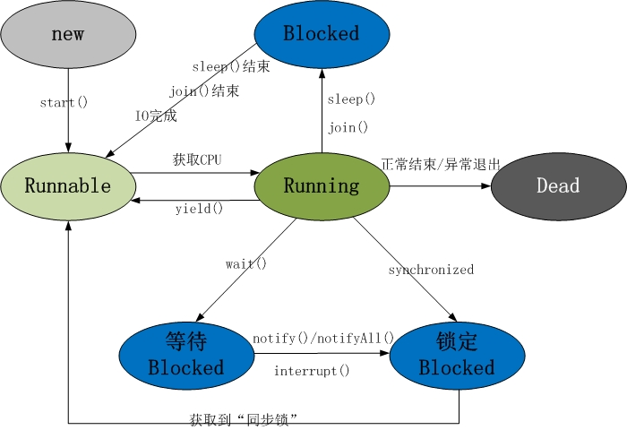

[TOC]

# 基础篇

```cmd
1. Java多线程系列目录(共43篇)-转	
	https://www.jianshu.com/p/dca27f047923
https://www.cnblogs.com/skywang12345/p/java_threads_category.html
```

线程共包括以下5种状态：

1. **新建状态(New) **: 线程对象被创建后，就进入了新建状态。例如，Thread thread = new Thread()。
2. **就绪状态(Runnable)**: 也被称为“可执行状态”。线程对象被创建后，其它线程调用了该对象的start()方法，从而来启动该线程。例如，thread.start()。处于就绪状态的线程，随时可能被CPU调度执行。
3. **运行状态(Running)**: 线程获取CPU权限进行执行。需要注意的是，线程只能从就绪状态进入到运行状态。
4. **阻塞状态(Blocked) **: 阻塞状态是线程因为某种原因放弃CPU使用权，暂时停止运行。直到线程进入就绪状态，才有机会转到运行状态。阻塞的情况分三种：
(01) **等待阻塞** -- 通过调用线程的wait()方法，让线程等待某工作的完成。
(02) **同步阻塞** -- 线程在获取synchronized同步锁失败(因为锁被其它线程所占用)，它会进入同步阻塞状态。
(03) **其他阻塞** -- 通过调用线程的sleep()或join()或发出了I/O请求时，线程会进入到阻塞状态。当sleep()状态超时、join()等待线程终止或者超时、或者I/O处理完毕时，线程重新转入就绪状态。
5. **死亡状态(Dead) **: 线程执行完了或者因异常退出了run()方法，该线程结束生命周期。

扩展：
**Object类**，定义了wait(), notify(), notifyAll()等休眠/唤醒函数。
**Thread类**，线程操作函数。例如sleep()休眠函数, interrupt()中断函数, getName()获取线程名称等。
**synchronized**关键字，区分为synchronized代码块和synchronized方法，让线程获取对象的同步锁。




# 实现多线程的两种方式 

 ```java
1. Runnable 是一个接口，该接口中只包含了一个run()方法。
   Runnable的作用，实现多线程。我们可以定义一个类A实现Runnable接口；然后，通过new Thread(new A())等方式新建线程。
2. Thread 是一个类。Thread本身就实现了Runnable接口。Thread的作用，实现多线程。
 ```

**Thread和Runnable的异同点**

```java
Thread 和 Runnable 的相同点：都是“多线程的实现方式”。
Thread 和 Runnable 的不同点：
Thread 是类，而Runnable是接口；Thread本身是实现了Runnable接口的类。我们知道“一个类只能有一个父类，但是却能实现多个接口”，因此Runnable具有更好的扩展性。
此外，Runnable还可以用于“资源的共享”。即，多个线程都是基于某一个Runnable对象建立的，它们会共享Runnable对象上的资源。//通常，建议通过“Runnable”实现多线程！
```

**Runnable的多线程示例**

```java
class MyThread implements Runnable {
    private int ticket = 10;
    public void run() {
        for (int i = 0; i < 20; i++) {
            if (this.ticket > 0) {
                System.out.println(Thread.currentThread().getName() + " 卖票：ticket" + this.ticket--);
            }
        }
    }
};

public class Test {
    public static void main(String[] args) {
        MyThread mt = new MyThread();
        // 启动3个线程t1,t2,t3(它们共用一个Runnable对象)，这3个线程一共卖10张票！
        Thread t1 = new Thread(mt);
        Thread t2 = new Thread(mt);
        Thread t3 = new Thread(mt);
        t1.start();
        t2.start();
        t3.start();
    }
}

//结果说明：
(01) 和下面“MyThread继承于Thread”不同；这里的MyThread实现了Thread接口。
(02) 主线程main创建并启动3个子线程，而且这3个子线程都是基于“mt这个Runnable对象”而创建的。运行结果是这3个子线程一共卖出了10张票。这说明它们是共享了MyThread接口的。

Thread-1 卖票：ticket10
Thread-2 卖票：ticket9
Thread-0 卖票：ticket9
Thread-2 卖票：ticket7
Thread-1 卖票：ticket8
Thread-2 卖票：ticket5
Thread-0 卖票：ticket6
Thread-2 卖票：ticket3
Thread-1 卖票：ticket4
Thread-2 卖票：ticket1
Thread-0 卖票：ticket2
```

**Thread的多线程示例**

```java
class MyThread extends Thread{
    private int ticket=5;
    public void run(){
        for(int i=0;i<20;i++){
            if(this.ticket>0){
                System.out.println(this.getName()+" 卖票：ticket"+this.ticket--);
            }
        }
    }
}

public class Test {
    public static void main(String[] args) {
        // 启动3个线程t1,t2,t3；每个线程各卖10张票！
        MyThread t1=new MyThread();
        MyThread t2=new MyThread();
        MyThread t3=new MyThread();
        t1.start();
        t2.start();
        t3.start();
    }
}

//结果说明：
(01) MyThread继承于Thread，它是自定义个线程。每个MyThread都会卖出10张票。
(02) 主线程main创建并启动3个MyThread子线程。每个子线程都各自卖出了10张票。

Thread-0 卖票：ticket5
Thread-0 卖票：ticket4
Thread-0 卖票：ticket3
Thread-0 卖票：ticket2
Thread-0 卖票：ticket1
Thread-1 卖票：ticket5
Thread-1 卖票：ticket4
Thread-1 卖票：ticket3
Thread-1 卖票：ticket2
Thread-1 卖票：ticket1
Thread-2 卖票：ticket5
Thread-2 卖票：ticket4
Thread-2 卖票：ticket3
Thread-2 卖票：ticket2
Thread-2 卖票：ticket1
```


**Thread中start()和run()的区别 **

```java
start(): 它的作用是启动一个新线程，新线程会执行相应的run()方法。start()不能被重复调用。
run(): run()就和普通的成员方法一样，可以被重复调用。单独调用run()的话，会在当前线程中执行run()，而并不会启动新线程！
```


# synchronized关键字 

**synchronized原理**

```java
在java中，每一个对象有且仅有一个同步锁。这也意味着，同步锁是依赖于对象而存在。
当我们调用某对象的synchronized方法时，就获取了该对象的同步锁。例如，synchronized(obj)就获取了“obj这个对象”的同步锁。
不同线程对同步锁的访问是互斥的。也就是说，某时间点，对象的同步锁只能被一个线程获取到！通过同步锁，我们就能在多线程中，实现对“对象/方法”的互斥访问。 例如，现在有两个线程A和线程B，它们都会访问“对象obj的同步锁”。假设，在某一时刻，线程A获取到“obj的同步锁”并在执行一些操作；而此时，线程B也企图获取“obj的同步锁” —— 线程B会获取失败，它必须等待，直到线程A释放了“该对象的同步锁”之后线程B才能获取到“obj的同步锁”从而才可以运行。
```


**synchronized基本规则**

```java
第一条: 当一个线程访问“某对象”的“synchronized方法”或者“synchronized代码块”时，其他线程对“该对象”的该“synchronized方法”或者“synchronized代码块”的访问将被阻塞。
第二条: 当一个线程访问“某对象”的“synchronized方法”或者“synchronized代码块”时，其他线程仍然可以访问“该对象”的非同步代码块。
第三条: 当一个线程访问“某对象”的“synchronized方法”或者“synchronized代码块”时，其他线程对“该对象”的其他的“synchronized方法”或者“synchronized代码块”的访问将被阻塞。
```

```java
// 第一条
class MyRunable implements Runnable {
    @Override
    public void run() {
        synchronized(this) {
            try {  
                for (int i = 0; i < 5; i++) {
                    Thread.sleep(100); // 休眠100ms
                    System.out.println(Thread.currentThread().getName() + " loop " + i);  
                }
            } catch (InterruptedException ie) {  
            }
        }  
    }
}

public class Demo1_1 {
    public static void main(String[] args) {  
        Runnable demo = new MyRunable();     // 新建“Runnable对象”
        Thread t1 = new Thread(demo, "t1");  // 新建“线程t1”, t1是基于demo这个Runnable对象
        Thread t2 = new Thread(demo, "t2");  // 新建“线程t2”, t2是基于demo这个Runnable对象
        t1.start();                          // 启动“线程t1”
        t2.start();                          // 启动“线程t2” 
    } 
}

// 结果说明：
run()方法中存在“synchronized(this)代码块”，而且t1和t2都是基于"demo这个Runnable对象"创建的线程。这就意味着，我们可以将synchronized(this)中的this看作是“demo这个Runnable对象”；因此，线程t1和t2共享“demo对象的同步锁”。所以，当一个线程运行的时候，另外一个线程必须等待“运行线程”释放“demo的同步锁”之后才能运行。

t1 loop 0
t1 loop 1
t1 loop 2
t1 loop 3
t1 loop 4
t2 loop 0
t2 loop 1
t2 loop 2
t2 loop 3
t2 loop 4
```

```java
// 第一条_续
class MyThread extends Thread {
    public MyThread(String name) {
        super(name);
    }
    @Override
    public void run() {
        synchronized(this) {
            try {  
                for (int i = 0; i < 5; i++) {
                    Thread.sleep(100); // 休眠100ms
                    System.out.println(Thread.currentThread().getName() + " loop " + i);  
                }
            } catch (InterruptedException ie) {  
            }
        }  
    }
}

public class Demo1_2 {
    public static void main(String[] args) {  
        Thread t1 = new MyThread("t1");  // 新建“线程t1”
        Thread t2 = new MyThread("t2");  // 新建“线程t2”
        t1.start();                      // 启动“线程t1”
        t2.start();                      // 启动“线程t2” 
    } 
}

// 代码说明：
比较Demo1_2 和 Demo1_1，我们发现，Demo1_2中的MyThread类是直接继承于Thread，而且t1和t2都是MyThread子线程。
幸运的是，在“Demo1_2的run()方法”也调用了synchronized(this)，正如“Demo1_1的run()方法”也调用了synchronized(this)一样！

// 结果说明：
如果这个结果一点也不令你感到惊讶，那么我相信你对synchronized和this的认识已经比较深刻了。否则的话，请继续阅读这里的分析。
synchronized(this)中的this是指“当前的类对象”，即synchronized(this)所在的类对应的当前对象。它的作用是获取“当前对象的同步锁”。
对于Demo1_2中，synchronized(this)中的this代表的是MyThread对象，而t1和t2是两个不同的MyThread对象，因此t1和t2在执行synchronized(this)时，获取的是不同对象的同步锁。对于Demo1_1对而言，synchronized(this)中的this代表的是MyRunable对象；t1和t2共同一个MyRunable对象，因此，一个线程获取了对象的同步锁，会造成另外一个线程等待。

t1 loop 0
t2 loop 0
t1 loop 1
t2 loop 1
t1 loop 2
t2 loop 2
t1 loop 3
t2 loop 3
t1 loop 4
t2 loop 4
```

```java
// 第二条
class Count {
    // 含有synchronized同步块的方法
    public void synMethod() {
        synchronized(this) {
            try {  
                for (int i = 0; i < 5; i++) {
                    Thread.sleep(100); // 休眠100ms
                    System.out.println(Thread.currentThread().getName() + " synMethod loop " + i);  
                }
            } catch (InterruptedException ie) {  
            }
        }  
    }
    // 非同步的方法
    public void nonSynMethod() {
        try {  
            for (int i = 0; i < 5; i++) {
                Thread.sleep(100);
                System.out.println(Thread.currentThread().getName() + " nonSynMethod loop " + i);  
            }
        } catch (InterruptedException ie) {  
        }
    }
}

public class Demo2 {
    public static void main(String[] args) {  
        final Count count = new Count();
        // 新建t1, t1会调用“count对象”的synMethod()方法
        Thread t1 = new Thread(
                new Runnable() {
                    @Override
                    public void run() {
                        count.synMethod();
                    }
                }, "t1");
        // 新建t2, t2会调用“count对象”的nonSynMethod()方法
        Thread t2 = new Thread(
                new Runnable() {
                    @Override
                    public void run() {
                        count.nonSynMethod();
                    }
                }, "t2");  
        t1.start();  // 启动t1
        t2.start();  // 启动t2
    } 
}

// 结果说明：
主线程中新建了两个子线程t1和t2。t1会调用count对象的synMethod()方法，该方法内含有同步块；而t2则会调用count对象的nonSynMethod()方法，该方法不是同步方法。t1运行时，虽然调用synchronized(this)获取“count的同步锁”；但是并没有造成t2的阻塞，因为t2没有用到“count”同步锁。

t1 synMethod loop 0
t2 nonSynMethod loop 0
t1 synMethod loop 1
t2 nonSynMethod loop 1
t1 synMethod loop 2
t2 nonSynMethod loop 2
t1 synMethod loop 3
t2 nonSynMethod loop 3
t1 synMethod loop 4
t2 nonSynMethod loop 4
```

```java
// 第三条
class Count {
    // 含有synchronized同步块的方法
    public void synMethod() {
        synchronized(this) {
            try {  
                for (int i = 0; i < 5; i++) {
                    Thread.sleep(100); // 休眠100ms
                    System.out.println(Thread.currentThread().getName() + " synMethod loop " + i);  
                }
            } catch (InterruptedException ie) {  
            }
        }  
    }
    // 也包含synchronized同步块的方法
    public void nonSynMethod() {
        synchronized(this) {
            try {  
                for (int i = 0; i < 5; i++) {
                    Thread.sleep(100);
                    System.out.println(Thread.currentThread().getName() + " nonSynMethod loop " + i);  
                }
            } catch (InterruptedException ie) {  
            }
        }
    }
}

public class Demo3 {
    public static void main(String[] args) {  
        final Count count = new Count();
        // 新建t1, t1会调用“count对象”的synMethod()方法
        Thread t1 = new Thread(
                new Runnable() {
                    @Override
                    public void run() {
                        count.synMethod();
                    }
                }, "t1");
        // 新建t2, t2会调用“count对象”的nonSynMethod()方法
        Thread t2 = new Thread(
                new Runnable() {
                    @Override
                    public void run() {
                        count.nonSynMethod();
                    }
                }, "t2");  
        t1.start();  // 启动t1
        t2.start();  // 启动t2
    } 
}

// 结果说明：
主线程中新建了两个子线程t1和t2。t1和t2运行时都调用synchronized(this)，这个this是Count对象(count)，而t1和t2共用count。因此，在t1运行时，t2会被阻塞，等待t1运行释放“count对象的同步锁”，t2才能运行。

t1 synMethod loop 0
t1 synMethod loop 1
t1 synMethod loop 2
t1 synMethod loop 3
t1 synMethod loop 4
t2 nonSynMethod loop 0
t2 nonSynMethod loop 1
t2 nonSynMethod loop 2
t2 nonSynMethod loop 3
t2 nonSynMethod loop 4
```


**synchronized方法 和 synchronized代码块**

```java
// synchronized方法示例
public synchronized void foo1() {
    System.out.println("synchronized methoed");
}
// synchronized代码块
public void foo2() {
    synchronized (this) {
        System.out.println("synchronized methoed");
    }
}
// synchronized代码块中的this是指当前对象。也可以将this替换成其他对象，例如将this替换成obj，则foo2()在执行synchronized(obj)时就获取的是obj的同步锁。
// synchronized代码块可以更精确的控制冲突限制访问区域，有时候表现更高效率。
```


**实例锁和全局锁**

```java
实例锁 -- 锁在某一个实例对象上。如果该类是单例，那么该锁也具有全局锁的概念。
// 实例锁对应的就是synchronized关键字。
全局锁 -- 该锁针对的是类，无论实例多少个对象，那么线程都共享该锁。
// 全局锁对应的就是static synchronized（或者是锁在该类的class或者classloader对象上）。
               
pulbic class Something {
    public synchronized void isSyncA(){}
    public synchronized void isSyncB(){}
    public static synchronized void cSyncA(){}
    public static synchronized void cSyncB(){}
}

假设，Something有两个实例x和y。分析下面4组表达式获取的锁的情况。
(01) (不能被同时访问)x.isSyncA()与x.isSyncB() 
(02) (可以同时被访问)x.isSyncA()与y.isSyncA()
(03) (不能被同时访问)x.cSyncA()与y.cSyncB()
(04) (可以被同时访问)x.isSyncA()与Something.cSyncA()
```

```java
// (01) 不能被同时访问。因为isSyncA()和isSyncB()都是访问同一个对象(对象x)的同步锁！
// LockTest1.java的源码
class Something {
    public synchronized void isSyncA(){
        try {  
            for (int i = 0; i < 5; i++) {
                Thread.sleep(100); // 休眠100ms
                System.out.println(Thread.currentThread().getName()+" : isSyncA");
            }
        }catch (InterruptedException ie) {  
        }  
    }
    public synchronized void isSyncB(){
        try {  
            for (int i = 0; i < 5; i++) {
                Thread.sleep(100); // 休眠100ms
                System.out.println(Thread.currentThread().getName()+" : isSyncB");
            }
        }catch (InterruptedException ie) {  
        }  
    }
}

public class LockTest1 {
    Something x = new Something();
    Something y = new Something();
    // 比较(01) x.isSyncA()与x.isSyncB() 
    private void test1() {
        // 新建t11, t11会调用 x.isSyncA()
        Thread t11 = new Thread(
                new Runnable() {
                    @Override
                    public void run() {
                        x.isSyncA();
                    }
                }, "t11");
        // 新建t12, t12会调用 x.isSyncB()
        Thread t12 = new Thread(
                new Runnable() {
                    @Override
                    public void run() {
                        x.isSyncB();
                    }
                }, "t12");  
        t11.start();  // 启动t11
        t12.start();  // 启动t12
    }
    public static void main(String[] args) {
        LockTest1 demo = new LockTest1();
        demo.test1();
    }
}

t11 : isSyncA
t11 : isSyncA
t11 : isSyncA
t11 : isSyncA
t11 : isSyncA
t12 : isSyncB
t12 : isSyncB
t12 : isSyncB
t12 : isSyncB
t12 : isSyncB
```

```java
// (02) 可以同时被访问。因为访问的不是同一个对象的同步锁，x.isSyncA()访问的是x的同步锁，而y.isSyncA()访问的是y的同步锁。

// LockTest2.java的源码
class Something {
    public synchronized void isSyncA(){
        try {  
            for (int i = 0; i < 5; i++) {
                Thread.sleep(100); // 休眠100ms
                System.out.println(Thread.currentThread().getName()+" : isSyncA");
            }
        }catch (InterruptedException ie) {  
        }  
    }
    public synchronized void isSyncB(){
        try {  
            for (int i = 0; i < 5; i++) {
                Thread.sleep(100); // 休眠100ms
                System.out.println(Thread.currentThread().getName()+" : isSyncB");
            }
        }catch (InterruptedException ie) {  
        }  
    }
    public static synchronized void cSyncA(){
        try {  
            for (int i = 0; i < 5; i++) {
                Thread.sleep(100); // 休眠100ms
                System.out.println(Thread.currentThread().getName()+" : cSyncA");
            } 
        }catch (InterruptedException ie) {  
        }  
    }
    public static synchronized void cSyncB(){
        try {  
            for (int i = 0; i < 5; i++) {
                Thread.sleep(100); // 休眠100ms
                System.out.println(Thread.currentThread().getName()+" : cSyncB");
            } 
        }catch (InterruptedException ie) {  
        }  
    }
}

public class LockTest2 {
    Something x = new Something();
    Something y = new Something();
    // 比较(02) x.isSyncA()与y.isSyncA()
    private void test2() {
        // 新建t21, t21会调用 x.isSyncA()
        Thread t21 = new Thread(
                new Runnable() {
                    @Override
                    public void run() {
                        x.isSyncA();
                    }
                }, "t21");
        // 新建t22, t22会调用 x.isSyncB()
        Thread t22 = new Thread(
                new Runnable() {
                    @Override
                    public void run() {
                        y.isSyncA();
                    }
                }, "t22");  
        t21.start();  // 启动t21
        t22.start();  // 启动t22
    }
    public static void main(String[] args) {
        LockTest2 demo = new LockTest2();
        demo.test2();
    }
}

t21 : isSyncA
t22 : isSyncA
t21 : isSyncA
t22 : isSyncA
t21 : isSyncA
t22 : isSyncA
t21 : isSyncA
t22 : isSyncA
t21 : isSyncA
t22 : isSyncA
```

```java
// (03) 不能被同时访问。因为cSyncA()和cSyncB()都是static类型，x.cSyncA()相当于Something.isSyncA()，y.cSyncB()相当于Something.isSyncB()，因此它们共用一个同步锁，不能被同时访问。
// LockTest3.java的源码
class Something {
    public synchronized void isSyncA(){
        try {  
            for (int i = 0; i < 5; i++) {
                Thread.sleep(100); // 休眠100ms
                System.out.println(Thread.currentThread().getName()+" : isSyncA");
            }
        }catch (InterruptedException ie) {  
        }  
    }
    public synchronized void isSyncB(){
        try {  
            for (int i = 0; i < 5; i++) {
                Thread.sleep(100); // 休眠100ms
                System.out.println(Thread.currentThread().getName()+" : isSyncB");
            }
        }catch (InterruptedException ie) {  
        }  
    }
    public static synchronized void cSyncA(){
        try {  
            for (int i = 0; i < 5; i++) {
                Thread.sleep(100); // 休眠100ms
                System.out.println(Thread.currentThread().getName()+" : cSyncA");
            } 
        }catch (InterruptedException ie) {  
        }  
    }
    public static synchronized void cSyncB(){
        try {  
            for (int i = 0; i < 5; i++) {
                Thread.sleep(100); // 休眠100ms
                System.out.println(Thread.currentThread().getName()+" : cSyncB");
            } 
        }catch (InterruptedException ie) {  
        }  
    }
}

public class LockTest3 {
    Something x = new Something();
    Something y = new Something();
    // 比较(03) x.cSyncA()与y.cSyncB()
    private void test3() {
        // 新建t31, t31会调用 x.isSyncA()
        Thread t31 = new Thread(
                new Runnable() {
                    @Override
                    public void run() {
                        x.cSyncA();
                    }
                }, "t31");
        // 新建t32, t32会调用 x.isSyncB()
        Thread t32 = new Thread(
                new Runnable() {
                    @Override
                    public void run() {
                        y.cSyncB();
                    }
                }, "t32");  
        t31.start();  // 启动t31
        t32.start();  // 启动t32
    }

    public static void main(String[] args) {
        LockTest3 demo = new LockTest3();
        demo.test3();
    }
}

t31 : cSyncA
t31 : cSyncA
t31 : cSyncA
t31 : cSyncA
t31 : cSyncA
t32 : cSyncB
t32 : cSyncB
t32 : cSyncB
t32 : cSyncB
t32 : cSyncB
```

```java
// (04) 可以被同时访问。因为isSyncA()是实例方法，x.isSyncA()使用的是对象x的锁；而cSyncA()是静态方法，Something.cSyncA()可以理解对使用的是“类的锁”。因此，它们是可以被同时访问的。
// LockTest4.java的源码
class Something {
    public synchronized void isSyncA(){
        try {  
            for (int i = 0; i < 5; i++) {
                Thread.sleep(100); // 休眠100ms
                System.out.println(Thread.currentThread().getName()+" : isSyncA");
            }
        }catch (InterruptedException ie) {  
        }  
    }
    public synchronized void isSyncB(){
        try {  
            for (int i = 0; i < 5; i++) {
                Thread.sleep(100); // 休眠100ms
                System.out.println(Thread.currentThread().getName()+" : isSyncB");
            }
        }catch (InterruptedException ie) {  
        }  
    }
    public static synchronized void cSyncA(){
        try {  
            for (int i = 0; i < 5; i++) {
                Thread.sleep(100); // 休眠100ms
                System.out.println(Thread.currentThread().getName()+" : cSyncA");
            } 
        }catch (InterruptedException ie) {  
        }  
    }
    public static synchronized void cSyncB(){
        try {  
            for (int i = 0; i < 5; i++) {
                Thread.sleep(100); // 休眠100ms
                System.out.println(Thread.currentThread().getName()+" : cSyncB");
            } 
        }catch (InterruptedException ie) {  
        }  
    }
}

public class LockTest4 {
    Something x = new Something();
    Something y = new Something();
    // 比较(04) x.isSyncA()与Something.cSyncA()
    private void test4() {
        // 新建t41, t41会调用 x.isSyncA()
        Thread t41 = new Thread(
                new Runnable() {
                    @Override
                    public void run() {
                        x.isSyncA();
                    }
                }, "t41");
        // 新建t42, t42会调用 x.isSyncB()
        Thread t42 = new Thread(
                new Runnable() {
                    @Override
                    public void run() {
                        Something.cSyncA();
                    }
                }, "t42");  
        t41.start();  // 启动t41
        t42.start();  // 启动t42
    }
    public static void main(String[] args) {
        LockTest4 demo = new LockTest4();
        demo.test4();
    }
}

t41 : isSyncA
t42 : cSyncA
t41 : isSyncA
t42 : cSyncA
t41 : isSyncA
t42 : cSyncA
t41 : isSyncA
t42 : cSyncA
t41 : isSyncA
t42 : cSyncA
```


# 线程等待与唤醒 

**wait(), notify(), notifyAll()等方法介绍**

Object类中关于等待/唤醒的API详细信息如下：
**notify()**  -- 唤醒在此对象监视器上等待的单个线程。
**notifyAll()**  -- 唤醒在此对象监视器上等待的所有线程。
**wait()** -- 当前线程处于“等待(阻塞)状态”，“直到其他线程调用此对象的 notify() 方法或 notifyAll() 方法”，当前线程被唤醒(进入“就绪状态”)。
**wait(long timeout)** -- 让当前线程处于“等待(阻塞)状态”，“直到其他线程调用此对象的 notify() 方法或 notifyAll() 方法，或者超过指定的时间量”，当前线程被唤醒(进入“就绪状态”)。
**wait(long timeout, int nanos)**  -- 让当前线程处于“等待(阻塞)状态”，“直到其他线程调用此对象的 notify() 方法或 notifyAll() 方法，或者其他某个线程中断当前线程，或者已超过某个实际时间量”，当前线程被唤醒(进入“就绪状态”)。

**wait()和notify()示例**

```java
// WaitTest.java的源码
class ThreadA extends Thread{
    public ThreadA(String name) {
        super(name);
    }
    public void run() {
        synchronized (this) {
            System.out.println(Thread.currentThread().getName()+" call notify()");
            // 唤醒当前的wait线程
            notify();
        }
    }
}
public class WaitTest {
    public static void main(String[] args) {
        ThreadA t1 = new ThreadA("t1");
        synchronized(t1) {
            try {
                // 启动“线程t1”
                System.out.println(Thread.currentThread().getName()+" start t1");
                t1.start();
                // 主线程等待t1通过notify()唤醒。
                System.out.println(Thread.currentThread().getName()+" wait()");
                t1.wait();
                System.out.println(Thread.currentThread().getName()+" continue");
            } catch (InterruptedException e) {
                e.printStackTrace();
            }
        }
    }
}

main start t1
main wait()
t1 call notify()
main continue

// 结果说明：
如下图，说明了“主线程”和“线程t1”的流程。
(01) 注意，图中"主线程" 代表“主线程main”。"线程t1" 代表WaitTest中启动的“线程t1”。 而“锁” 代表“t1这个对象的同步锁”。
(02) “主线程”通过 new ThreadA("t1") 新建“线程t1”。随后通过synchronized(t1)获取“t1对象的同步锁”。然后调用t1.start()启动“线程t1”。
(03) “主线程”执行t1.wait() 释放“t1对象的锁”并且进入“等待(阻塞)状态”。等待t1对象上的线程通过notify() 或 notifyAll()将其唤醒。
(04) “线程t1”运行之后，通过synchronized(this)获取“当前对象的锁”；接着调用notify()唤醒“当前对象上的等待线程”，也就是唤醒“主线程”。
(05) “线程t1”运行完毕之后，释放“当前对象的锁”。紧接着，“主线程”获取“t1对象的锁”，然后接着运行。

```

[](https://images0.cnblogs.com/blog/497634/201312/18183712-f04899f92aaa43b6a33a85fecfa60a9d.png)

jdk文档中关于wait的一段介绍：

```java
Causes the current thread to wait until another thread invokes the notify() method or the notifyAll() method for this object. 
In other words, this method behaves exactly as if it simply performs the call wait(0).
The current thread must own this object's monitor. The thread releases ownership of this monitor and waits until another thread notifies threads waiting on this object's monitor to wake up either through a call to the notify method or the notifyAll method. The thread then waits until it can re-obtain ownership of the monitor and resumes execution.
引起“当前线程”等待，直到另外一个线程调用notify()或notifyAll()唤醒该线程。换句话说，这个方法和wait(0)的效果一样！(补充，对于wait(long millis)方法，当millis为0时，表示无限等待，直到被notify()或notifyAll()唤醒)。
“当前线程”在调用wait()时，必须拥有该对象的同步锁。该线程调用wait()之后，会释放该锁；然后一直等待直到“其它线程”调用对象的同步锁的notify()或notifyAll()方法。然后，该线程继续等待直到它重新获取“该对象的同步锁”，然后就可以接着运行。
注意：jdk的解释中，说wait()的作用是让“当前线程”等待，而“当前线程”是指正在cpu上运行的线程！
这也意味着，虽然t1.wait()是通过“线程t1”调用的wait()方法，但是调用t1.wait()的地方是在“主线程main”中。而主线程必须是“当前线程”，也就是运行状态，才可以执行t1.wait()。所以，此时的“当前线程”是“主线程main”！因此，t1.wait()是让“主线程”等待，而不是“线程t1”！
```

**wait(long timeout)和notify()**

```java
wait(long timeout)会让当前线程处于“等待(阻塞)状态”，“直到其他线程调用此对象的 notify() 方法或 notifyAll() 方法，或者超过指定的时间量”，当前线程被唤醒(进入“就绪状态”)。
// WaitTimeoutTest.java的源码
class ThreadA extends Thread{
    public ThreadA(String name) {
        super(name);
    }
    public void run() {
        System.out.println(Thread.currentThread().getName() + " run ");
        // 死循环，不断运行。
        while(true)
            ;
    }
}
public class WaitTimeoutTest {
    public static void main(String[] args) {
        ThreadA t1 = new ThreadA("t1");
        synchronized(t1) {
            try {
                // 启动“线程t1”
                System.out.println(Thread.currentThread().getName() + " start t1");
                t1.start();
                // 主线程等待t1通过notify()唤醒 或 notifyAll()唤醒，或超过3000ms延时；然后才被唤醒。
                System.out.println(Thread.currentThread().getName() + " call wait ");
                t1.wait(3000);
                System.out.println(Thread.currentThread().getName() + " continue");
            } catch (InterruptedException e) {
                e.printStackTrace();
            }
        }
    }
}

main start t1
main call wait 
t1 run                  // 大约3秒之后...输出“main continue”
main continue
    
// 结果说明：
如下图，说明了“主线程”和“线程t1”的流程。
(01) 注意，图中"主线程" 代表WaitTimeoutTest主线程(即，线程main)。"线程t1" 代表WaitTest中启动的线程t1。 而“锁” 代表“t1这个对象的同步锁”。
(02) 主线程main执行t1.start()启动“线程t1”。
(03) 主线程main执行t1.wait(3000)，此时，主线程进入“阻塞状态”。需要“用于t1对象锁的线程通过notify() 或者 notifyAll()将其唤醒” 或者 “超时3000ms之后”，主线程main才进入到“就绪状态”，然后才可以运行。
(04) “线程t1”运行之后，进入了死循环，一直不断的运行。
(05) 超时3000ms之后，主线程main会进入到“就绪状态”，然后接着进入“运行状态”。
```

[](https://images0.cnblogs.com/blog/497634/201312/18183848-d4c16bf2760847afa4fede6a9d959083.png)

**wait() 和 notifyAll()**

```java
public class NotifyAllTest {
    private static Object obj = new Object();
    public static void main(String[] args) {
        ThreadA t1 = new ThreadA("t1");
        ThreadA t2 = new ThreadA("t2");
        ThreadA t3 = new ThreadA("t3");
        t1.start();
        t2.start();
        t3.start();
        try {
            System.out.println(Thread.currentThread().getName()+" sleep(3000)");
            Thread.sleep(3000);
        } catch (InterruptedException e) {
            e.printStackTrace();
        }
        synchronized(obj) {
            // 主线程等待唤醒。
            System.out.println(Thread.currentThread().getName()+" notifyAll()");
            obj.notifyAll();
        }
    }
    static class ThreadA extends Thread{
        public ThreadA(String name){
            super(name);
        }
        public void run() {
            synchronized (obj) {
                try {
                    // 打印输出结果
                    System.out.println(Thread.currentThread().getName() + " wait");
                    // 唤醒当前的wait线程
                    obj.wait();
                    // 打印输出结果
                    System.out.println(Thread.currentThread().getName() + " continue");
                } catch (InterruptedException e) {
                    e.printStackTrace();
                }
            }
        }
    }
}

t1 wait
main sleep(3000)
t3 wait
t2 wait
main notifyAll()
t2 continue
t3 continue
t1 continue

// 结果说明：
参考下面的流程图。 
(01) 主线程中新建并且启动了3个线程"t1", "t2"和"t3"。
(02) 主线程通过sleep(3000)休眠3秒。在主线程休眠3秒的过程中，我们假设"t1", "t2"和"t3"这3个线程都运行了。以"t1"为例，当它运行的时候，它会执行obj.wait()等待其它线程通过notify()或额nofityAll()来唤醒它；相同的道理，"t2"和"t3"也会等待其它线程通过nofity()或nofityAll()来唤醒它们。
(03) 主线程休眠3秒之后，接着运行。执行 obj.notifyAll() 唤醒obj上的等待线程，即唤醒"t1", "t2"和"t3"这3个线程。 紧接着，主线程的synchronized(obj)运行完毕之后，主线程释放“obj锁”。这样，"t1", "t2"和"t3"就可以获取“obj锁”而继续运行了！
```

[](https://images0.cnblogs.com/blog/497634/201312/18183923-95275c066212410f96181704a681f453.png)

Object中的wait(), notify()等函数，和synchronized一样，会对“对象的同步锁”进行操作。

wait()会使“当前线程”等待，因为线程进入等待状态，所以线程应该释放它锁持有的“同步锁”，否则其它线程获取不到该“同步锁”而无法运行！
OK，线程调用wait()之后，会释放它锁持有的“同步锁”；而且，根据前面的介绍，我们知道：等待线程可以被notify()或notifyAll()唤醒。现在，请思考一个问题：notify()是依据什么唤醒等待线程的？或者说，wait()等待线程和notify()之间是通过什么关联起来的？答案是：依据“对象的同步锁”。

负责唤醒等待线程的那个线程(我们称为“**唤醒线程**”)，它只有在获取“该对象的同步锁”(**这里的同步锁必须和等待线程的同步锁是同一个**)，并且调用notify()或notifyAll()方法之后，才能唤醒等待线程。虽然，等待线程被唤醒；但是，它不能立刻执行，因为唤醒线程还持有“该对象的同步锁”。必须等到唤醒线程释放了“对象的同步锁”之后，等待线程才能获取到“对象的同步锁”进而继续运行。

总之，notify(), wait()依赖于“同步锁”，而“同步锁”是对象锁持有，并且每个对象有且仅有一个！这就是为什么notify(), wait()等函数定义在Object类，而不是Thread类中的原因。


# 线程让步yield() 

yield()的作用是让步。它能让当前线程由“运行状态”进入到“就绪状态”，从而让其它具有相同优先级的等待线程获取执行权；但是，并不能保证在当前线程调用yield()之后，其它具有相同优先级的线程就一定能获得执行权；也有可能是当前线程又进入到“运行状态”继续运行！

```java
// YieldTest.java的源码
class ThreadA extends Thread{
    public ThreadA(String name){ 
        super(name); 
    } 
    public synchronized void run(){ 
        for(int i=0; i <10; i++){ 
            System.out.printf("%s [%d]:%d\n", this.getName(), this.getPriority(), i); 
            // i整除4时，调用yield
            if (i%4 == 0)
                Thread.yield();
        } 
    } 
} 
public class YieldTest{ 
    public static void main(String[] args){ 
        ThreadA t1 = new ThreadA("t1"); 
        ThreadA t2 = new ThreadA("t2"); 
        t1.start(); 
        t2.start();
    } 
}

// 结果说明：
“线程t1”在能被4整数的时候，并没有切换到“线程t2”。这表明，yield()虽然可以让线程由“运行状态”进入到“就绪状态”；但是，它不一定会让其它线程获取CPU执行权(即，其它线程进入到“运行状态”)，即使这个“其它线程”与当前调用yield()的线程具有相同的优先级。

t1 [5]:0
t2 [5]:0
t1 [5]:1
t1 [5]:2
t1 [5]:3
t1 [5]:4
t1 [5]:5
t1 [5]:6
t1 [5]:7
t1 [5]:8
t1 [5]:9
t2 [5]:1
t2 [5]:2
t2 [5]:3
t2 [5]:4
t2 [5]:5
t2 [5]:6
t2 [5]:7
t2 [5]:8
t2 [5]:9
```


**yield() 与 wait()的比较**

[wait()](http://www.cnblogs.com/skywang12345/p/3479224.html)的作用是让当前线程由“运行状态”进入“等待(阻塞)状态”的同时，也会释放同步锁。而yield()的作用是让步，它也会让当前线程离开“运行状态”。它们的区别是：
(01) wait()是让线程由“运行状态”进入到“等待(阻塞)状态”，而不yield()是让线程由“运行状态”进入到“就绪状态”。
(02) wait()是会线程释放它所持有对象的同步锁，而yield()方法不会释放锁。

```java
// 下面通过示例演示yield()是不会释放锁的。
// YieldLockTest.java 的源码
public class YieldLockTest{ 
    private static Object obj = new Object();
    public static void main(String[] args){ 
        ThreadA t1 = new ThreadA("t1"); 
        ThreadA t2 = new ThreadA("t2"); 
        t1.start(); 
        t2.start();
    } 
    static class ThreadA extends Thread{
        public ThreadA(String name){ 
            super(name); 
        } 
        public void run(){ 
            // 获取obj对象的同步锁
            synchronized (obj) {
                for(int i=0; i <10; i++){ 
                    System.out.printf("%s [%d]:%d\n", this.getName(), this.getPriority(), i); 
                    // i整除4时，调用yield
                    if (i%4 == 0)
                        Thread.yield();
                }
            }
        } 
    } 
}

// 结果说明：
主线程main中启动了两个线程t1和t2。t1和t2在run()会引用同一个对象的同步锁，即synchronized(obj)。在t1运行过程中，虽然它会调用Thread.yield()；但是，t2是不会获取cpu执行权的。因为，t1并没有释放“obj所持有的同步锁”！

t1 [5]:0
t1 [5]:1
t1 [5]:2
t1 [5]:3
t1 [5]:4
t1 [5]:5
t1 [5]:6
t1 [5]:7
t1 [5]:8
t1 [5]:9
t2 [5]:0
t2 [5]:1
t2 [5]:2
t2 [5]:3
t2 [5]:4
t2 [5]:5
t2 [5]:6
t2 [5]:7
t2 [5]:8
t2 [5]:9
```


# 线程休眠sleep() 

sleep() 定义在Thread.java中。
sleep() 的作用是让当前线程休眠，即当前线程会从“[运行状态](http://www.cnblogs.com/skywang12345/p/3479024.html)”进入到“[休眠(阻塞)状态](http://www.cnblogs.com/skywang12345/p/3479024.html)”。sleep()会指定休眠时间，线程休眠的时间会大于/等于该休眠时间；在线程重新被唤醒时，它会由“[阻塞状态](http://www.cnblogs.com/skywang12345/p/3479024.html)”变成“[就绪状态](http://www.cnblogs.com/skywang12345/p/3479024.html)”，从而等待cpu的调度执行。

```java
// SleepTest.java的源码
class ThreadA extends Thread{
    public ThreadA(String name){ 
        super(name); 
    } 
    public synchronized void run() { 
        try {
            for(int i=0; i <10; i++){ 
                System.out.printf("%s: %d\n", this.getName(), i); 
                // i能被4整除时，休眠100毫秒
                if (i%4 == 0)
                    Thread.sleep(100);
            } 
        } catch (InterruptedException e) {
            e.printStackTrace();
        }
    } 
} 
public class SleepTest{ 
    public static void main(String[] args){ 
        ThreadA t1 = new ThreadA("t1"); 
        t1.start(); 
    } 
}

// 结果说明：
程序比较简单，在主线程main中启动线程t1。t1启动之后，当t1中的计算i能被4整除时，t1会通过Thread.sleep(100)休眠100毫秒。

t1: 0
t1: 1
t1: 2
t1: 3
t1: 4
t1: 5
t1: 6
t1: 7
t1: 8
t1: 9
```

**sleep() 与 wait()的比较**

wait()的作用是让当前线程由“运行状态”进入“等待(阻塞)状态”的同时，也会释放同步锁。而sleep()的作用是也是让当前线程由“运行状态”进入到“休眠(阻塞)状态”。
但是，wait()会释放对象的同步锁，而sleep()则不会释放锁。

```java
// SleepLockTest.java的源码
public class SleepLockTest{ 
    private static Object obj = new Object();
    public static void main(String[] args){ 
        ThreadA t1 = new ThreadA("t1"); 
        ThreadA t2 = new ThreadA("t2"); 
        t1.start(); 
        t2.start();
    } 
    static class ThreadA extends Thread{
        public ThreadA(String name){ 
            super(name); 
        } 
        public void run(){ 
            // 获取obj对象的同步锁
            synchronized (obj) {
                try {
                    for(int i=0; i <10; i++){ 
                        System.out.printf("%s: %d\n", this.getName(), i); 
                        // i能被4整除时，休眠100毫秒
                        if (i%4 == 0)
                            Thread.sleep(100);
                    }
                } catch (InterruptedException e) {
                    e.printStackTrace();
                }
            }
        } 
    } 
}

// 结果说明：
主线程main中启动了两个线程t1和t2。t1和t2在run()会引用同一个对象的同步锁，即synchronized(obj)。在t1运行过程中，虽然它会调用Thread.sleep(100)；但是，t2是不会获取cpu执行权的。因为，t1并没有释放“obj所持有的同步锁”！
注意，若我们注释掉synchronized (obj)后再次执行该程序，t1和t2是可以相互切换的。

t1: 0
t1: 1
t1: 2
t1: 3
t1: 4
t1: 5
t1: 6
t1: 7
t1: 8
t1: 9
t2: 0
t2: 1
t2: 2
t2: 3
t2: 4
t2: 5
t2: 6
t2: 7
t2: 8
t2: 9
```


# join() 方法

join() 的作用：让“主线程”等待“子线程”结束之后才能继续运行。

```java
// 主线程
public class Father extends Thread {
    public void run() {
        Son s = new Son();
        s.start();
        s.join();
        ...
    }
}
// 子线程
public class Son extends Thread {
    public void run() {
        ...
    }
}

// 说明：
上面的有两个类Father(主线程类)和Son(子线程类)。因为Son是在Father中创建并启动的，所以，Father是主线程类，Son是子线程类。
在Father主线程中，通过new Son()新建“子线程s”。接着通过s.start()启动“子线程s”，并且调用s.join()。在调用s.join()之后，Father主线程会一直等待，直到“子线程s”运行完毕；在“子线程s”运行完毕之后，Father主线程才能接着运行。 这也就是我们所说的“join()的作用，是让主线程会等待子线程结束之后才能继续运行”！

// 问题：
虽然s.join()被调用的地方是发生在“Father主线程”中，但是s.join()是通过“子线程s”去调用的join()。那么，join()方法中的isAlive()应该是判断“子线程s”是不是Alive状态；对应的wait(0)也应该是“让子线程s”等待才对。但如果是这样的话，s.join()的作用怎么可能是“让主线程等待，直到子线程s完成为止”呢，应该是让"子线程等待才对(因为调用子线程对象s的wait方法嘛)"？
答案：wait()的作用是让“当前线程”等待，而这里的“当前线程”是指当前在CPU上运行的线程。所以，虽然是调用子线程的wait()方法，但是它是通过“主线程”去调用的；所以，休眠的是主线程，而不是“子线程”！
```

```java
// JoinTest.java的源码
public class JoinTest{ 
    public static void main(String[] args){ 
        try {
            ThreadA t1 = new ThreadA("t1"); // 新建“线程t1”
            t1.start();                     // 启动“线程t1”
            t1.join();                        // 将“线程t1”加入到“主线程main”中，并且“主线程main()会等待它的完成”
            System.out.printf("%s finish\n", Thread.currentThread().getName()); 
        } catch (InterruptedException e) {
            e.printStackTrace();
        }
    } 

    static class ThreadA extends Thread{
        public ThreadA(String name){ 
            super(name); 
        } 
        public void run(){ 
            System.out.printf("%s start\n", this.getName()); 
            // 延时操作
            for(int i=0; i <1000000; i++) ;
            System.out.printf("%s finish\n", this.getName()); 
        } 
    } 
}

// 结果说明：
运行流程如图 
(01) 在“主线程main”中通过 new ThreadA("t1") 新建“线程t1”。 接着，通过 t1.start() 启动“线程t1”，并执行t1.join()。
(02) 执行t1.join()之后，“主线程main”会进入“阻塞状态”等待t1运行结束。“子线程t1”结束之后，会唤醒“主线程main”，“主线程”重新获取cpu执行权，继续运行。

t1 start
t1 finish
main finish
```

[](https://images0.cnblogs.com/blog/497634/201312/18184312-a72a58e2bda54b17bf669f325ecda377.png)


# interrupt()和线程终止方式 

```java
// 关于interrupt()，java的djk文档描述如下：http://docs.oracle.com/javase/7/docs/api/
Interrupts this thread.
Unless the current thread is interrupting itself, which is always permitted, the checkAccess method of this thread is invoked, which may cause a SecurityException to be thrown.
If this thread is blocked in an invocation of the wait(), wait(long), or wait(long, int) methods of the Object class, or of the join(), join(long), join(long, int), sleep(long), or sleep(long, int), methods of this class, then its interrupt status will be cleared and it will receive an InterruptedException.
If this thread is blocked in an I/O operation upon an interruptible channel then the channel will be closed, the thread's interrupt status will be set, and the thread will receive a ClosedByInterruptException.
If this thread is blocked in a Selector then the thread's interrupt status will be set and it will return immediately from the selection operation, possibly with a non-zero value, just as if the selector's wakeup method were invoked.
If none of the previous conditions hold then this thread's interrupt status will be set.
Interrupting a thread that is not alive need not have any effect.

interrupt()的作用是中断本线程。
本线程中断自己是被允许的；其它线程调用本线程的interrupt()方法时，会通过checkAccess()检查权限。这有可能抛出SecurityException异常。
如果本线程是处于阻塞状态：调用线程的wait(), wait(long)或wait(long, int)会让它进入等待(阻塞)状态，或者调用线程的join(), join(long), join(long, int), sleep(long), sleep(long, int)也会让它进入阻塞状态。若线程在阻塞状态时，调用了它的interrupt()方法，那么它的“中断状态”会被清除并且会收到一个InterruptedException异常。例如，线程通过wait()进入阻塞状态，此时通过interrupt()中断该线程；调用interrupt()会立即将线程的中断标记设为“true”，但是由于线程处于阻塞状态，所以该“中断标记”会立即被清除为“false”，同时，会产生一个InterruptedException的异常。
如果线程被阻塞在一个Selector选择器中，那么通过interrupt()中断它时；线程的中断标记会被设置为true，并且它会立即从选择操作中返回。
如果不属于前面所说的情况，那么通过interrupt()中断线程时，它的中断标记会被设置为“true”。
中断一个“已终止的线程”不会产生任何操作。
```

**终止线程的方式**

Thread中的stop()和suspend()方法，由于固有的不安全性，已经建议不再使用！

**终止处于“阻塞状态”的线程**

```java
通常，我们通过“中断”方式终止处于“阻塞状态”的线程。
当线程由于被调用了sleep(), wait(), join()等方法而进入阻塞状态；若此时调用线程的interrupt()将线程的中断标记设为true。由于处于阻塞状态，中断标记会被清除，同时产生一个InterruptedException异常。将InterruptedException放在适当的为止就能终止线程，形式如下：

@Override
public void run() {
    try {
        while (true) {
            // 执行任务...
        }
    } catch (InterruptedException ie) {  
        // 由于产生InterruptedException异常，退出while(true)循环，线程终止！
    }
}

说明：在while(true)中不断的执行任务，当线程处于阻塞状态时，调用线程的interrupt()产生InterruptedException中断。中断的捕获在while(true)之外，这样就退出了while(true)循环！
注意：对InterruptedException的捕获务一般放在while(true)循环体的外面，这样，在产生异常时就退出了while(true)循环。否则，InterruptedException在while(true)循环体之内，就需要额外的添加退出处理。
```

**终止处于“运行状态”的线程**

```java
通常，我们通过“标记”方式终止处于“运行状态”的线程。其中，包括“中断标记”和“额外添加标记”。
// (01) 通过“中断标记”终止线程。
@Override
public void run() {
    while (!isInterrupted()) {
        // 执行任务...
    }
}
说明：isInterrupted()是判断线程的中断标记是不是为true。当线程处于运行状态，并且我们需要终止它时；可以调用线程的interrupt()方法，使用线程的中断标记为true，即isInterrupted()会返回true。此时，就会退出while循环。
注意：interrupt()并不会终止处于“运行状态”的线程！它会将线程的中断标记设为true。

// (02) 通过“额外添加标记”。
private volatile boolean flag= true;
protected void stopTask() {
    flag = false;
}
@Override
public void run() {
    while (flag) {
        // 执行任务...
    }
}
说明：线程中有一个flag标记，它的默认值是true；并且我们提供stopTask()来设置flag标记。当我们需要终止该线程时，调用该线程的stopTask()方法就可以让线程退出while循环。
注意：将flag定义为volatile类型，是为了保证flag的可见性。即其它线程通过stopTask()修改了flag之后，本线程能看到修改后的flag的值。


// 综合线程处于“阻塞状态”和“运行状态”的终止方式，比较通用的终止线程的形式如下：
@Override
public void run() {
    try {
        // 1. isInterrupted()保证，只要中断标记为true就终止线程。
        while (!isInterrupted()) {
            // 执行任务...
        }
    } catch (InterruptedException ie) {  
        // 2. InterruptedException异常保证，当InterruptedException异常产生时，线程被终止。
    }
}
```

**终止线程的示例**

```java
// 终止线程的示例
// interrupt()常常被用来终止“阻塞状态”线程。
// Demo1.java的源码
class MyThread extends Thread {
    public MyThread(String name) {
        super(name);
    }
    @Override
    public void run() {
        try {  
            int i=0;
            while (!isInterrupted()) {
                Thread.sleep(100); // 休眠100ms
                i++;
                System.out.println(Thread.currentThread().getName()+" ("+this.getState()+") loop " + i);  
            }
        } catch (InterruptedException e) {  
            System.out.println(Thread.currentThread().getName() +" ("+this.getState()+") catch InterruptedException.");  
        }
    }
}
public class Demo1 {
    public static void main(String[] args) {  
        try {  
            Thread t1 = new MyThread("t1");  // 新建“线程t1”
            System.out.println(t1.getName() +" ("+t1.getState()+") is new.");  
            t1.start();                      // 启动“线程t1”
            System.out.println(t1.getName() +" ("+t1.getState()+") is started.");  
            // 主线程休眠300ms，然后主线程给t1发“中断”指令。
            Thread.sleep(300);
            t1.interrupt();
            System.out.println(t1.getName() +" ("+t1.getState()+") is interrupted.");
            // 主线程休眠300ms，然后查看t1的状态。
            Thread.sleep(300);
            System.out.println(t1.getName() +" ("+t1.getState()+") is interrupted now.");
        } catch (InterruptedException e) {  
            e.printStackTrace();
        }
    } 
}

// 结果说明：
(01) 主线程main中通过new MyThread("t1")创建线程t1，之后通过t1.start()启动线程t1。
(02) t1启动之后，会不断的检查它的中断标记，如果中断标记为“false”；则休眠100ms。
(03) t1休眠之后，会切换到主线程main；主线程再次运行时，会执行t1.interrupt()中断线程t1。t1收到中断指令之后，会将t1的中断标记设置“false”，而且会抛出InterruptedException异常。在t1的run()方法中，是在循环体while之外捕获的异常；因此循环被终止。

t1 (NEW) is new.
t1 (RUNNABLE) is started.
t1 (RUNNABLE) loop 1
t1 (RUNNABLE) loop 2
t1 (TIMED_WAITING) is interrupted.
t1 (RUNNABLE) catch InterruptedException.
t1 (TERMINATED) is interrupted now.
```

```java
// 通过“额外添加标记”的方式终止“状态状态”的线程的示例
// Demo3.java的源码
class MyThread extends Thread {
    private volatile boolean flag= true;
    public void stopTask() {
        flag = false;
    }
    public MyThread(String name) {
        super(name);
    }
    @Override
    public void run() {
        synchronized(this) {
            try {
                int i=0;
                while (flag) {
                    Thread.sleep(100); // 休眠100ms
                    i++;
                    System.out.println(Thread.currentThread().getName()+" ("+this.getState()+") loop " + i);  
                }
            } catch (InterruptedException ie) {  
                System.out.println(Thread.currentThread().getName() +" ("+this.getState()+") catch InterruptedException.");  
            }
        }  
    }
}
public class Demo3 {
    public static void main(String[] args) {  
        try {  
            MyThread t1 = new MyThread("t1");  // 新建“线程t1”
            System.out.println(t1.getName() +" ("+t1.getState()+") is new.");  
            t1.start();                      // 启动“线程t1”
            System.out.println(t1.getName() +" ("+t1.getState()+") is started.");  
            // 主线程休眠300ms，然后主线程给t1发“中断”指令。
            Thread.sleep(300);
            t1.stopTask();
            System.out.println(t1.getName() +" ("+t1.getState()+") is interrupted.");
            // 主线程休眠300ms，然后查看t1的状态。
            Thread.sleep(300);
            System.out.println(t1.getName() +" ("+t1.getState()+") is interrupted now.");
        } catch (InterruptedException e) {  
            e.printStackTrace();
        }
    } 
}

t1 (NEW) is new.
t1 (RUNNABLE) is started.
t1 (RUNNABLE) loop 1
t1 (RUNNABLE) loop 2
t1 (TIMED_WAITING) is interrupted.
t1 (RUNNABLE) loop 3
t1 (TERMINATED) is interrupted now.
```

interrupted() 和 isInterrupted()都能够用于检测对象的“中断标记”。

区别是，interrupted()除了返回中断标记之外，它还会清除中断标记(即将中断标记设为false)；

而isInterrupted()仅仅返回中断标记。

# 线程优先级和守护线程

java 中的线程优先级的范围是1～10，默认的优先级是5。“高优先级线程”会优先于“低优先级线程”执行。

java 中有两种线程：**用户线程**和**守护线程**。可以通过isDaemon()方法来区别它们：如果返回false，则说明该线程是“用户线程”；否则就是“守护线程”。
用户线程一般用户执行用户级任务，而守护线程也就是“后台线程”，一般用来执行后台任务。需要注意的是：Java虚拟机在“用户线程”都结束后会后退出。

JDK 中关于线程优先级和守护线程的介绍如下：

```java
Every thread has a priority. Threads with higher priority are executed in preference to threads with lower priority. Each thread may or may not also be marked as a daemon. When code running in some thread creates a new Thread object, the new thread has its priority initially set equal to the priority of the creating thread, and is a daemon thread if and only if the creating thread is a daemon.

When a Java Virtual Machine starts up, there is usually a single non-daemon thread (which typically calls the method named main of some designated class). The Java Virtual Machine continues to execute threads until either of the following occurs:

The exit method of class Runtime has been called and the security manager has permitted the exit operation to take place.
All threads that are not daemon threads have died, either by returning from the call to the run method or by throwing an exception that propagates beyond the run method. 
Marks this thread as either a daemon thread or a user thread. The Java Virtual Machine exits when the only threads running are all daemon threads.

每个线程都有一个优先级。“高优先级线程”会优先于“低优先级线程”执行。每个线程都可以被标记为一个守护进程或非守护进程。在一些运行的主线程中创建新的子线程时，子线程的优先级被设置为等于“创建它的主线程的优先级”，当且仅当“创建它的主线程是守护线程”时“子线程才会是守护线程”。

当Java虚拟机启动时，通常有一个单一的非守护线程（该线程通过是通过main()方法启动）。JVM会一直运行直到下面的任意一个条件发生，JVM就会终止运行：
(01) 调用了exit()方法，并且exit()有权限被正常执行。
(02) 所有的“非守护线程”都死了(即JVM中仅仅只有“守护线程”)。

每一个线程都被标记为“守护线程”或“用户线程”。当只有守护线程运行时，JVM会自动退出。
```

```java
class MyThread extends Thread{  
    public MyThread(String name) {
        super(name);
    }
    public void run(){
        for (int i=0; i<5; i++) {
            System.out.println(Thread.currentThread().getName()
                    +"("+Thread.currentThread().getPriority()+ ")"
                    +", loop "+i);
        }
    } 
}
public class Demo {  
    public static void main(String[] args) {  
        System.out.println(Thread.currentThread().getName()
                +"("+Thread.currentThread().getPriority()+ ")");
        Thread t1=new MyThread("t1");    // 新建t1
        Thread t2=new MyThread("t2");    // 新建t2
        t1.setPriority(1);                // 设置t1的优先级为1
        t2.setPriority(10);                // 设置t2的优先级为10
        t1.start();                        // 启动t1
        t2.start();                        // 启动t2
    }  
}

// 结果说明：
(01) 主线程main的优先级是5。
(02) t1的优先级被设为1，而t2的优先级被设为10。cpu在执行t1和t2的时候，根据时间片轮循调度，所以能够并发执行。

main(5)
t1(1), loop 0
t2(10), loop 0
t1(1), loop 1
t2(10), loop 1
t1(1), loop 2
t2(10), loop 2
t1(1), loop 3
t2(10), loop 3
t1(1), loop 4
t2(10), loop 4
```

```java
// 守护线程的示例
// Demo.java
class MyThread extends Thread{  
    public MyThread(String name) {
        super(name);
    }
    public void run(){
        try {
            for (int i=0; i<5; i++) {
                Thread.sleep(3);
                System.out.println(this.getName() +"(isDaemon="+this.isDaemon()+ ")" +", loop "+i);
            }
        } catch (InterruptedException e) {
        }
    } 
}
class MyDaemon extends Thread{  
    public MyDaemon(String name) {
        super(name);
    }
    public void run(){
        try {
            for (int i=0; i<10000; i++) {
                Thread.sleep(1);
                System.out.println(this.getName() +"(isDaemon="+this.isDaemon()+ ")" +", loop "+i);
            }
        } catch (InterruptedException e) {
        }
    } 
}
public class Demo {  
    public static void main(String[] args) {  
        System.out.println(Thread.currentThread().getName()
                +"(isDaemon="+Thread.currentThread().isDaemon()+ ")");
        Thread t1=new MyThread("t1");    // 新建t1
        Thread t2=new MyDaemon("t2");    // 新建t2
        t2.setDaemon(true);                // 设置t2为守护线程
        t1.start();                        // 启动t1
        t2.start();                        // 启动t2
    }  
}

// 结果说明：
(01) 主线程main是用户线程，它创建的子线程t1也是用户线程。
(02) t2是守护线程。在“主线程main”和“子线程t1”(它们都是用户线程)执行完毕，只剩t2这个守护线程的时候，JVM自动退出。

main(isDaemon=false)
t2(isDaemon=true), loop 0
t2(isDaemon=true), loop 1
t1(isDaemon=false), loop 0
t2(isDaemon=true), loop 2
t2(isDaemon=true), loop 3
t1(isDaemon=false), loop 1
t2(isDaemon=true), loop 4
t2(isDaemon=true), loop 5
t2(isDaemon=true), loop 6
t1(isDaemon=false), loop 2
t2(isDaemon=true), loop 7
t2(isDaemon=true), loop 8
t2(isDaemon=true), loop 9
t1(isDaemon=false), loop 3
t2(isDaemon=true), loop 10
t2(isDaemon=true), loop 11
t1(isDaemon=false), loop 4
t2(isDaemon=true), loop 12
```


# 生产消费者问题 

生产/消费者问题是个非常典型的多线程问题，涉及到的对象包括**“生产者”、“消费者”、“仓库”和“产品”**。他们之间的关系如下：
(01) 生产者仅仅在仓储未满时候生产，仓满则停止生产。
(02) 消费者仅仅在仓储有产品时候才能消费，仓空则等待。
(03) 当消费者发现仓储没产品可消费时候会通知生产者生产。
(04) 生产者在生产出可消费产品时候，应该通知等待的消费者去消费。

```java
// 通过wait()/notify()方式实现该模型(后面在学习了线程池相关内容之后，再通过其它方式实现生产/消费者模型)。
// Demo1.java
// 仓库
class Depot {
    private int capacity;    // 仓库的容量
    private int size;        // 仓库的实际数量
    public Depot(int capacity) {
        this.capacity = capacity;
        this.size = 0;
    }
    public synchronized void produce(int val) {
        try {
             // left 表示“想要生产的数量”(有可能生产量太多，需多此生产)
            int left = val;
            while (left > 0) {
                // 库存已满时，等待“消费者”消费产品。
                while (size >= capacity)
                    wait();
                // 获取“实际生产的数量”(即库存中新增的数量)
                // 如果“库存”+“想要生产的数量”>“总的容量”，则“实际增量”=“总的容量”-“当前容量”。(此时填满仓库)
                // 否则“实际增量”=“想要生产的数量”
                int inc = (size+left)>capacity ? (capacity-size) : left;
                size += inc;
                left -= inc;
                System.out.printf("%s produce(%3d) --> left=%3d, inc=%3d, size=%3d\n", 
                        Thread.currentThread().getName(), val, left, inc, size);
                // 通知“消费者”可以消费了。
                notifyAll();
            }
        } catch (InterruptedException e) {
        }
    } 
    public synchronized void consume(int val) {
        try {
            // left 表示“客户要消费数量”(有可能消费量太大，库存不够，需多此消费)
            int left = val;
            while (left > 0) {
                // 库存为0时，等待“生产者”生产产品。
                while (size <= 0)
                    wait();
                // 获取“实际消费的数量”(即库存中实际减少的数量)
                // 如果“库存”<“客户要消费的数量”，则“实际消费量”=“库存”；
                // 否则，“实际消费量”=“客户要消费的数量”。
                int dec = (size<left) ? size : left;
                size -= dec;
                left -= dec;
                System.out.printf("%s consume(%3d) <-- left=%3d, dec=%3d, size=%3d\n", 
                        Thread.currentThread().getName(), val, left, dec, size);
                notifyAll();
            }
        } catch (InterruptedException e) {
        }
    }
    public String toString() {
        return "capacity:"+capacity+", actual size:"+size;
    }
} 

// 生产者
class Producer {
    private Depot depot;
    public Producer(Depot depot) {
        this.depot = depot;
    }
    // 消费产品：新建一个线程向仓库中生产产品。
    public void produce(final int val) {
        new Thread() {
            public void run() {
                depot.produce(val);
            }
        }.start();
    }
}

// 消费者
class Customer {
    private Depot depot;
    public Customer(Depot depot) {
        this.depot = depot;
    }
    // 消费产品：新建一个线程从仓库中消费产品。
    public void consume(final int val) {
        new Thread() {
            public void run() {
                depot.consume(val);
            }
        }.start();
    }
}

public class Demo1 {  
    public static void main(String[] args) {  
        Depot mDepot = new Depot(100);
        Producer mPro = new Producer(mDepot);
        Customer mCus = new Customer(mDepot);
        mPro.produce(60);
        mPro.produce(120);
        mCus.consume(90);
        mCus.consume(150);
        mPro.produce(110);
    }
}

// 说明：
(01) Producer是“生产者”类，它与“仓库(depot)”关联。当调用“生产者”的produce()方法时，它会新建一个线程并向“仓库”中生产产品。
(02) Customer是“消费者”类，它与“仓库(depot)”关联。当调用“消费者”的consume()方法时，它会新建一个线程并消费“仓库”中的产品。
(03) Depot是“仓库”类，仓库中记录“仓库的容量(capacity)”以及“仓库中当前产品数目(size)”。
	“仓库”类的生产方法produce()和消费方法consume()方法都是synchronized方法，进入synchronized方法体，意味着这个线程获取到了该“仓库”对象的同步锁。这也就是说，同一时间，生产者和消费者线程只能有一个能运行。通过同步锁，实现了对“残酷”的互斥访问。
	对于生产方法produce()而言：当仓库满时，生产者线程等待，需要等待消费者消费产品之后，生产线程才能生产；生产者线程生产完产品之后，会通过notifyAll()唤醒同步锁上的所有线程，包括“消费者线程”，即我们所说的“通知消费者进行消费”。
	对于消费方法consume()而言：当仓库为空时，消费者线程等待，需要等待生产者生产产品之后，消费者线程才能消费；消费者线程消费完产品之后，会通过notifyAll()唤醒同步锁上的所有线程，包括“生产者线程”，即我们所说的“通知生产者进行生产”。
      
Thread-0 produce( 60) --> left=  0, inc= 60, size= 60
Thread-4 produce(110) --> left= 70, inc= 40, size=100
Thread-2 consume( 90) <-- left=  0, dec= 90, size= 10
Thread-3 consume(150) <-- left=140, dec= 10, size=  0
Thread-1 produce(120) --> left= 20, inc=100, size=100
Thread-3 consume(150) <-- left= 40, dec=100, size=  0
Thread-4 produce(110) --> left=  0, inc= 70, size= 70
Thread-3 consume(150) <-- left=  0, dec= 40, size= 30
Thread-1 produce(120) --> left=  0, inc= 20, size= 50
```

