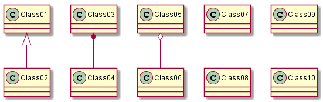
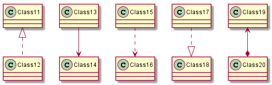
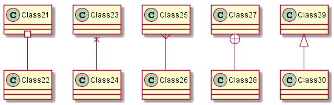
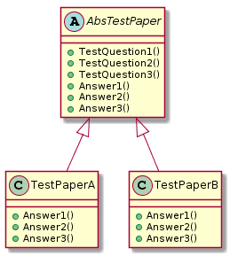
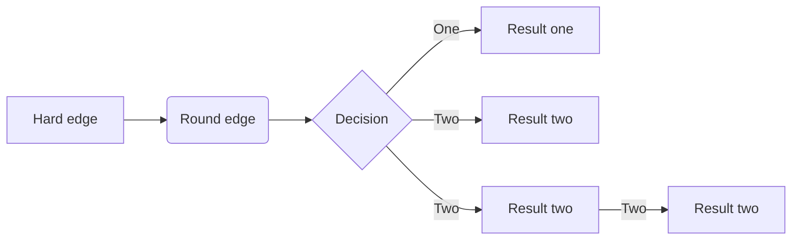

[TOC]

---

# 设计模式的概念

**设计模式（Design pattern）**代表了最佳的实践，通常被有经验的面向对象的软件开发人员所采用。设计模式是软件开发人员在软件开发过程中面临的一般问题的解决方案。这些解决方案是众多软件开发人员经过相当长的一段时间的试验和错误总结出来的。

设计模式（Design Pattern）是一套被反复使用、多数人知晓的、经过分类的、代码设计经验的总结。

使用设计模式的目的：为了代码可重用性、让代码更容易被他人理解、保证代码可靠性。 设计模式使代码编写真正工程化；设计模式是[软件工程](https://baike.baidu.com/item/软件工程/25279)的基石脉络，如同大厦的结构一样。

# 设计模式的组成和分类

> 根据其目的（模式是用来做什么的）可分为创建型(Creational)，结构型(Structural)和行为型(Behavioral)三种：
>
> > • **创建型**模式主要用于创建对象。
> > • **结构型**模式主要用于处理类或对象的组合。
> > • **行为型**模式主要用于描述对类或对象怎样交互和怎样分配职责。
>
>
> 根据范围（模式主要是用于处理类之间关系还是处理对象之间的关系）可分为类模式和对象模式两种：
>
> > • 类模式处理类和子类之间的关系，这些关系通过继承建立，在编译时刻就被确定下来，是属于静态的。
> > • 对象模式处理对象间的关系，这些关系在运行时刻变化，更具动态性。


# UML图示说明

| **Type**            | **Symbol** | **Drawing**                                       |
| ------------------- | ---------- | ------------------------------------------------- |
| Extension（扩展）   | $$<|--$$   |  |
| Composition（组合） | $$*--$$    |      |
| Aggregation（聚合） | $$o--$$    |      |

使用`..` 来代替 `--` 可以得到点 线.

在这些规则下，也可以绘制下列图形

```json
@startuml 
Class01 <|-- Class02 
Class03 *-- Class04 
Class05 o-- Class06 
Class07 .. Class08 
Class09 -- Class10 
@enduml 
```



```json
@startuml 
Class11 <|.. Class12 
Class13 --> Class14 
Class15 ..> Class16 
Class17 ..|> Class18 
Class19 <--* Class20 
@enduml 
```



```json
@startuml 
Class21 #-- Class22 
Class23 x-- Class24 
Class25 }-- Class26 
Class27 +-- Class28 
Class29 ^-- Class30 
@enduml 
```




**定义可访问性**

一旦你定义了域或者方法，你可以定义相应条目的可访问性质。

| **Character** |               **Icon for field**               |               **Icon for method**               | **Visibility**  |
| ------------- | :--------------------------------------------: | :---------------------------------------------: | --------------- |
| `-`           |          |          | private         |
| `#`           |        |        | protected       |
| `~`           |  |  | package private |
| `+`           |           |           | public          |

# 六大设计原则

> [学习6大设计原则、23种设计模式](https://blog.csdn.net/eleanoryss/article/details/79555200)
>
> [总结下软件设计的六大原则](https://www.jianshu.com/p/e5cee091eab3)
>
> [6大设计原则总结](https://www.cnblogs.com/DI-DIAO/p/8613357.html)
>
> [JAVA设计模式总结之23种设计模式](https://www.cnblogs.com/pony1223/p/7608955.html)
>
> [图说设计模式](https://design-patterns.readthedocs.io/zh_CN/latest/index.html)

## 单一职责原则(SRP)

> There should never be more than one reason for a class to change.
>
> 理解：一个类应该只有一个发生变化的原因，即一个类只负责一项职责。如果一个类有多个职责，这些职责就耦合在了一起。当一个职责发生变化时，可能会影响其它的职责。另外，多个职责耦合在一起会影响复用性。此原则的核心是解耦和增强内聚性。
>
> 总结：一个类只承担一个职责

## 开放封闭原则(OCP)

> Software entities like classes,modules and functions should be open for extension but closed for modifications.
>
> 理解：对扩展开放，对更改封闭。类模块应该是可扩展的，但是不可修改。
>
> 总结：对软件实体的改动，最好用扩展而非修改的方式。

## 里式替换原则(LSP)

> Functions that use pointers or references to base classes must be able to use objects of derived classes without knowing it.
>
> 理解：父类可被子类替换，但反之不一定成立。也就是说，代码中可以将父类全部替换为子类，程序不会出现异常，但反过来就不一定了。
>
> 总结：在继承类是，务必重写（override）父类中所有的方法，尤其需要注意父类的protected方法（它们往往是让你重写的），子类尽量不要暴露自己的public方法供外界调用。

## 迪米特法则(LKP)

> Only talk to you immediate friends.
>
> 理解：如果两个类不必彼此直接通信，那么这两个类就不应当发生直接的相互作用，如果其中一个类需要调用另一个类的某一个方法的话，可以通过第三者转发这个调用。
>
> 总结：一定要做到：低耦合、高内聚。

## 接口隔离原则(ISP)

> The dependency of one class to another one should depend on the smallest possible interface.
>
> 理解：不要对外暴露没有实际意义的接口。也就是说，尽量保证接口的实用性。当需要对外暴露接口时，需要再三斟酌，若没必要对外提供就删了吧，因为一旦提供了就意味着，将来要多做一件事情，何苦给自己找事做呢。
>
> 总结：不要对外暴露没有实际意义的接口。

## 依赖倒置原则(DIP)

> High level modules should not depends upon low level modules. Both should depend upon abstractions. Abstractions should not depend upon details. Details should depend upon abstractions.
>
> 理解：高层模块不应该依赖于底层模块，而应该依赖于抽象。抽象不应依赖于细节，细节应依赖于抽象。应该面向接口编程，不该面向实现类编程。面向实现类编程相当于就事论事，那是正向依赖；面向接口编程，相当于透过现象看本质，抓住事务的共性，那就是反向依赖，即依赖倒置。
>
> 总结：面向接口编程，提取出事务的本质和共性。


# 创建型模式

>[在线plantuml工具](http://www.plantuml.com/plantuml/uml/SyfFKj2rKt3CoKnELR1Io4ZDoSa70000)
>
>[plantuml语法](http://plantuml.com/zh/class-diagram)
>
>[Draw Diagrams With Markdown](https://support.typora.io/Draw-Diagrams-With-Markdown/ )

## **抽象工厂模式**(Abstract Factory)


```json
@startuml
abstract AbsBmwCar{
  +drive()
}
note left: 抽象产品，代表了某一类的产品
class BmwSportCar{
  +drive()
}
class BmwBusinessCar{
  +drive()
}
note left: 具体某类产品

abstract AbsAudiCar{
  +drive()
}
class AudiSportCar{
  +drive()
}
class AudiBusinessCar{
  +drive()
}

abstract AbsBenzCar{
  +drive()
}
class BenzSportCar{
  +drive()
}
class BenzBusinessCar{
  +drive()
}

abstract AbsDriver{
  +createBenzCar()
  +createBmwCar()
  +createAudiCar()
}
note left: 抽象工厂，包含了所有产品创建的抽象方法
class SportDriver{
  +createBenzCar()
  +createBmwCar()
  +createAudiCar()
}
class BusinessDriver{
  +createBenzCar()
  +createBmwCar()
  +createAudiCar()
}

class Client

AbsBmwCar <|-- BmwSportCar
AbsBmwCar <|-- BmwBusinessCar
AbsAudiCar <|-- AudiSportCar
AbsAudiCar <|-- AudiBusinessCar
AbsBenzCar <|-- BenzSportCar
AbsBenzCar <|-- BenzBusinessCar
AbsDriver <|-- SportDriver
AbsDriver <|-- BusinessDriver
Client --> AbsBmwCar
Client --> AbsAudiCar 
Client --> AbsBenzCar 
Client --> AbsDriver
SportDriver ..> BmwSportCar
SportDriver ..> BmwBusinessCar
SportDriver ..> AudiSportCar
SportDriver ..> AudiBusinessCar
SportDriver ..> BenzSportCar
SportDriver ..> BenzBusinessCar

BusinessDriver ..> BmwSportCar
BusinessDriver ..> BmwBusinessCar
BusinessDriver ..> AudiBusinessCar
BusinessDriver ..> AudiBusinessCar
BusinessDriver ..> BenzSportCar
BusinessDriver ..> BenzBusinessCar
@enduml
```

> [《JAVA设计模式》之抽象工厂模式(Abstract Factory)](https://www.cnblogs.com/betterboyz/p/9355777.html)

>每一个模式都是针对一定问题的解决方案。抽象工厂模式与工厂方法模式的最大区别就在于，工厂方法模式针对的是一个产品等级结构；而抽象工厂模式则需要面对多个产品等级结构。
>
>##### 优点
>
>抽象工厂模式正如其名字一样，理解起来非常抽象，**正是因为这种抽象，使得抽象工厂模式非常强大和灵活**，比其他两种工厂设计模式要强大很多。抽象工厂模式可以创建多个系列，并且每个系列抽象子类一一对应，这种强大的功能是其他两种工厂模式都不能实现的。
>
>**通过抽象工厂模式统一控制多个系列的抽象子类，可以用多个系列的抽象子类完成一些复杂的需求**。例如我们文中说到的本地持久化方案的切换，最后通过我们的不断优化，做到**只需要修改一个预编译指令的参数即可切换整个数据持久化方案**，这是其他工厂模式所不能完成的。
>
>**抽象工厂模式延续了工厂模式的优点，外界接触不到任何类型的抽象子类**，而只需要知道不同类型的抽象类即可，抽象子类的创建过程都在工厂子类中。这种设计方式充分的利用了面向对象语言中的多态特性，使灵活性大大提升。而且**抽象工厂模式是非常符合开放封闭原则的，对扩展的开放以及对修改的封闭都完美支持**。
>
>**缺点**
>
>抽象工厂模式带来的缺点也是显而易见的，**最明显的缺点就是模式比较庞大**，所以需要在适合的业务场景使用这种模式，否则会适得其反。
>
>
>
>上面说到抽象工厂和工厂方法模式的功能添加都非常复杂，那么我们有没有什么办法可以简化呢？ 
>
>答案是肯定有的： 那就是工厂模式 +  配置文件 + 反射。具体怎么实现，请看下回分解。


## **建造者模式**(Builder)

> [建造者模式](https://blog.csdn.net/u014727260/article/details/82712802)


```json
@startuml
class Director{
  -builder:Builder
  +construct():void
}
note top: 指挥者,构建一个使用Builder接口的对象

interface Builder{
  #buildPart1():void
  #buildPart2():void
  #retrieveResult():Product
}
note top: Builder是为创建一个Product对象\n的各个部件指定的抽象接口

class Product {
  -part1:String
  -part2:String
}
note bottom: 具体产品

class ConcreteBuilder{
  -product:Product
  #buildPart1():void
  #buildPart2():void
  #retrieveResult():Product
}
note bottom: 具体创建者,实现Builder接口,\n构建和装配各个部件

Builder <|-- ConcreteBuilder
ConcreteBuilder .left.> Product
Director o-right-> Builder
@enduml
```


## **工厂方法模式**(Factory Method)


```json
@startuml
interface Icar{
  +run()
}

class Audi{
  +run()
}

class Byd{
  +run()
}

interface ICarFactory{
  +createCar()
}

class AudiFactory{
  +createCar()
}

class BydFactory{
  +createCar()
}

Icar .left.> ICarFactory
Icar <|-- Audi
Icar <|-- Byd
ICarFactory <|-- AudiFactory
ICarFactory <|-- BydFactory
Audi <.. AudiFactory
Byd <.. BydFactory
@enduml
```

>工厂方法模式角色：
>
>​           抽象工厂(Creator)角色：是工厂方法模式的核心，与应用程序无关。任何在模式中创建的对象的工厂类必须实现这个接口。
>
>​           具体工厂(Concrete Creator)角色：这是实现抽象工厂接口的具体工厂类，包含与应用程序密切相关的逻辑，并且受到应用程序调用以创建产品对象。
>
>​           抽象产品(Product)角色：工厂方法模式所创建的对象的超类型，也就是产品对象的共同父类或共同拥有的接口。
>
>​           具体产品(Concrete Product)角色：这个角色实现了抽象产品角色所定义的接口。某具体产品有专门的具体工厂创建，它们之间往往一一对应。
>
> 在工厂方法模式中，核心工厂类不在负责产品的创建，而是将具体的创建工作交给子类去完成。也就是后所这个核心工厂仅仅只是提供创建的接口，具体实现方法交给继承它的子类去完成。


## **原型模式**(Prototype)


```json
@startuml
class Client{
}
note right:让一个原型克隆自身,\n从而新建一个对象

abstract Shape{
  -id:String
  #type:String
  +draw():void
  +clone():Object
}
note top: 原型类,定义实现一个克隆自身的方法

class Rectangle{
  +draw():void
}
note bottom: 具体原型类,实现自己的操作

class Square{
  +draw():void
}

class Circle{
  +draw():void
}

class ShapeCache {
  -shapeMap:Hashtable<String, Shape>
  +getShape(shapeId:String):Shape
  +loadCache():void
}
note bottom: 从数据库获取实体类，并把它们存储在一个Hashtable中

Shape <|-- Rectangle
Shape <|-- Square
Shape <|-- Circle
Shape <-left- ShapeCache
Client --> ShapeCache
@enduml
```


## **单例模式**(Singleton)


```json
@startuml
class Singleton{
  -instance : Singleton
  -Singleton()
  +GetInstance()
}
note right:Singleton类，定义一个GetInstance操作，允许客户访问它的唯一实例。\n GetInstance是一个静态方法，主要创建自己的唯一实例
@enduml
```

> 单例模式只允许创建一个对象，因此节省内存，加快对象访问速度，因此对象需要被公用的场合适合使用，如多个模块使用同一个数据源连接对象等等。如：
>
>  （1）需要频繁实例化然后销毁的对象。
>
>  （2）创建对象时耗时过多或者耗资源过多，但又经常用到的对象。
>
>  （3）有状态的工具类对象。
>
>  （4）频繁访问数据库或文件的对象。
>

```java
package per.hyc.designPattern.Singleton;

/**
 * 1、懒汉式，线程不安全
 * 是否 Lazy 初始化：是
 * 是否多线程安全：否
 * 实现难度：易
 * 描述：这种方式是最基本的实现方式，这种实现最大的问题就是不支持多线程。因为没有加锁 synchronized，所以严格意义上它并不算单例模式。
 * 这种方式 lazy loading 很明显，不要求线程安全，在多线程不能正常工作。
 */
class SingleObject_1 {
    private static SingleObject_1 instance;

    private SingleObject_1() {
    }

    public static SingleObject_1 getInstance() {
        if (instance == null) {
            instance = new SingleObject_1();
        }
        return instance;
    }

    public void showMessage() {
        System.out.println("1、懒汉式，线程不安全");
    }
}

/**
 * 2、懒汉式，线程安全
 * 是否 Lazy 初始化：是
 * 是否多线程安全：是
 * 实现难度：易
 * 描述：这种方式具备很好的 lazy loading，能够在多线程中很好的工作，但是，效率很低，99% 情况下不需要同步。
 * 优点：第一次调用才初始化，避免内存浪费。
 * 缺点：必须加锁 synchronized 才能保证单例，但加锁会影响效率。
 * getInstance() 的性能对应用程序不是很关键（该方法使用不太频繁）。
 */
class SingleObject_2 {
    private static SingleObject_2 instance;

    private SingleObject_2() {
    }

    public static synchronized SingleObject_2 getInstance() {
        if (instance == null) {
            instance = new SingleObject_2();
        }
        return instance;
    }

    public void showMessage() {
        System.out.println("2、懒汉式，线程安全");
    }
}

/**
 * 3、饿汉式
 * 是否 Lazy 初始化：否
 * 是否多线程安全：是
 * 实现难度：易
 * 描述：这种方式比较常用，但容易产生垃圾对象。
 * 优点：没有加锁，执行效率会提高。
 * 缺点：类加载时就初始化，浪费内存。
 * 它基于 classloader 机制避免了多线程的同步问题，不过，instance 在类装载时就实例化，
 * 虽然导致类装载的原因有很多种，在单例模式中大多数都是调用 getInstance 方法，
 * 但是也不能确定有其他的方式（或者其他的静态方法）导致类装载，这时候初始化 instance
 * 显然没有达到 lazy loading 的效果。
 */
class SingleObject_3 {
    private static SingleObject_3 instance = new SingleObject_3();

    private SingleObject_3() {
    }

    public static SingleObject_3 getInstance() {
        return instance;
    }

    public void showMessage() {
        System.out.println("3、饿汉式");
    }
}


/**
 * 4、双检锁/双重校验锁（DCL，即 double-checked locking）
 * JDK 版本：JDK1.5 起
 * 是否 Lazy 初始化：是
 * 是否多线程安全：是
 * 实现难度：较复杂
 * 描述：这种方式采用双锁机制，安全且在多线程情况下能保持高性能。
 * getInstance() 的性能对应用程序很关键。
 */
class SingleObject_4 {
    private volatile static SingleObject_4 singleton;

    private SingleObject_4() {
    }

    public static SingleObject_4 getInstance() {
        if (singleton == null) {
            synchronized (SingleObject_4.class) {
                if (singleton == null) {
                    singleton = new SingleObject_4();
                }
            }
        }
        return singleton;
    }

    public void showMessage() {
        System.out.println("4、双检锁/双重校验锁（DCL，即 double-checked locking）");
    }
}

/**
 * 5、登记式/静态内部类
 * 是否 Lazy 初始化：是
 * 是否多线程安全：是
 * 实现难度：一般
 * 描述：这种方式能达到双检锁方式一样的功效，但实现更简单。对静态域使用延迟初始化，
 * 应使用这种方式而不是双检锁方式。这种方式只适用于静态域的情况，
 * 双检锁方式可在实例域需要延迟初始化时使用。
 * 这种方式同样利用了 classloader 机制来保证初始化 instance 时只有一个线程，
 * 它跟第 3 种方式不同的是：第 3 种方式只要 Singleton 类被装载了，
 * 那么 instance 就会被实例化（没有达到 lazy loading 效果），
 * 而这种方式是 Singleton 类被装载了，instance 不一定被初始化。
 * 因为 SingletonHolder 类没有被主动使用，只有通过显式调用 getInstance 方法时，
 * 才会显式装载 SingletonHolder 类，从而实例化 instance。
 * 想象一下，如果实例化 instance 很消耗资源，所以想让它延迟加载，
 * 另外一方面，又不希望在 Singleton 类加载时就实例化，
 * 因为不能确保 Singleton 类还可能在其他的地方被主动使用从而被加载，
 * 那么这个时候实例化 instance 显然是不合适的。
 * 这个时候，这种方式相比第 3 种方式就显得很合理。
 */
class SingleObject_5 {
    private static class SingletonHolder {
        private static final SingleObject_5 INSTANCE = new SingleObject_5();
    }

    private SingleObject_5() {
    }

    public static final SingleObject_5 getInstance() {
        return SingletonHolder.INSTANCE;
    }

    public void showMessage() {
        System.out.println("5、登记式/静态内部类");
    }
}

/**
 * 6、枚举
 * JDK 版本：JDK1.5 起
 * 是否 Lazy 初始化：否
 * 是否多线程安全：是
 * 实现难度：易
 * 描述：这种实现方式还没有被广泛采用，但这是实现单例模式的最佳方法。
 * 它更简洁，自动支持序列化机制，绝对防止多次实例化。
 * 这种方式是 Effective Java 作者 Josh Bloch 提倡的方式，它不仅能避免多线程同步问题，
 * 而且还自动支持序列化机制，防止反序列化重新创建新的对象，绝对防止多次实例化。
 * 不过，由于 JDK1.5 之后才加入 enum 特性，用这种方式写不免让人感觉生疏，
 * 在实际工作中，也很少用。
 * 不能通过 reflection attack 来调用私有构造方法。
 */
enum SingleObject_6 {
    INSTANCE;

    public void showMessage() {
        System.out.println("6、枚举");
    }
}

/**
 * 经验之谈：一般情况下，不建议使用第 1 种和第 2 种懒汉方式，建议使用第 3 种饿汉方式。
 * 只有在要明确实现 lazy loading 效果时，才会使用第 5 种登记方式。
 * 如果涉及到反序列化创建对象时，可以尝试使用第 6 种枚举方式。
 * 如果有其他特殊的需求，可以考虑使用第 4 种双检锁方式。
 */
public class Singleton {
    static void TestSingleObject_1() {
        //不合法的构造函数
        //编译时错误：构造函数 SingleObject() 是不可见的
        //SingleObject object = new SingleObject();

        //获取唯一可用的对象
        SingleObject_1 object = SingleObject_1.getInstance();

        //显示消息
        object.showMessage();
    }

    static void TestSingleObject_2() {
        //获取唯一可用的对象
        SingleObject_2 object = SingleObject_2.getInstance();

        //显示消息
        object.showMessage();
    }

    static void TestSingleObject_3() {
        //获取唯一可用的对象
        SingleObject_3 object = SingleObject_3.getInstance();

        //显示消息
        object.showMessage();
    }

    static void TestSingleObject_4() {
        //获取唯一可用的对象
        SingleObject_4 object = SingleObject_4.getInstance();

        //显示消息
        object.showMessage();
    }


    static void TestSingleObject_5() {
        //获取唯一可用的对象
        SingleObject_5 object = SingleObject_5.getInstance();

        //显示消息
        object.showMessage();
    }

    static void TestSingleObject_6() {
        //获取唯一可用的对象
        SingleObject_6 object = SingleObject_6.INSTANCE;

        //显示消息
        object.showMessage();
    }


    public static void main(String[] args) {
        TestSingleObject_1();
        TestSingleObject_2();
        TestSingleObject_3();
        TestSingleObject_4();
        TestSingleObject_5();
        TestSingleObject_6();

    }
}


1、懒汉式，线程不安全
2、懒汉式，线程安全
3、饿汉式
4、双检锁/双重校验锁（DCL，即 double-checked locking）
5、登记式/静态内部类
6、枚举
```


# 行为型模式

## 职责链模式(Chain of Responsibility)


```json
@startuml
abstract AbstractLogger{
  #level:int
  +logMessage(level: int, message:string)
  +setNextLogger(nextLogger: AbstractLogger)
  +write(message:string)
}
note right: 定义一个处理请示的接口

class Client

class ConsoleLogger{
  +write(message:string)
}

class ErrorLogger{
  +write(message:string)
}

class FileLogger{
  +write(message:string)
}
note bottom: 具体处理者类，处理它所负责的请求，可访问它的后继者，\n 如果可以处理该请求就处理，不然将请求转发给它的后继者

Client -right-> AbstractLogger
AbstractLogger<|-- ConsoleLogger
AbstractLogger <|-- ErrorLogger
AbstractLogger <|-- FileLogger
AbstractLogger <--o AbstractLogger
@enduml
```

>**优点**
>
>- 责任链模式将请求和处理分开，请求者不知道是谁处理的，处理者可以不用知道请求的全貌。
>- 提高系统的灵活性。
>
>**缺点**
>
>- 降低程序的性能。每个请求都是从链头遍历到链尾，当链比较长的时候，性能会大幅下降。
>- 不易于调试。由于该模式采用了类似递归的方式，调试的时候逻辑比较复杂。
>
>**应用场景**
>
>责任链模式是一种常见的模式，Struts2的核心控件FilterDispatcher是一个Servlet过滤器，该控件就是采用责任链模式，可以对用户请求进行层层过滤处理。责任链模式在实际项目中的使用比较多，其典型的应用场景如下：
>
>- 一个请求需要一系列的处理工作。
>- 业务流的处理，例如文件审批。
>- 对系统进行扩展补充。

> 在责任链模式中，客户只需要将请求发送到责任链上即可，无须关心请求的处理细节和请求的传递过程，所以责任链将请求的发送者和请求的处理者解耦了。
> 责任链模式是一种对象行为型模式，其主要优点如下。
>
> 1. 不能保证每个请求一定被处理。由于一个请求没有明确的接收者，所以不能保证它一定会被处理，该请求可能一直传到链的末端都得不到处理。
> 2. 对比较长的职责链，请求的处理可能涉及多个处理对象，系统性能将受到一定影响。
> 3. 职责链建立的合理性要靠客户端来保证，增加了客户端的复杂性，可能会由于职责链的错误设置而导致系统出错，如可能会造成循环调用。

## 命令模式(Command)


```json
@startuml
class Invoker{
  -concreteCommandA:ICommand
  -concreteCommandB:ICommand
  +orderA():void
  +orderB():void
}
note top: 要求该命令执行这个请求

interface ICommand {
  +execute():void
}
note top: 用来声明执行操作的接口

class ConcreteCommandA{
  -receiver:Receiver
  +execute():void
}

class ConcreteCommandB{
  -receiver:Receiver
  +execute():void
}
note bottom: 将一个接收者对象绑定于一个动作,\n调用接收者相应的操作,以实现Execute

class Receiver{
  +execute():void
}
note bottom: 知道如何实施与执行一个请求相关\n的操作,任何类都可能作为一个接收者

Client .right.> Invoker
Client .right.> Receiver
ICommand <|-- ConcreteCommandA
ICommand <|-- ConcreteCommandB
Invoker o-right-> ICommand
Receiver <-- ConcreteCommandA
@enduml
```

> 命令模式的几个角色：
> 抽象命令接口ICommand：定义命令的接口，声明执行的方法。
> 具体的命令对象ConcreteCommand：持有具体的接受者对象，完成具体的具体的命令。
> 接受者对象Receiver：接受者对象，真正执行命令的对象。
> 传递命令对象Invoker：持有命令对象，要求命令对象执行请求。
> 客户端对象Client：创建具体命令的对象并且设置命令对象的接受者。
>
> [Java设计模式（18）之命令模式](https://blog.csdn.net/zhwyj1019/article/details/79758057)


## 解释器模式(Interpreter)


```json
@startuml
abstract ReadXmlExpression{
  +interpret(c:Context):String[]
}
note left: 抽象表达式,声明一个抽象的解释操作,\n这个接口为抽象语法树中所有的节点共享

class ElementExpression{
  -eles:Collection<ReadXmlExpression>
  -eleName:String
  +addEle(ele:ReadXmlExpression):boolean
  +removeEle(ele:ReadXmlExpression):boolean
  +interpret(c:Context):String[]
}
note bottom: 非终结表达式,为文法中的非终结\n符实现解释操作。对文法中每一条\n规则R1..Rn都需要一个具体的非终结符\n表达式类

class ElementTerminalExpression{
  -eleName:String
  +interpret(c:Context):String[]
}
note bottom: 终结表达式,实现与文法中的终结符\n相关联的解释操作

class PropertyTerminalExpression{
  -eleName:String
  +interpret(c:Context):String[]
}

class Context{
  -preEle:Element
  -document:Document
  +reInit():void
  +getNowEle(pEle:Element,eleName:String):Element
}
note right: 包含解释器之外的一些全局信息

ReadXmlExpression <|-- ElementExpression
ReadXmlExpression <|-- ElementTerminalExpression
ReadXmlExpression <|-- PropertyTerminalExpression
Clinet ..> Context
Clinet ..> ReadXmlExpression
ElementExpression o--> ReadXmlExpression
@enduml
```


## 迭代器模式(Iterator)


```json
@startuml
interface IAggregate{
  +CreateIterator(): int
}
note top: 聚集接口

class Client

interface AbsIterator{
  +First()
  +Next()
  +IsDone()
  +CurrentItem()
}
note top: 迭代接口类，用于得到开始对象、 \n 得到下一个对象、判断是否到结尾、 \n 当前对象等抽象方法，统一接口

class ConcreteIterator
note bottom: 具体迭代器类

class ConcreteAggregate{
  +CreateIterator(): int
}
note bottom: 具体聚集类，继承自IAggregate


Client -left-> AbsIterator
Client -right-> IAggregate
IAggregate <|-- ConcreteAggregate
AbsIterator <|-- ConcreteIterator
ConcreteAggregate <-left- ConcreteIterator
ConcreteAggregate .left.> ConcreteIterator
@enduml
```


## 中介者模式(Mediator)


```json
@startuml
interface Mediator
note left: 接口终中介者，定义了Colleague \n 对象到Mediator对象的接口

abstract AbsColleague

class ConcreteMediator
note left: 具体中介者对象，实现抽象类的方法，\n 它需要知道所有具体的Colleague类，并从具体的 \n Colleague接收消息，向具体Colleague对象发出命令

class ColleagueA
note top: 具体Colleague类，每个具体Colleague只知道自己 \n 的行为，而不了解其他Colleague类的情况， \n 但它们却都认识Mediator对象

class ColleagueB

Mediator <|-- ConcreteMediator
AbsColleague <|-- ColleagueA
AbsColleague <|-- ColleagueB
ColleagueA <-- ConcreteMediator
ColleagueB <-- ConcreteMediator
@enduml
```

> 中介者模式的定义
>
> 用一个中介者对象封装一系列的对象交互，中介者使各对象不需要显示地相互作用，从而使耦合松散，而且可以独立地改变它们之间的交互。
>
>
> 中介者模式的优点
>
> 适当地使用中介者模式可以避免同事类之间的过度耦合，使得各同事类之间可以相对独立地使用。
> 使用中介者模式可以将对象间一对多的关联转变为一对一的关联，使对象间的关系易于理解和维护。
> 使用中介者模式可以将对象的行为和协作进行抽象，能够比较灵活的处理对象间的相互作用。
> 适用场景
>
>  在面向对象编程中，一个类必然会与其他的类发生依赖关系，完全独立的类是没有意义的。一个类同时依赖多个类的情况也相当普遍，既然存在这样的情况，说明，一对多的依赖关系有它的合理性，适当的使用中介者模式可以使原本凌乱的对象关系清晰，但是如果滥用，则可能会带来反的效果。一般来说，只有对于那种同事类之间是网状结构的关系，才会考虑使用中介者模式。可以将网状结构变为星状结构，使同事类之间的关系变的清晰一些。
>  中介者模式是一种比较常用的模式，也是一种比较容易被滥用的模式。对于大多数的情况，同事类之间的关系不会复杂到混乱不堪的网状结构，因此，大多数情况下，将对象间的依赖关系封装的同事类内部就可以的，没有必要非引入中介者模式。滥用中介者模式，只会让事情变的更复杂。

>##### 优点：
>
>1、降低了类的复杂度，将一对多转化成了一对一。
>2、各个类之间的解耦。
>3、符合迪米特原则。
>
>##### 缺点：
>
>1.中介者会庞大，变得复杂难以维护。
>2.如果中介者类出现问题，将会导致所有相关类出问题。
>
>**Where:**
>
>多个类相互耦合，形成了网状结构。
>
>[设计模式之中介者模式（Mediator Pattern）](https://www.jianshu.com/p/638cee44c9f6)


## 备忘录模式(Memento)

>[Java设计模式学习记录-备忘录模式]()https://www.cnblogs.com/jimoer/p/9537997.html


```json
@startuml
class Game{
  +playerStep:int
  +restore(gameMemento: GameMemento):void
  +createGameMemento():GameMemento
}
note Bottom: 负责创建一个备忘录GameMemento， \n 用以记录当前时刻的内部状态， \n 并可使用备忘录恢复内部状态

class GameMemento{
  -playerSteps:int
}
note top: 负责存储Game对象的内部状态，\n 并可防止Game以外的对象访问 \n 备忘录GameMemento

class Caretaker{
  -gameMemento: GameMemento
  +saveMemento(gameMemento:GameMemento):void
}
note right: 负责保存好备忘录GameMemento

Game .right.> GameMemento
GameMemento <--o Caretaker
@enduml
```


## 观察者模式(Observer)


```json
@startuml
class ISubject{
  +attach(observer: Observer)
  +detach(observer: Observer)
  +notifyAllObservers()
}
note top: ISubject类,它把所有对观察者对象的引用保存在一个\n聚集里,每个主题都可以有任何数量的观察者.  主题提供\n一个接口,可以增加和删除观察者对象 

class Subject{
  #observers:List<Observer>
  +state: int
  +getState()
  +setState()
  +attach(observer: Observer)
  +detach(observer: Observer)
  +notifyAllObservers()
}
note bottom: Subject类,具体主题,将有关状态存入\n具体观察者对象;在具体主题的内部状态改变\n的时候，给所有登记过的观察者发出通知 

abstract Observer{
  #subject:Subject
  +update()
}
note top: 抽象观察者,为所有的具体观察者定义\n一个接口,在得到主题的通知时更新自己

class BinaryObserver{
  +update()
}

class OctalObserver{
  +update()
}
note bottom: 具体观察者,实现抽象观察者角色所\n要求的更新接口,以便使自身状态与主题状态相协调

class HexaObserver{
  +update()
}

ISubject <|-- Subject
Observer <|-- BinaryObserver
Observer <|-- OctalObserver
Observer <|-- HexaObserver
Subject <-left- HexaObserver
ISubject -right-> Observer
@enduml
```


## 状态模式(State)


```json
@startuml
interface State
note left: 状态类接口，定义一个接口以封装与 \n Context的一个特定状态相关的行为

class Context{
  +Request()
}
note left: 维护一个ConcreteState子类的实例，\n 这个实例定义当前的状态

class ConcreteStateA{
  +Handle()
}
note right: 具体状态，每一个子类实现一个 \n 与Context的一个状态相关的行为

class ConcreteStateB{
  +Handle()
}

class ConcreteStateC{
  +Handle()
}

Context o--> State
State <|-- ConcreteStateA
State <|-- ConcreteStateB
State <|-- ConcreteStateC
@enduml
```


## 策略模式(Strategy)


```json
@startuml
class OperationAdd{
  +doOperation()
}
class OperationSubstract{
  +doOperation()
}
class OperationMultiply{
  +doOperation()
}
note bottom: 具体策略类，封装了具体的算法或行为，继承于IStrategy

class Context{
  +executeStrategy()
}
note bottom: Context上下文，用一个 \n ConcreateStategy来配置， \n 维护一个对IStrategy对象的引用

interface IStrategy{
  +doOperation()
}
note right:策略类，定义所有支持的算法的公共接口


Context <-left-o IStrategy
IStrategy<|-- OperationAdd
IStrategy<|-- OperationSubstract
IStrategy<|-- OperationMultiply
@enduml
```

> [二十三种设计模式 - 策略模式](https://www.jianshu.com/p/cb4cdda0c3c9)

> > 模式定义
>
> 策略模式：属于对象的行为模式。其用意是针对一组算法，将每一个算法封装到具有共同接口的独立的类中，从而使得它们可以相互替换。
>
> 策略模式：使得算法可以在不影响到客户端的情况下发生变化。
>
> 策略模式：是对算法的包装，是把使用算法的责任和算法本身分割开来，委派给不同的对象管理。策略模式通常把一个系列的算法包装到一系列的策略类里面，作为一个抽象策略类的子类。用一句话来说，就是：“准备一组算法，并将每一个算法封装起来，使得它们可以互换”。

>> 参与者
>
>策略模式参与者：
>
>**Context**：环境角色，持有一个Strategy的引用。
>
>**Strategy**：抽象策略角色，这是一个抽象角色，通常由一个接口或抽象类实现。此角色给出所有的具体策略类所需的接口。
>
>**ConcreteStrategy**：具体策略角色，包装了相关的算法或行为

> 优点：
>
> 1. 业务逻辑和前端展示相互分离开了。业务逻辑的修改，不影响前端代码展示。
> 2. 每一个业务逻辑单独一个类，修改或者添加一个类，不会影响到其他的类。
> 3. 使用工厂类封装了业务逻辑类，前端不需要知道到底每种业务怎么实现，只需要知道他的父类即可。
>
> 缺点：
>
> 1. 如果活动很频繁，经常会搞各种各样的活动，那么业务逻辑就会有很多种，每一次都要增加一个类。
> 2. 每增加一个类都要修改工厂类，修改会很频繁。

> > 策略模式的优点
>
> （1）策略模式提供了管理相关的算法族的办法。策略类的等级结构定义了一个算法或行为族。恰当使用继承可以把公共的代码移到父类里面，从而避免代码重复。
>
> （2）使用策略模式可以避免使用多重条件(if-else)语句。多重条件语句不易维护，它把采取哪一种算法或采取哪一种行为的逻辑与算法或行为的逻辑混合在一起，统统列在一个多重条件语句里面，比使用继承的办法还要原始和落后。
>
> > 策略模式的缺点
>
> （1）客户端必须知道所有的策略类，并自行决定使用哪一个策略类。这就意味着客户端必须理解这些算法的区别，以便适时选择恰当的算法类。换言之，策略模式只适用于客户端知道算法或行为的情况。
>
> （2）由于策略模式把每个具体的策略实现都单独封装成为类，如果备选的策略很多的话，那么对象的数目就会很可观

> - 用途不一样 
>   工厂是创建型模式,它的作用就是创建对象； 
>   策略是行为型模式,它的作用是让一个对象在许多行为中选择一种行为;
>
> - 关注点不一样 
>   一个关注对象创建 
>   一个关注行为的封装
> - 解决不同的问题 
>   工厂模式是创建型的设计模式，它接受指令，创建出符合要求的实例；它主要解决的是资源的统一分发，将对象的创建完全独立出来，让对象的创建和具体的使用客户无关。主要应用在多数据库选择，类库文件加载等。 
>   策略模式是为了解决的是策略的切换与扩展，更简洁的说是定义策略族，分别封装起来，让他们之间可以相互替换，策略模式让策略的变化独立于使用策略的客户。
> - 工厂相当于黑盒子，策略相当于白盒子；


## 模板方法模式(Template Method)



```json
@startuml
abstract AbsTestPaper{
  +TestQuestion1()
  +TestQuestion2()
  +TestQuestion3()
  +Answer1()
  +Answer2()
  +Answer3()
}

class TestPaperA{
  +Answer1()
  +Answer2()
  +Answer3()
}

class TestPaperB{
  +Answer1()
  +Answer2()
  +Answer3()
}

AbsTestPaper <|-- TestPaperA
AbsTestPaper <|-- TestPaperB
@enduml
```


## 访问者模式(Visitor)

> [设计模式：访问者（Visitor）模式](https://www.cnblogs.com/zyrblog/p/9244754.html)
>
> [访问者模式一篇就够了](https://www.jianshu.com/p/1f1049d0a0f4)


```json
@startuml
class Clinet{
  +visitor()
}

abstract Staff{
  +accept(visitor: Visitor)
}
note top: 定义一个accept操作,它以一个访问为参数

class Engineer{
  +accept(visitor: Visitor)
}
class Manager{
  +accept(visitor: Visitor)
}
note bottom: 具体元素,实现accept操作

class BusinessReport{
  -mStaffs: List<Staff>
  +showReport(visitor: Visitor)
}
note bottom: 能枚举它的元素,可以提供一个高层的接口\n以允许访问者访问它的元素

interface Visitor{
  +visit(engineer: Engineer)
  +visit(manager: Manager)
}
note top:为该对象结构中每个实现类声明一个visit操作

class CEOVisitor{
  +visit(engineer: Engineer)
  +visit(manager: Manager) 
}

class CTOVisitor{
  +visit(engineer: Engineer)
  +visit(manager: Manager) 
}
note bottom: 具体访问者,实现每个由Visitor声明的操作,\n每个操作实现算法的一部分,而该算法\n片段仍是对应于结构中对象的类

Staff <|-- Engineer
Staff <|-- Manager
Visitor <|-- CEOVisitor
Visitor <|-- CTOVisitor
Clinet --> BusinessReport
Clinet -right-> Visitor
BusinessReport -left-> Staff
@enduml
```

> 角色介绍
>
> - **Visitor：**接口或者抽象类，定义了对每个 Element 访问的行为，它的参数就是被访问的元素，它的方法个数理论上与元素的个数是一样的，因此，访问者模式要求元素的类型要稳定，如果经常添加、移除元素类，必然会导致频繁地修改 Visitor 接口，如果出现这种情况，则说明不适合使用访问者模式。
> - **ConcreteVisitor：**具体的访问者，它需要给出对每一个元素类访问时所产生的具体行为。
> - **Element：**元素接口或者抽象类，它定义了一个接受访问者（accept）的方法，其意义是指每一个元素都要可以被访问者访问。
> - **ElementA、ElementB：**具体的元素类，它提供接受访问的具体实现，而这个具体的实现，通常情况下是使用访问者提供的访问该元素类的方法。
> - **ObjectStructure：**定义当中所提到的对象结构，对象结构是一个抽象表述，它内部管理了元素集合，并且可以迭代这些元素提供访问者访问。


# 结构型模式

## 适配器模式(Adapter)


```json
@startuml
abstract AbsPlayer{
  +attack()
  +defense()
}
note left: 球员抽象类

class Forwards{
  +attack()
  +defense()
}

class Center{
  +attack()
  +defense()
}

class Guards{
  +attack()
  +defense()
}

class Translator{
  +attack()
  +defense()
}

class ChinaCenter{
  +jingong()
  +fangshou()
}
note left: 中国中锋

AbsPlayer <|-- Forwards
AbsPlayer <|-- Center
AbsPlayer <|-- Guards
AbsPlayer <|-- Translator
ChinaCenter <-- Translator
@enduml
```

```java
优点：
1：将目标类和适配者类解耦，通过引入一个适配器类来重用现有的适配者类，无需修改原有结构。
2：增加了类的透明性和复用性，将具体的业务实现过程封装在适配者类中，对于客户端类而言是透明的，而且提高了适配者的复用性，同一适配者类可以在多个不同的系统中复用。
3：灵活性和扩展性都非常好，通过使用配置文件，可以很方便的更换适配器，也可以在不修改原有代码的基础上 增加新的适配器，完全复合开闭原则。

缺点：
1：一次最多只能适配一个适配者类，不能同时适配多个适配者。
2：适配者类不能为最终类，在C#中不能为sealed类
3：目标抽象类只能为接口，不能为类，其使用有一定的局限性。
```


## 桥接模式(Bridge)


```json
@startuml
interface Color{
  +bepaint(penType:String,name:String):void
}

class Blue{
  +bepaint(penType:String,name:String):void
}

class Green{
  +bepaint(penType:String,name:String):void
}

class Pen{
  #color:Color
  +draw(name:String):void
}

class SmallPen{
  +draw(name:String):void
}

class MiddlePen{
  +draw(name:String):void
}

Pen <|-- SmallPen
Pen <|-- MiddlePen
Color <|-- Blue
Color <|-- Green
Pen o-left-> Color
@enduml
```

>## 概述 
>
>在软件系统中，某些类型由于自身的逻辑，它具有两个或多个维度的变化，那么如何应对这种“多维度的变化”？如何利用[面向对象](http://baike.baidu.com/view/125370.htm)的技术来使得该类型能够轻松的沿着多个方向进行变化，而又不引入额外的复杂度？这就要使用Bridge模式。
>
>## 意图 
>
>【GOF95】在提出[桥梁模式](http://baike.baidu.com/subview/10501892/10686151.htm)的时候指出，桥梁模式的用意是"将抽象化(Abstraction)与实现化([Implementation](http://baike.baidu.com/subview/1147244/1147244.htm))[脱耦](http://baike.baidu.com/view/1877376.htm)，使得二者可以独立地变化"。这句话有三个关键词，也就是抽象化、实现化和脱耦。
>
>### 抽象化
>
>存在于多个实体中的共同的概念性联系，就是抽象化。作为一个过程，抽象化就是忽略一些信息，从而把不同的实体当做同样的实体对待【LISKOV94】。
>
>### 实现化
>
>抽象化给出的具体实现，就是实现化。
>
>### 脱耦
>
>所谓[耦合](http://baike.baidu.com/subview/156245/156245.htm)，就是两个实体的行为的某种强关联。而将它们的强关联去掉，就是耦合的解脱，或称[脱耦](http://baike.baidu.com/subview/1877376/1877376.htm)。在这里，脱耦是指将抽象化和实现化之间的耦合解脱开，或者说是将它们之间的强关联改换成弱关联。
>
>将两个角色之间的继承关系改为[聚合关系](http://baike.baidu.com/view/338574.htm)，就是将它们之间的强关联改换成为弱关联。因此，[桥梁模式](http://baike.baidu.com/subview/10501892/10686151.htm)中的所谓脱耦，就是指在一个软件系统的抽象化和实现化之间使用组合/聚合关系而不是继承关系，从而使两者可以相对独立地变化。这就是桥梁模式的用意。
>
>

## 组合模式(Composite)


```json
@startuml
abstract AbsCompany{
  +add(company: AbsCompany)
  +remove(company: AbsCompany)
  +display(depth: int)
  +lineOfDuty()
}
note right: 组合中的对象声明接口，在适当情况下，\n 实现所有类共有接口的默认行为。声明一个\n 接口用于访问和管理AbsCompany的子部件

class ConcreteCompany{
  +add(company: AbsCompany)
  +remove(company: AbsCompany)
  +display(depth: int)
  +lineOfDuty()
}
note bottom: 定义有枝节点行为，用来存储子部件，\n 在AbsCompany接口中实现与子部件有关 \n 的操作，比如增加Add和删除Remove

class HRDepartment{
  +add(company: AbsCompany)
  +remove(company: AbsCompany)
  +display(depth: int)
  +lineOfDuty()
}
note bottom: 在组合中表示叶节点对象， \n 叶节点没有子节点

class FinanceDepartment{
  +add(company: AbsCompany)
  +remove(company: AbsCompany)
  +display(depth: int)
  +lineOfDuty()
}

AbsCompany <|-- ConcreteCompany
AbsCompany <|-- HRDepartment
AbsCompany <|-- FinanceDepartment
AbsCompany <--o ConcreteCompany
@enduml
```

> **组合模式(Composite Pattern)**：组合多个对象形成树形结构以表示具有 "整体—部分" 关系的层次结构。组合模式对单个对象（即叶子对象）和组合对象（即容器对象）的使用具有一致性，组合模式又可以称为 "整体—部分"(Part-Whole) 模式，它是一种对象结构型模式。
>
> 由于在软件开发中存在大量的树形结构，因此组合模式是一种使用频率较高的结构型设计模式，Java SE中的AWT和Swing包的设计就基于组合模式。
>
> 除此以外，在XML解析、组织结构树处理、文件系统设计等领域，组合模式都得到了广泛应用。
>
> #### 角色
>
> **Component（抽象构件）**：它可以是接口或抽象类，为叶子构件和容器构件对象声明接口，在该角色中可以包含所有子类共有行为的声明和实现。在抽象构件中定义了访问及管理它的子构件的方法，如增加子构件、删除子构件、获取子构件等。
>
> **Leaf（叶子构件）**：它在组合结构中表示叶子节点对象，叶子节点没有子节点，它实现了在抽象构件中定义的行为。对于那些访问及管理子构件的方法，可以通过异常等方式进行处理。
>
> **Composite（容器构件）**：它在组合结构中表示容器节点对象，容器节点包含子节点，其子节点可以是叶子节点，也可以是容器节点，它提供一个集合用于存储子节点，实现了在抽象构件中定义的行为，包括那些访问及管理子构件的方法，在其业务方法中可以递归调用其子节点的业务方法。
>
> 组合模式的**关键是定义了一个抽象构件类，它既可以代表叶子，又可以代表容器**，而客户端针对该抽象构件类进行编程，无须知道它到底表示的是叶子还是容器，可以对其进行统一处理。**同时容器对象与抽象构件类之间还建立一个聚合关联关系**，在容器对象中既可以包含叶子，也可以包含容器，以此实现递归组合，形成一个树形结构。

> ### 透明与安全
>
> 在使用组合模式时，根据抽象构件类的定义形式，我们可将组合模式分为透明组合模式和安
> 全组合模式两种形式。
>
> **透明组合模式**
>
> 透明组合模式中，抽象构件角色中声明了所有用于管理成员对象的方法，譬如在示例中 `Component` 声明了 `add`、`remove` 方法，这样做的好处是确保所有的构件类都有相同的接口。透明组合模式也是组合模式的标准形式。
>
> 透明组合模式的缺点是不够安全，因为叶子对象和容器对象在本质上是有区别的，叶子对象不可能有下一个层次的对象，即不可能包含成员对象，因此为其提供 `add()`、`remove()` 等方法是没有意义的，这在编译阶段不会出错，但在运行阶段如果调用这些方法可能会出错（如果没有提供相应的错误处理代码）
>
> **安全组合模式**
>
> 在安全组合模式中，在抽象构件角色中没有声明任何用于管理成员对象的方法，而是在容器构件 `Composite` 类中声明并实现这些方法。

> ### 组合模式总结
>
> 组合模式的**主要优点**如下：
>
> - 组合模式可以清楚地定义分层次的复杂对象，表示对象的全部或部分层次，它让客户端忽略了层次的差异，方便对整个层次结构进行控制。
> - 客户端可以一致地使用一个组合结构或其中单个对象，不必关心处理的是单个对象还是整个组合结构，简化了客户端代码。
> - 在组合模式中增加新的容器构件和叶子构件都很方便，无须对现有类库进行任何修改，符合“开闭原则”。
> - 组合模式为树形结构的面向对象实现提供了一种灵活的解决方案，通过叶子对象和容器对象的递归组合，可以形成复杂的树形结构，但对树形结构的控制却非常简单。
>
> 组合模式的**主要缺点**如下：
>
> - 使得设计更加复杂，客户端需要花更多时间理清类之间的层次关系。
> - 在增加新构件时很难对容器中的构件类型进行限制。
>
> **适用场景**：
>
> - 在具有整体和部分的层次结构中，希望通过一种方式忽略整体与部分的差异，客户端可以一致地对待它们。
> - 在一个使用面向对象语言开发的系统中需要处理一个树形结构。
> - 在一个系统中能够分离出叶子对象和容器对象，而且它们的类型不固定，需要增加一些新的类型。

## 装饰模式(Decorator)


```json
@startuml
interface IComponent{
  +Operation()
}
note left: IComponent是定义一个对象接口，\n 可以给这些对象动态地添加职责

class ConcreteComponent{
  +Operation()
}
note bottom: ConcreteComponent是定义了一个具体的对象，\n 也可以给这个对象添加一些职责

abstract AbsDecorator{
  -component:IComponent
  +Operation()
}
note left: AbsDecorator，装饰抽象类，\n 继承了IComponent，从外类来扩展\n IComponent类的功能，\n 但对于IComponent来说，是无需知道\n AbsDecorator的存在的

class ConcreteDecoratorA{
  +Operation()
  -AddedBehaviorA()
}

class ConcreteDecoratorB{
  +Operation()
  -AddedBehaviorB()
}
note bottom: ConcreteDecorator就是具体的装饰对象，\n 起到给IComponent添加职责的功能

IComponent <|-- ConcreteComponent
IComponent <|-- AbsDecorator
AbsDecorator  <|-- ConcreteDecoratorA
AbsDecorator  <|-- ConcreteDecoratorB
IComponent <--o AbsDecorator
@enduml
```

**装饰器模式：**在不改变原有结构的情况下，允许动态的给一个现有对象添加一些额外的职责（额外的结构）

**装饰器模式主要解决：**动态对一个类进行扩展，保证其原有结构不变的基础上获得新的结构和功能。这种扩展不以继承的方式实现，有效的防止子类过分膨胀的问题。

**优点：**装饰类和被装饰类可以独立发展，不会相互耦合。

> **装饰模式**是继承的一个替代的方法，装饰模式可以动态扩展一个实现类的功能。另外，装饰模式可以实现未知顺序的扩展，将原有的父子结构转换为兄弟结构，降低系统的耦合度。

> **装饰器模式的优点**
>
> 装饰模式与继承关系的目的都是要扩展对象的功能，但是装饰模式可以提供比继承更多的灵活性。通过使用不同的具体装饰类以及这些装饰类的排列组合，可以创造出很多不同行为的组合。可以使用多个具体装饰类来装饰同一对象，得到功能更为强大的对象。
>
> **装饰器模式的缺点**
>
> 这种比继承更加灵活机动的特性，也同时意味着装饰模式比继承更加易于出错，排错也很困难，对于多次装饰的对象，调试时寻找错误可能需要逐级排查，较为烦琐。


## 外观模式(Facade)


```json
@startuml
class ControllerFacade{
  +on():void
  +off():void
}
note right: Facadew外观类\n 知道哪些子系统负责处理请求，\n 将客户的请求代理给适当的子系统对象 

class Light{
  +on():void
  +off():void
}

class Television{
  +on():void
  +off():void
}

class Aircondition{
  +on():void
  +off():void
}


class Client

Client -right-> ControllerFacade
ControllerFacade--> Light
ControllerFacade --> Television
ControllerFacade--> Aircondition
@enduml
```

> 门面模式要求一个子系统的外部与其内部的通信必须通过一个统一的门面(Facade)对象进行。门面模式提供一个高层次的接口，使得子系统更易于使用。
>
> 就如同医院的接待员一样，门面模式的门面类将客户端与子系统的内部复杂性分隔开，使得客户端只需要与门面对象打交道，而不需要与子系统内部的很多对象打交道。
>
> 初学者往往以为通过继承一个门面类便可在子系统中加入新的行为，这是错误的。门面模式的用意是为子系统提供一个集中化和简化的沟通管道，而不能向子系统加入新的行为。


## 享元模式(Flyweight)

>[享元模式](https://www.jianshu.com/p/a2aa75939766)
>
>[享元模式（Flyweight）](https://baike.baidu.com/item/享元模式/10541959?fr=aladdin)又称为 *轻量级模式*，它是一种对象结构型模式。
>
>面向对象技术可以很好地解决一些灵活性或可扩展性问题，但在很多情况下需要在系统中增加类和对象的个数。当对象数量太多时，将导致运行代价过高，带来性能下降等问题。[享元模式](https://baike.baidu.com/item/享元模式/10541959?fr=aladdin) 正是为解决这一类问题而诞生的。
>
>[享元模式](https://baike.baidu.com/item/享元模式/10541959?fr=aladdin) 是对象池的一种实现。类似于线程池，线程池可以避免不停的创建和销毁多个对象，消耗性能。[享元模式](https://baike.baidu.com/item/享元模式/10541959?fr=aladdin) 也是为了减少内存的使用，避免出现大量重复的创建销毁对象的场景。
>
>[享元模式](https://baike.baidu.com/item/享元模式/10541959?fr=aladdin) 的宗旨是共享细粒度对象，将多个对同一对象的访问集中起来，不必为每个访问者创建一个单独的对象，以此来降低内存的消耗。
>
>[享元模式](https://baike.baidu.com/item/享元模式/10541959?fr=aladdin) 把一个对象的状态分成内部状态和外部状态，内部状态即是不变的，外部状态是变化的；然后通过共享不变的部分，达到减少对象数量并节约内存的目的。
>
>[享元模式](https://baike.baidu.com/item/享元模式/10541959?fr=aladdin) 本质：**缓存共享对象，降低内存消耗**


```json
@startuml
interface IFlyweight{
  +operation(extrinsicState:String):void
}


class ConcreteFlyweight{
  -intrinsicState:String
  +operation(extrinsicState:String):void
}

class FlyweightFactory{
  -pool:Map<String, IFlyweight>
  +getFlyweight(intrinsicState:String):IFlyweight
}
class Client

Client ..> FlyweightFactory
ConcreteFlyweight --|> IFlyweight
FlyweightFactory o-right- IFlyweight 
ConcreteFlyweight <.right. Client
@enduml
```

> [享元模式（Flyweight）](https://baike.baidu.com/item/享元模式/10541959?fr=aladdin)又称为 *轻量级模式*，它是一种对象结构型模式。
>
> 面向对象技术可以很好地解决一些灵活性或可扩展性问题，但在很多情况下需要在系统中增加类和对象的个数。当对象数量太多时，将导致运行代价过高，带来性能下降等问题。[享元模式](https://baike.baidu.com/item/享元模式/10541959?fr=aladdin) 正是为解决这一类问题而诞生的。
>
> [享元模式](https://baike.baidu.com/item/享元模式/10541959?fr=aladdin) 是对象池的一种实现。类似于线程池，线程池可以避免不停的创建和销毁多个对象，消耗性能。[享元模式](https://baike.baidu.com/item/享元模式/10541959?fr=aladdin) 也是为了减少内存的使用，避免出现大量重复的创建销毁对象的场景。
>
> [享元模式](https://baike.baidu.com/item/享元模式/10541959?fr=aladdin) 的宗旨是共享细粒度对象，将多个对同一对象的访问集中起来，不必为每个访问者创建一个单独的对象，以此来降低内存的消耗。
>
> [享元模式](https://baike.baidu.com/item/享元模式/10541959?fr=aladdin) 把一个对象的状态分成内部状态和外部状态，内部状态即是不变的，外部状态是变化的；然后通过共享不变的部分，达到减少对象数量并节约内存的目的。
>
> [享元模式](https://baike.baidu.com/item/享元模式/10541959?fr=aladdin) 本质：**缓存共享对象，降低内存消耗**

> **优点**
>
> - [享元模式](https://baike.baidu.com/item/享元模式/10541959?fr=aladdin) 可以极大减少内存中对象的数量，使得相同对象或相似对象在内存中只保存一份，降低内存占用，增强程序的性能；
> - [享元模式](https://baike.baidu.com/item/享元模式/10541959?fr=aladdin) 的外部状态相对独立，而且不会影响其内部状态，从而使得享元对象可以在不同的环境中被共享；
>
> **缺点**
>
> - [享元模式](https://baike.baidu.com/item/享元模式/10541959?fr=aladdin) 使得系统更加复杂，需要分离出内部状态和外部状态，这使得程序的逻辑复杂化；
> - 为了使对象可以共享，[享元模式](https://baike.baidu.com/item/享元模式/10541959?fr=aladdin) 需要将享元对象的状态外部化，而且外部状态必须具备固化特性，不应该随内部状态改变而改变，否则会导致系统的逻辑混乱；
>
> **使用场景**
>
> - 系统中存在大量的相似对象；
> - 细粒度的对象都具备较接近的外部状态，而且内部状态与环境无关，也就是说对象没有特定身份；
> - 需要缓冲池的场景；

> [java中，从享元模式角度再看String](https://blog.csdn.net/xueshandugu/article/details/88862677)
>
> ```java
> String a = "将导致运行代价过高";
> String b = "将导致运行代价过高";
> String c = new String("将导致运行代价过高");
> String d = new String("将导致运行代价过高");
> a==b  true
> c==d  false
> ```
>
> 

## 代理模式(Proxy)


```json
@startuml
interface IGiveGift{
  +giveDolls()
  +giveFlowers()
}
note right: IGiveGift类，定义了Pursuit和GiftProxy的公用接口，\n 这样就在任何使用Pursuit的地方都可以使用GiftProxy

class Pursuit{
  +giveDolls()
  +giveFlowers()
}

class GiftProxy{
  +giveDolls()
  +giveFlowers()
}

Client -right-> IGiveGift
IGiveGift<|-- Pursuit
IGiveGift<|-- GiftProxy
Pursuit <-left- GiftProxy: -Pursuit
@enduml
```

**代理模式：**为其他对象提供一种代理以控制对这个对象的访问。

代理模式使用一个代理类来代表另一个类的功能，代理类持有现有对象，并利用现有对象对外界提供功能。代理模式可以看作是对原有对象的一个再包装，现在其他对象对原有对象的访问都应该通过代理的模式来做，起到控制访问的效果。

**代理模式主要解决：**直接访问对象的时候需要很多额外的操作（比如权限控制，安全性检查等），这个对象被访问的时候希望能无一例外的对这些请求做控制，此时则需要使用到代理模式。

**优点：**

1、职责清晰，满足[单一职责原则](https://baike.baidu.com/item/单一职责原则/9456515)。 被代理者和代理者各自负责自己的职责即可，将被代理者的访问控制转移到代理者身上。

2、高扩展性，代理者可以作为一个被代理者被再次包装，在不改变原有结构的基础上扩展新功能。

------

代理模式可以看作是一种特殊目的的装饰器模式。

- 装饰器是在不改变原有类的结构下，为其增加新的功能。代理模式则是在不改变原有类的结构下，控制其他类对其的访问，这种控制功能可以看作是为原有类增加的特殊的新功能。
- 代理模式为了实现对原有类的访问的控制，则要求持有原有对象。装饰器模式没有必要的要求，装饰器模式可以和被装饰类（原有类）互相独立，只需要在需要装饰的时候可以获取到被装饰类即可。
- 依据第二点，可以看出代理模式和装饰器模式之间**最大的区别**在于：代理模式中，代理者和被代理者的关系需要在编译时就确定下来，实现对被代理者的有效控制；装饰器模式中，装饰者和被装饰者之间是相互独立的，当被装饰者有新功能需要添加的时候，使用合适的装饰者将其装饰即可。

# 设计模式总结

>[设计模式总结](https://blog.csdn.net/u010921682/article/details/82886397)
>
>[设计模式总结](https://www.cnblogs.com/qixuejia/p/4511460.html)
>
>[常见设计模式总结](https://www.jianshu.com/p/f6b045929cc8)

| 设计模式 | 用法                                                         |
| -------- | ------------------------------------------------------------ |
| 单例     | 保证类的实例只有一个                                         |
| 简单工厂 | 根据参数创建对应具体子类                                     |
| 策略     | 算法、规则的封装、传入具体调用，调用具体算法                 |
| 装饰者   | 动态对一个对象进行增属性、调用方法等操作，链式操作<br />随意组合。梳头、画眉、只梳头不画眉、只画眉不梳头 |
| 工厂方法 | 创建类，一个实现类要有一个工厂类<br />总是通过对应的工厂类创建实现类，判断在客户端进行。工厂类太多。 |
| 代理     | 对象中保存能执行另一种操作的对象，通过这个保存的对象去操作。 |
| 原型     | 用克隆(Clone)，代替new对象。克隆的方式能够保留一些同样的信息。 |
| 模板方法 | 提炼出相同的公共代码，封装为一个方法模板。                   |
| 外观     | 通过改造内部实现，让外部看起来调用的方式很简单<br />(如，实际需要调用3个方法，但增加一个方法来调用这3个方法，让外部只调用一个方法即可)。 |
| 建造者   | 将一个复制对象的构建与它的表示分离，使得同样的构建过程可以创建不同的表示。 |
| 观察者   | 观察者类里面放了一个集合，包含了多个被通知类，被通知类实现一个抽象方法，有一个方法接受通知。 |
| 抽象工厂 | 增加一个接口，让外部依赖接口而不是具体类                     |
| 状态     | 多个大致相同的类，只是状态不同，随着不停的调用<br />一个状态会转为另一个状态(一个类转为另一个类) |
| 适配器   | 将一个类的接口转换成客户希望的另外一个接口<br />可以理解为，仅仅改为一个方法名，在方法内部调用真正的方法(名字不同)。 |
| 备忘录   | 增加一个类用于存储状态，一个类负责备份和恢复状态             |
| 组合     | 部分-整体关系，解决无限递归问题。                            |
| 迭代器   | 分离了集合对象的遍历行为，抽象出一个迭代器类来负责。解决遍历问题 |
| 桥接     | 将继承关系分离出来改为聚合关系                               |
| 命令     | 对请求的封装，请求-》真正执行(队列)                          |
| 职责链   | 类似于Asp.net管道，一条链操作，每个类都有处理的机会<br />没权限就往上级抛，直到有权限的类能够处理 |
| 中介者   | 通过一个中介类来处理两个类之间的信息交换                     |
| 享元     | 对象的大多数状态为外部状态，如果删除对象的外部状态<br />那么可以用相对较少的共享对象取代很多组对象。 |
| 访问者   | 它把数据结构和作用于结构上的操作之间的耦合解脱开（用类封装变化的数据） |
| 解释器   | 用类去封装一条规则                                           |





