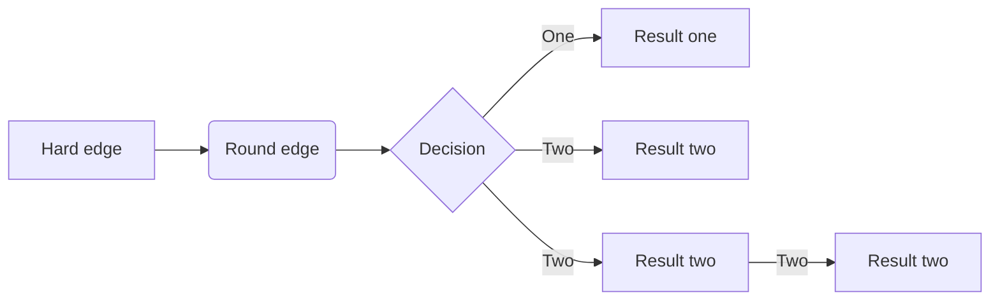

[TOC]

# 设计模式总结

>[设计模式总结](https://blog.csdn.net/u010921682/article/details/82886397)
>
>[设计模式总结](https://www.cnblogs.com/qixuejia/p/4511460.html)
>
>[常见设计模式总结](https://www.jianshu.com/p/f6b045929cc8)

| 设计模式 | 用法                                                         |
| -------- | ------------------------------------------------------------ |
| 单例     | 保证类的实例只有一个                                         |
| 简单工厂 | 根据参数创建对应具体子类                                     |
| 策略     | 算法、规则的封装、传入具体调用，调用具体算法                 |
| 装饰者   | 动态对一个对象进行增属性、调用方法等操作，链式操作，随意组合。梳头、画眉、只梳头不画眉、只画眉不梳头 |
| 工厂方法 | 创建类，一个实现类要有一个工厂类。总是通过对应的工厂类创建实现类，判断在客户端进行。工厂类太多。 |
| 代理     | 对象中保存能执行另一种操作的对象，通过这个保存的对象去操作。 |
| 原型     | 用克隆(Clone)，代替new对象。克隆的方式能够保留一些同样的信息。 |
| 模板方法 | 提炼出相同的公共代码，封装为一个方法模板。                   |
| 外观     | 通过改造内部实现，让外部看起来调用的方式很简单(如，实际需要调用3个方法，但增加一个方法来调用这3个方法，让外部只调用一个方法即可)。 |
| 建造者   | 将一个复制对象的构建与它的表示分离，使得同样的构建过程可以创建不同的表示。 |
| 观察者   | 观察者类里面放了一个集合，包含了多个被通知类，被通知类实现一个抽象方法，有一个方法接受通知。 |
| 抽象工厂 | 增加一个接口，让外部依赖接口而不是具体类                     |
| 状态     | 多个大致相同的类，只是状态不同，随着不停的调用，一个状态会转为另一个状态(一个类转为另一个类) |
| 适配器   | 将一个类的接口转换成客户希望的另外一个接口。 可以理解为，仅仅改为一个方法名，在方法内部调用真正的方法(名字不同)。 |
| 备忘录   | 增加一个类用于存储状态，一个类负责备份和恢复状态             |
| 组合     | 部分-整体关系，解决无限递归问题。                            |
| 迭代器   | 分离了集合对象的遍历行为，抽象出一个迭代器类来负责。解决遍历问题 |
| 桥接     | 将继承关系分离出来改为聚合关系                               |
| 命令     | 对请求的封装，请求-》真正执行(队列)                          |
| 职责链   | 类似于Asp.net管道，一条链操作，每个类都有处理的机会，没权限就往上级抛，直到有权限的类能够处理 |
| 中介者   | 通过一个中介类来处理两个类之间的信息交换                     |
| 享元     | 对象的大多数状态为外部状态，如果删除对象的外部状态，那么可以用相对较少的共享对象取代很多组对象。 |
| 访问者   | 它把数据结构和作用于结构上的操作之间的耦合解脱开（用类封装变化的数据） |
| 解释器   | 用类去封装一条规则                                           |

