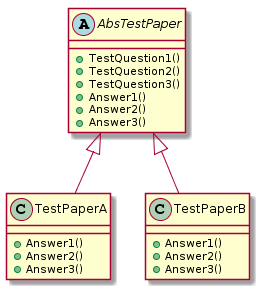

[TOC]

# 职责链模式(Chain of Responsibility)


```json
@startuml
abstract AbstractLogger{
  #level:int
  +logMessage(level: int, message:string)
  +setNextLogger(nextLogger: AbstractLogger)
  +write(message:string)
}
note right: 定义一个处理请示的接口

class Client

class ConsoleLogger{
  +write(message:string)
}

class ErrorLogger{
  +write(message:string)
}

class FileLogger{
  +write(message:string)
}
note bottom: 具体处理者类，处理它所负责的请求，可访问它的后继者，\n 如果可以处理该请求就处理，不然将请求转发给它的后继者

Client -right-> AbstractLogger
AbstractLogger<|-- ConsoleLogger
AbstractLogger <|-- ErrorLogger
AbstractLogger <|-- FileLogger
AbstractLogger <--o AbstractLogger
@enduml
```

>**优点**
>
>- 责任链模式将请求和处理分开，请求者不知道是谁处理的，处理者可以不用知道请求的全貌。
>- 提高系统的灵活性。
>
>**缺点**
>
>- 降低程序的性能。每个请求都是从链头遍历到链尾，当链比较长的时候，性能会大幅下降。
>- 不易于调试。由于该模式采用了类似递归的方式，调试的时候逻辑比较复杂。
>
>**应用场景**
>
>责任链模式是一种常见的模式，Struts2的核心控件FilterDispatcher是一个Servlet过滤器，该控件就是采用责任链模式，可以对用户请求进行层层过滤处理。责任链模式在实际项目中的使用比较多，其典型的应用场景如下：
>
>- 一个请求需要一系列的处理工作。
>- 业务流的处理，例如文件审批。
>- 对系统进行扩展补充。

> 在责任链模式中，客户只需要将请求发送到责任链上即可，无须关心请求的处理细节和请求的传递过程，所以责任链将请求的发送者和请求的处理者解耦了。
> 责任链模式是一种对象行为型模式，其主要优点如下。
>
> 1. 不能保证每个请求一定被处理。由于一个请求没有明确的接收者，所以不能保证它一定会被处理，该请求可能一直传到链的末端都得不到处理。
> 2. 对比较长的职责链，请求的处理可能涉及多个处理对象，系统性能将受到一定影响。
> 3. 职责链建立的合理性要靠客户端来保证，增加了客户端的复杂性，可能会由于职责链的错误设置而导致系统出错，如可能会造成循环调用。

# 命令模式(Command)


```json
@startuml
class Invoker{
  -concreteCommandA:ICommand
  -concreteCommandB:ICommand
  +orderA():void
  +orderB():void
}
note top: 要求该命令执行这个请求

interface ICommand {
  +execute():void
}
note top: 用来声明执行操作的接口

class ConcreteCommandA{
  -receiver:Receiver
  +execute():void
}

class ConcreteCommandB{
  -receiver:Receiver
  +execute():void
}
note bottom: 将一个接收者对象绑定于一个动作,\n调用接收者相应的操作,以实现Execute

class Receiver{
  +execute():void
}
note bottom: 知道如何实施与执行一个请求相关\n的操作,任何类都可能作为一个接收者

Client .right.> Invoker
Client .right.> Receiver
ICommand <|-- ConcreteCommandA
ICommand <|-- ConcreteCommandB
Invoker o-right-> ICommand
Receiver <-- ConcreteCommandA
@enduml
```

> 命令模式的几个角色：
> 抽象命令接口ICommand：定义命令的接口，声明执行的方法。
> 具体的命令对象ConcreteCommand：持有具体的接受者对象，完成具体的具体的命令。
> 接受者对象Receiver：接受者对象，真正执行命令的对象。
> 传递命令对象Invoker：持有命令对象，要求命令对象执行请求。
> 客户端对象Client：创建具体命令的对象并且设置命令对象的接受者。
>
> [Java设计模式（18）之命令模式](https://blog.csdn.net/zhwyj1019/article/details/79758057)
>
> 


# 解释器模式(Interpreter)


```json
@startuml
abstract ReadXmlExpression{
  +interpret(c:Context):String[]
}
note left: 抽象表达式,声明一个抽象的解释操作,\n这个接口为抽象语法树中所有的节点共享

class ElementExpression{
  -eles:Collection<ReadXmlExpression>
  -eleName:String
  +addEle(ele:ReadXmlExpression):boolean
  +removeEle(ele:ReadXmlExpression):boolean
  +interpret(c:Context):String[]
}
note bottom: 非终结表达式,为文法中的非终结\n符实现解释操作。对文法中每一条\n规则R1..Rn都需要一个具体的非终结符\n表达式类

class ElementTerminalExpression{
  -eleName:String
  +interpret(c:Context):String[]
}
note bottom: 终结表达式,实现与文法中的终结符\n相关联的解释操作

class PropertyTerminalExpression{
  -eleName:String
  +interpret(c:Context):String[]
}

class Context{
  -preEle:Element
  -document:Document
  +reInit():void
  +getNowEle(pEle:Element,eleName:String):Element
}
note right: 包含解释器之外的一些全局信息

ReadXmlExpression <|-- ElementExpression
ReadXmlExpression <|-- ElementTerminalExpression
ReadXmlExpression <|-- PropertyTerminalExpression
Clinet ..> Context
Clinet ..> ReadXmlExpression
ElementExpression o--> ReadXmlExpression
@enduml
```


# 迭代器模式(Iterator)


```json
@startuml
interface IAggregate{
  +CreateIterator(): int
}
note top: 聚集接口

class Client

interface AbsIterator{
  +First()
  +Next()
  +IsDone()
  +CurrentItem()
}
note top: 迭代接口类，用于得到开始对象、 \n 得到下一个对象、判断是否到结尾、 \n 当前对象等抽象方法，统一接口

class ConcreteIterator
note bottom: 具体迭代器类

class ConcreteAggregate{
  +CreateIterator(): int
}
note bottom: 具体聚集类，继承自IAggregate


Client -left-> AbsIterator
Client -right-> IAggregate
IAggregate <|-- ConcreteAggregate
AbsIterator <|-- ConcreteIterator
ConcreteAggregate <-left- ConcreteIterator
ConcreteAggregate .left.> ConcreteIterator
@enduml
```


# 中介者模式(Mediator)


```json
@startuml
interface Mediator
note left: 接口终中介者，定义了Colleague \n 对象到Mediator对象的接口

abstract AbsColleague

class ConcreteMediator
note left: 具体中介者对象，实现抽象类的方法，\n 它需要知道所有具体的Colleague类，并从具体的 \n Colleague接收消息，向具体Colleague对象发出命令

class ColleagueA
note top: 具体Colleague类，每个具体Colleague只知道自己 \n 的行为，而不了解其他Colleague类的情况， \n 但它们却都认识Mediator对象

class ColleagueB

Mediator <|-- ConcreteMediator
AbsColleague <|-- ColleagueA
AbsColleague <|-- ColleagueB
ColleagueA <-- ConcreteMediator
ColleagueB <-- ConcreteMediator
@enduml
```

> 中介者模式的定义
>
> 用一个中介者对象封装一系列的对象交互，中介者使各对象不需要显示地相互作用，从而使耦合松散，而且可以独立地改变它们之间的交互。
>
>
> 中介者模式的优点
>
> 适当地使用中介者模式可以避免同事类之间的过度耦合，使得各同事类之间可以相对独立地使用。
> 使用中介者模式可以将对象间一对多的关联转变为一对一的关联，使对象间的关系易于理解和维护。
> 使用中介者模式可以将对象的行为和协作进行抽象，能够比较灵活的处理对象间的相互作用。
> 适用场景
>
>     在面向对象编程中，一个类必然会与其他的类发生依赖关系，完全独立的类是没有意义的。一个类同时依赖多个类的情况也相当普遍，既然存在这样的情况，说明，一对多的依赖关系有它的合理性，适当的使用中介者模式可以使原本凌乱的对象关系清晰，但是如果滥用，则可能会带来反的效果。一般来说，只有对于那种同事类之间是网状结构的关系，才会考虑使用中介者模式。可以将网状结构变为星状结构，使同事类之间的关系变的清晰一些。
>     中介者模式是一种比较常用的模式，也是一种比较容易被滥用的模式。对于大多数的情况，同事类之间的关系不会复杂到混乱不堪的网状结构，因此，大多数情况下，将对象间的依赖关系封装的同事类内部就可以的，没有必要非引入中介者模式。滥用中介者模式，只会让事情变的更复杂。
> 

>##### 优点：
>
>1、降低了类的复杂度，将一对多转化成了一对一。
>2、各个类之间的解耦。
>3、符合迪米特原则。
>
>##### 缺点：
>
>1.中介者会庞大，变得复杂难以维护。
>2.如果中介者类出现问题，将会导致所有相关类出问题。
>
>**Where:**
>
>多个类相互耦合，形成了网状结构。
>
>[设计模式之中介者模式（Mediator Pattern）](https://www.jianshu.com/p/638cee44c9f6)


# 备忘录模式(Memento)

>[Java设计模式学习记录-备忘录模式]()https://www.cnblogs.com/jimoer/p/9537997.html


```json
@startuml
class Game{
  +playerStep:int
  +restore(gameMemento: GameMemento):void
  +createGameMemento():GameMemento
}
note Bottom: 负责创建一个备忘录GameMemento， \n 用以记录当前时刻的内部状态， \n 并可使用备忘录恢复内部状态

class GameMemento{
  -playerSteps:int
}
note top: 负责存储Game对象的内部状态，\n 并可防止Game以外的对象访问 \n 备忘录GameMemento

class Caretaker{
  -gameMemento: GameMemento
  +saveMemento(gameMemento:GameMemento):void
}
note right: 负责保存好备忘录GameMemento

Game .right.> GameMemento
GameMemento <--o Caretaker
@enduml
```


# 观察者模式(Observer)


```json
@startuml
class ISubject{
  +attach(observer: Observer)
  +detach(observer: Observer)
  +notifyAllObservers()
}
note top: ISubject类,它把所有对观察者对象的引用保存在一个\n聚集里,每个主题都可以有任何数量的观察者.  主题提供\n一个接口,可以增加和删除观察者对象 

class Subject{
  #observers:List<Observer>
  +state: int
  +getState()
  +setState()
  +attach(observer: Observer)
  +detach(observer: Observer)
  +notifyAllObservers()
}
note bottom: Subject类,具体主题,将有关状态存入\n具体观察者对象;在具体主题的内部状态改变\n的时候，给所有登记过的观察者发出通知 

abstract Observer{
  #subject:Subject
  +update()
}
note top: 抽象观察者,为所有的具体观察者定义\n一个接口,在得到主题的通知时更新自己

class BinaryObserver{
  +update()
}

class OctalObserver{
  +update()
}
note bottom: 具体观察者,实现抽象观察者角色所\n要求的更新接口,以便使自身状态与主题状态相协调

class HexaObserver{
  +update()
}

ISubject <|-- Subject
Observer <|-- BinaryObserver
Observer <|-- OctalObserver
Observer <|-- HexaObserver
Subject <-left- HexaObserver
ISubject -right-> Observer
@enduml
```


# 状态模式(State)


```json
@startuml
interface State
note left: 状态类接口，定义一个接口以封装与 \n Context的一个特定状态相关的行为

class Context{
  +Request()
}
note left: 维护一个ConcreteState子类的实例，\n 这个实例定义当前的状态

class ConcreteStateA{
  +Handle()
}
note right: 具体状态，每一个子类实现一个 \n 与Context的一个状态相关的行为

class ConcreteStateB{
  +Handle()
}

class ConcreteStateC{
  +Handle()
}

Context o--> State
State <|-- ConcreteStateA
State <|-- ConcreteStateB
State <|-- ConcreteStateC
@enduml
```


# 策略模式(Strategy)


```json
@startuml
class OperationAdd{
  +doOperation()
}
class OperationSubstract{
  +doOperation()
}
class OperationMultiply{
  +doOperation()
}
note bottom: 具体策略类，封装了具体的算法或行为，继承于IStrategy

class Context{
  +executeStrategy()
}
note bottom: Context上下文，用一个 \n ConcreateStategy来配置， \n 维护一个对IStrategy对象的引用

interface IStrategy{
  +doOperation()
}
note right:策略类，定义所有支持的算法的公共接口


Context <-left-o IStrategy
IStrategy<|-- OperationAdd
IStrategy<|-- OperationSubstract
IStrategy<|-- OperationMultiply
@enduml
```

> [二十三种设计模式 - 策略模式](https://www.jianshu.com/p/cb4cdda0c3c9)

> #### 模式定义
>
> 策略模式：属于对象的行为模式。其用意是针对一组算法，将每一个算法封装到具有共同接口的独立的类中，从而使得它们可以相互替换。
>
> 策略模式：使得算法可以在不影响到客户端的情况下发生变化。
>
> 策略模式：是对算法的包装，是把使用算法的责任和算法本身分割开来，委派给不同的对象管理。策略模式通常把一个系列的算法包装到一系列的策略类里面，作为一个抽象策略类的子类。用一句话来说，就是：“准备一组算法，并将每一个算法封装起来，使得它们可以互换”。


>#### 参与者
>
>策略模式参与者：
>
>**Context**：环境角色，持有一个Strategy的引用。
>
>**Strategy**：抽象策略角色，这是一个抽象角色，通常由一个接口或抽象类实现。此角色给出所有的具体策略类所需的接口。
>
>**ConcreteStrategy**：具体策略角色，包装了相关的算法或行为

> 优点：
>
> 1. 业务逻辑和前端展示相互分离开了。业务逻辑的修改，不影响前端代码展示。
> 2. 每一个业务逻辑单独一个类，修改或者添加一个类，不会影响到其他的类。
> 3. 使用工厂类封装了业务逻辑类，前端不需要知道到底每种业务怎么实现，只需要知道他的父类即可。
>
> 缺点：
>
> 1. 如果活动很频繁，经常会搞各种各样的活动，那么业务逻辑就会有很多种，每一次都要增加一个类。
> 2. 每增加一个类都要修改工厂类，修改会很频繁。

> ### 策略模式的优点
>
> （1）策略模式提供了管理相关的算法族的办法。策略类的等级结构定义了一个算法或行为族。恰当使用继承可以把公共的代码移到父类里面，从而避免代码重复。
>
> （2）使用策略模式可以避免使用多重条件(if-else)语句。多重条件语句不易维护，它把采取哪一种算法或采取哪一种行为的逻辑与算法或行为的逻辑混合在一起，统统列在一个多重条件语句里面，比使用继承的办法还要原始和落后。
>
> ### 策略模式的缺点
>
> （1）客户端必须知道所有的策略类，并自行决定使用哪一个策略类。这就意味着客户端必须理解这些算法的区别，以便适时选择恰当的算法类。换言之，策略模式只适用于客户端知道算法或行为的情况。
>
> （2）由于策略模式把每个具体的策略实现都单独封装成为类，如果备选的策略很多的话，那么对象的数目就会很可观

> - 用途不一样 
>   工厂是创建型模式,它的作用就是创建对象； 
>   策略是行为型模式,它的作用是让一个对象在许多行为中选择一种行为;
>
> - 关注点不一样 
>   一个关注对象创建 
>   一个关注行为的封装
> - 解决不同的问题 
>   工厂模式是创建型的设计模式，它接受指令，创建出符合要求的实例；它主要解决的是资源的统一分发，将对象的创建完全独立出来，让对象的创建和具体的使用客户无关。主要应用在多数据库选择，类库文件加载等。 
>   策略模式是为了解决的是策略的切换与扩展，更简洁的说是定义策略族，分别封装起来，让他们之间可以相互替换，策略模式让策略的变化独立于使用策略的客户。
> - 工厂相当于黑盒子，策略相当于白盒子；


# 模板方法模式(Template Method)



```json
@startuml
abstract AbsTestPaper{
  +TestQuestion1()
  +TestQuestion2()
  +TestQuestion3()
  +Answer1()
  +Answer2()
  +Answer3()
}

class TestPaperA{
  +Answer1()
  +Answer2()
  +Answer3()
}

class TestPaperB{
  +Answer1()
  +Answer2()
  +Answer3()
}

AbsTestPaper <|-- TestPaperA
AbsTestPaper <|-- TestPaperB
@enduml
```


# 访问者模式(Visitor)

> [设计模式：访问者（Visitor）模式](https://www.cnblogs.com/zyrblog/p/9244754.html)
>
> [访问者模式一篇就够了](https://www.jianshu.com/p/1f1049d0a0f4)


```json
@startuml
class Clinet{
  +visitor()
}

abstract Staff{
  +accept(visitor: Visitor)
}
note top: 定义一个accept操作,它以一个访问为参数

class Engineer{
  +accept(visitor: Visitor)
}
class Manager{
  +accept(visitor: Visitor)
}
note bottom: 具体元素,实现accept操作

class BusinessReport{
  -mStaffs: List<Staff>
  +showReport(visitor: Visitor)
}
note bottom: 能枚举它的元素,可以提供一个高层的接口\n以允许访问者访问它的元素

interface Visitor{
  +visit(engineer: Engineer)
  +visit(manager: Manager)
}
note top:为该对象结构中每个实现类声明一个visit操作

class CEOVisitor{
  +visit(engineer: Engineer)
  +visit(manager: Manager) 
}

class CTOVisitor{
  +visit(engineer: Engineer)
  +visit(manager: Manager) 
}
note bottom: 具体访问者,实现每个由Visitor声明的操作,\n每个操作实现算法的一部分,而该算法\n片段仍是对应于结构中对象的类

Staff <|-- Engineer
Staff <|-- Manager
Visitor <|-- CEOVisitor
Visitor <|-- CTOVisitor
Clinet --> BusinessReport
Clinet -right-> Visitor
BusinessReport -left-> Staff
@enduml
```

> 角色介绍
>
> - **Visitor：**接口或者抽象类，定义了对每个 Element 访问的行为，它的参数就是被访问的元素，它的方法个数理论上与元素的个数是一样的，因此，访问者模式要求元素的类型要稳定，如果经常添加、移除元素类，必然会导致频繁地修改 Visitor 接口，如果出现这种情况，则说明不适合使用访问者模式。
> - **ConcreteVisitor：**具体的访问者，它需要给出对每一个元素类访问时所产生的具体行为。
> - **Element：**元素接口或者抽象类，它定义了一个接受访问者（accept）的方法，其意义是指每一个元素都要可以被访问者访问。
> - **ElementA、ElementB：**具体的元素类，它提供接受访问的具体实现，而这个具体的实现，通常情况下是使用访问者提供的访问该元素类的方法。
> - **ObjectStructure：**定义当中所提到的对象结构，对象结构是一个抽象表述，它内部管理了元素集合，并且可以迭代这些元素提供访问者访问。


